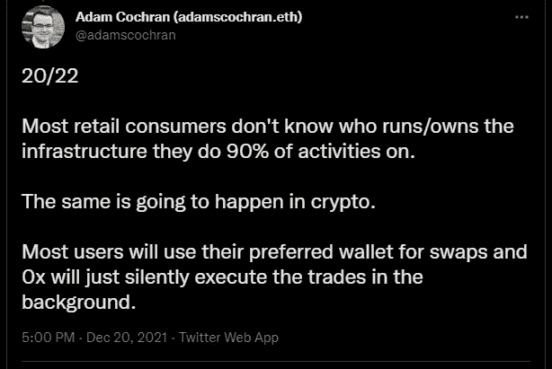

# 下一代互联网的基础设施是什么？

> 原文：<https://medium.com/coinmonks/whats-the-infrastructure-for-the-next-iteration-of-the-internet-21a025eb673f?source=collection_archive---------24----------------------->

在最近这个 Web3 概念化的时代，网络的未来隐含着搭便车的执行，对隐私和数据所有权的持续需求怎么强调都不为过。

然而，Web3 与其前身(web2)的实质性差异可以旨在去中心化。应用程序不再运行在单一服务器上/将用户数据存储在单一数据库中。相反，Web3 应用程序建立在由无数对等节点(区块链)组成的分散网络上。这些应用程序被称为去中心化应用程序(Dapps ),正如你经常在 web3 狂热者中听到的那样。

web3 的魅力在于其去中心化的本质，价值将由用户控制和拥有，而不是像谷歌、苹果或脸书这样的管理互联网的中介。互联网的这一革命性创新创造了大量的经济价值。一个很好的证据就是资产和证券的令牌化，一些资产和证券由于价格波动而具有投机性的供求力量。这一革命过程产生了流动性万亿美元的经济价值。

感谢 [**0xproject**](https://twitter.com/0xProject) 在令牌化价值交换中拥抱去中心化的概念，这已被证明是共识的未来，带来了集权的终结。

> **“去中心化治理是创造下一代互联网的终极工具”** Brent Oshiro。

假设互联网的未来依赖于去中心化的核心理念。在这种情况下，最终需要一个开放的、无许可的平台，一个通用的价值交换标准。这被证明是一个更容易的途径，让开发者和企业构建 web3 应用，允许分散交换和跨不同区块链的令牌化价值的规模。

# web3 令牌化价值交换背后的基础架构。

Cinneamhain Ventures 合伙人 Adam Cochran 在他的推特上说:“大多数用户将使用他们喜欢的钱包进行掉期交易，而 0x 将在后台默默地执行交易”。事实上，这是 0x 项目的最终目标，创建一个由社区管理的完美的 Web3 基础设施。

网络的功效可以归因于其无主的性质，没有任何公司或组织可以声称对其拥有所有权，而少数组织可以决定互联网的结构。开发人员使用一个通用的一致算法来构建它，忽略这些标准将导致一个对比鲜明和脱节的互联网。正如 HTTP 是当今 Web(Web2)中的连接层或通用标准，它使价值能够在服务器和浏览器之间流动一样 0xproject，牢固地建立了去中心化交换协议(Web3)的基础。

在跨所有集成链的令牌化价值交换中，0x 的广泛采用是显而易见的。由于分散治理，$ZRX 令牌持有者对 Web3 基础设施的治理具有独特的影响力。出于本文的目的，我将忽略财务指标，而坚持 0xproject 的项目指标。

## 0xproject 协议中

0x 项目于 2017 年启动，从自己的低流动性订单簿协议转向成为一个 API 聚合器，Defi apps 可以跨各种链进行集成。它成功地根除了每个应用程序无法引导自己的流动性的问题，一个独特的功能是通过自己的订单簿和私人流动性池获得其他聚合器没有的其他流动性。

最火的 Defi 杀手锏是新推出的[***请求报系统(RFQ)*** ，](https://docs.0x.org/market-makers/docs/introduction)采用最新的 0x v4 协议。RFQ 系统是 Defi 增长的催化剂，因为它允许专业做市商将 CEX 流动性直接带给 DEX 用户，以支持中型和大型交易的良好定价。对于场外交易商、MM(市场标记)、0x API 集成商和未来的分散交易所来说，这是一个全方位的游戏规则改变者。[现为 0x 前产品经理的 Blake Henderson](https://twitter.com/HendoVentures) 对内容进行了深入分析:[在专业做市商的帮助下不断增长的 Defi](https://blog.0xproject.com/growing-defi-with-the-help-of-professional-market-makers-0xs-new-request-for-quote-system-8d5fb08594bf)。

# 谁会真正使用 0x？

也许，您可能想知道“这些听起来很棒的特性，但是谁会真正使用 0x 呢？”答案是，很可能你有。

0x 为 Defi 的相互作用(需求)和流动性来源(供给)提供动力。0x 被 [**抹茶**](https://matcha.xyz/) 、MetaMask、ShapeShift、Zapper、Defi Saver 以及许多其他钱包和聚合器协议使用。0x API/protocol 不能停止推进标准，以欢迎更多的 0x API 集成商加入生态系统，尤其是在使用强大的 0x 协议 V4 的情况下。

## 0x V4，游戏规则改变者

[作为 DEX 协议最高效版本的 **0x V4**](https://blog.0x.org/say-hello-to-0x-v4/) 的推出吸引了专业市场交易商更具竞争力的流动性，为 RFQ 流动性节省了高达 70%的汽油，为限价订单节省了 10%的汽油。

**0x API 付给你正滑点:**最新的 V4 协议说 Web3 上“不再有隐藏费用”。随着价格和交易量的增加，你在至少一笔交易中出现正滑点的可能性接近 100%。大多数交易者无知地放弃了这种正滑点，转而使用其他 DEX 协议，放弃了正滑点收益，也许他们对报价感到高兴，而忽略了考虑正滑点的更好的执行价格。为了更好地了解这一点， *0x 检查了超过 700k 的 0x API 交易，以了解这种情况发生的频率和影响，* [*这是相应数据的 Twitter 线程*](https://twitter.com/0xProject/status/1519806979459276800?s=20&t=4fxQXTu9bORgrggqh0rgRQ) 。0xblog 还提供了一个关于*[*RFQ 如何保护用户免受 MEV 导致的滑脱的深入内容。*](https://blog.0x.org/measuring-the-impact-of-hidden-dex-costs/)*

*0x v4 还提供了 [***即插即用流动性***](https://protocol.0x.org/en/latest/advanced/plp.html) 即可插拔流动性(PLP)。这使得定制的链上流动性池能够在整合其他流动性来源之前通过标准接口被堵塞。不需要将流动性提供者置于沙盒中。*

*目前使用 0x V4 协议在 uniswap 和 Sushiswap 上交易比较便宜。0x 通过促进 Defi legos(借款、债务偿还、提供流动性)融入贸易环境，重新定义了 Defi 的可能性。这使得向具有任意令牌的池提供流动性成为可能，LP(流动性池)令牌的互换、复合/Aave 的抵押品也是可能的。*

*[***0x 协议 v4 NFT 互换支持现已上线以太坊 mainnet！***](https://blog.0x.org/introducing-multi-chain-nft-swaps/) 。对其他 0x 集成链的 NFT 交换支持将很快推出。0x 为构建下一代完全去中心化和可互操作的 web3 NFT 应用程序/市场奠定了基础，这些应用程序/市场有足够的可能性:*

**

***灵活的模块化架构:** 0x 将 Web3 放在灵活的人手里:特别感谢 **2362 个独特的持有者**到场支持升级提案，$ZRX 持有者现在可以通过 ZEIPS 控制协议的特定功能。*

***订单可选性:**由于 ***离链订单*** 附带免费列表，而 ***可索引/可发现订单*** 通过其“预签名”功能发出可由子图索引的订单，因此 Nfts 可以根据订单完成的时间选择离开用户的钱包。*

***Gas optimized:** 0x V4 现在是以太坊上交换 NFT 最实惠的协议，比其他 NFT 协议便宜 41%，这是由于合同的优化 Gas 效率。*

***收集订单:**使用 0x 协议 V4，用户现在可以更高效地清扫收集的气体地板。*

***更多令牌标准:** 0x 协议以其链外顺序特性为 Web3 增加了很多灵活性。使用 0x V4，用户现在可以交换(购买和出售)所有主要的令牌标准，如 ERC20、ERC721、ERC1155 等。*

# *宏观采用和生态系统增长*

*尽管市场的宏观经济状况不佳，但 0x 协议量一直在增长，0x 是企业在其应用程序中构建分散式 exchange 功能时最值得信赖的基础架构解决方案。*

*即使协议的容量看起来不透明，大多数人也可能很容易地计算出 Uniswap、Sushiswap 或 CEX 的容量。但是大多数人并没有意识到 0x 的体积。事实上，4300 多万笔交易的交易额超过 1570 亿美元，0x 仍然是最大的集成商生态系统。*

> *请随时访问 [0x 分析仪表板](http://analytics.0x.org/)，进一步了解 0x 网络的发展。0x 一直在磨更多，抢占市场份额。*

***生态系统扩张到非 EVM 连锁:** [***0x 与 python***](https://blog.0x.org/0x-joins-the-pyth-network/)合作，预示着他们也有可能有一个非 EVM 的未来。Pyth Network 是该领域最大的数据提供商之一，但主要专注于 Solana 生态系统。*

*正如*游戏认可*游戏一样， [***比特币基地与 0x***](https://blog.0x.org/coinbase-partners-with-0x-to-power-new-nft-marketplace/) 合作，为他们新的非功能性游戏社交市场提供动力。由于最新的 gaseless 0x 协议，比特币基地现在为用户提供了以最低交易成本发现、购买、销售和连接 NFT 的更好方法。*

*[***0x Labs 在筹集了由 Greylock 牵头的 7000 万美元 B 轮融资后，加入了 Greylock 旗下受人尊敬的公司组合***](https://blog.0x.org/0x-labs-raises-70m-series-b/) ，继续扩大 Web3 的核心交换基础设施。事实上，随着 0x Labs 继续扩大其团队和产品，这是迎接下一个 100 倍用户、企业和机构浪潮的良好开端。*

*尽管如此，我也对将于 2022 年 11 月 3 日在旧金山举行的 2022 年 0xpo 峰会感到兴奋。*

*0x 的使命仍然是:建立一个所有价值都能自由流动的符号化世界。*

> *订阅 [**0xblog**](https://blog.0x.org/) 获取网络洞察，并将来自 0x 生态系统的新闻直接发送到您的收件箱。*
> 
> *加入官方的[**0x Discord 服务器**](https://discord.com/invite/FduK2mE) ，与社区互动，了解生态系统中发生的所有令人兴奋的事情。*

> *加入 Coinmonks [电报频道](https://t.me/coincodecap)和 [Youtube 频道](https://www.youtube.com/c/coinmonks/videos)了解加密交易和投资*

# *另外，阅读*

*   *[加密交易机器人](/coinmonks/crypto-trading-bot-c2ffce8acb2a)|[P2E NFT 15 大游戏](https://coincodecap.com/p2e-nft-games)*
*   *[币安期货交易](https://coincodecap.com/binance-futures-trading)|[3 commas vs Mudrex vs eToro](https://coincodecap.com/mudrex-3commas-etoro)*
*   *[如何购买 Monero](https://coincodecap.com/buy-monero) | [IDEX 评论](https://coincodecap.com/idex-review) | [BitKan 交易机器人](https://coincodecap.com/bitkan-trading-bot)*
*   *[尤霍德勒 vs 科恩洛 vs 霍德诺特](/coinmonks/youhodler-vs-coinloan-vs-hodlnaut-b1050acde55a) | [Cryptohopper vs 哈斯博特](https://coincodecap.com/cryptohopper-vs-haasbot)*
*   *[顶级付费加密货币和区块链课程](https://coincodecap.com/blockchain-courses)*
*   *[MXC 交易所评论](/coinmonks/mxc-exchange-review-3af0ec1cba8c) | [Pionex vs 币安](https://coincodecap.com/pionex-vs-binance) | [Pionex 套利机器人](https://coincodecap.com/pionex-arbitrage-bot)*