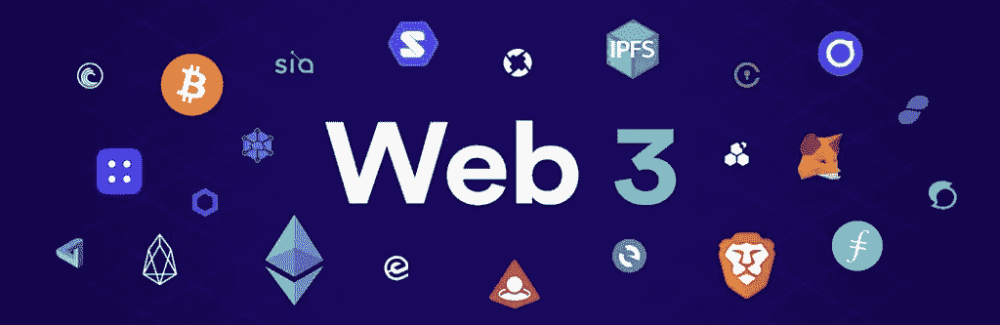

# Web 3 是什么？

> 原文：<https://medium.com/coinmonks/whats-web-3-7634908ed6bb?source=collection_archive---------22----------------------->

关于 Web3，你需要知道什么？

自诞生以来，网络已经经历了一系列的变化。所以你可能已经猜到或者已经知道 web1 和 web2 的存在。现在，web3 是所有的大惊小怪。这是网络发展的新阶段。如果你和我一样，你可能想知道这是什么，为什么人们这么关心。现在，让我们从听流行语过渡到理解它们。

网络始于用户可以访问的静态网站，其特点是用户访问网站只是为了获取信息。没有注册，没有日志，也没有帖子。这就是 web1 的意义所在。然后在 20 世纪 90 年代末和 21 世纪初出现了 web 2。人们现在可以创造信息。数据库变得更加必要，网站变成了应用程序，不再仅仅是网站。然而，数据是由运营这些网站的公司存储的，他们获取我们生成的数据并存储起来，以使应用程序工作。像谷歌、脸书和推特这样的公司都是例子。

这很有趣，直到我们都意识到 web 的黑暗面。我们的数据是由大公司处理的，他们未经我们同意就出售这些数据。尽管已经制定了多部法律，但数据泄露仍然是一个很大的问题。Web3 改变了这一切。Web3 的核心原则是去中心化，我是认真的。去中心化是可能的，因为支撑 web3 的主要技术是区块链技术。

去中心化是如何可能的。

数据不再像 web2.0 那样存储在公司的数据库中。数据现在使用区块链存储，这允许数据分散存储，因为区块链是没有中央授权的计算机的连接。另一个有趣的事实是，即使数据存在于一个分散的系统中，加密技术也使得人们能够确定他们的数据是如何被使用的。这不是很好玩吗？。那些出售你的信息的公司不会再有史努比广告了。

现在我们中的一些人可能会想为什么我们还没有完全过渡到 web3，我的意思是我们还在等什么？。首先，我们知道这是一个分散的系统，但是，我们必须开发应用程序，让大多数不是区块链开发人员的人也能使用它。

现在关键是他们的动机是什么。与 web2 不同，在 web 2 中，他们可以通过出售他们的数据从客户身上赚钱，而在 web3 中，每个人都可以轻松地完全控制限制任何此类风险。所以像传统的 web2 应用程序一样赚钱是很困难的。
另一个方面是缺乏这方面的知识。它是新的，公司不太了解它。投资者对一个分散的系统如何成功运行持怀疑态度，这是很自然的。然而，我相信这种态度会随着时间而改变。

再次欢呼，我希望你看到了一些有助于你了解 web3 的东西。

> 加入 Coinmonks [电报频道](https://t.me/coincodecap)和 [Youtube 频道](https://www.youtube.com/c/coinmonks/videos)了解加密交易和投资

# 另外，阅读

*   [交易信号是什么？](https://coincodecap.com/trading-signal) | [Bitstamp vs 比特币基地](https://coincodecap.com/bitstamp-coinbase) | [买索拉纳](https://coincodecap.com/buy-solana)
*   [ProfitFarmers 回顾](https://coincodecap.com/profitfarmers-review) | [如何使用 Cornix Trading Bot](https://coincodecap.com/cornix-trading-bot)
*   [十大最佳加密货币博客](https://coincodecap.com/best-cryptocurrency-blogs) | [YouHodler 评论](https://coincodecap.com/youhodler-review)
*   [my constant Review](https://coincodecap.com/myconstant-review)|[8 款最佳摇摆交易机器人](https://coincodecap.com/best-swing-trading-bots)
*   [MXC 交易所评论](/coinmonks/mxc-exchange-review-3af0ec1cba8c) | [Pionex vs 币安](https://coincodecap.com/pionex-vs-binance) | [Pionex 套利机器人](https://coincodecap.com/pionex-arbitrage-bot)