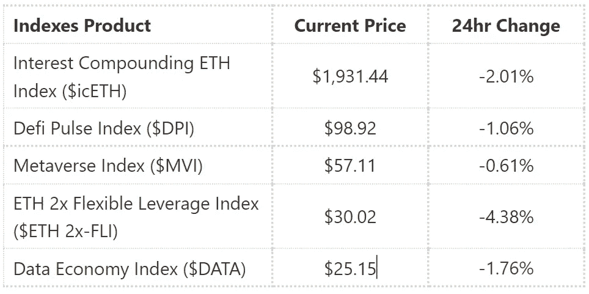
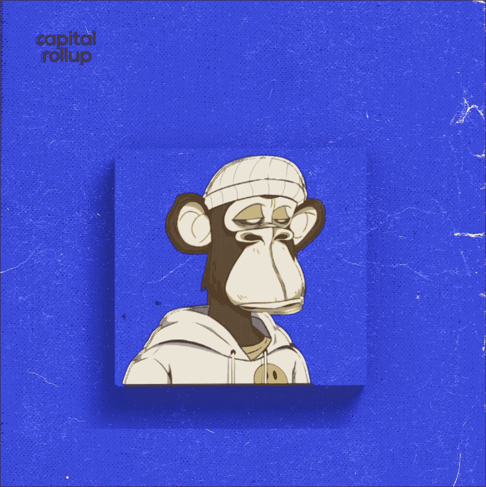

# NFTs 和有价值是什么？

> 原文：<https://medium.com/coinmonks/whats-with-nfts-and-having-value-3af6b493fbdf?source=collection_archive---------73----------------------->

欢迎来到最新一期的 CapitalRollup Digest！今天的文摘是 5 月 18 日的，所以你大概需要 5 分钟。我们马上开始。

*   今天的市场看起来怎么样？(前 5/10 大热门指数)

Index Price Market Update

# NFTs 和有价值是什么？

不可替代令牌的价值在于它们验证不可替代资产的真实性。这将这些资产与其他资产区分开来。例如，毕加索的画是不可替代的。虽然任何人都可以复制他的画，但原画仍然是不可替代的，独一无二的。NFT 使数字内容不可替代，因此很有价值。

为了更全面地理解 NFTs 的价值，我们必须理解可替代性的概念。

可替代性一词指的是用一种资产交换另一种同等价值资产的能力。例如，一种货币是一种可替代的资产，这样，如果你有 20 美元，你可以把它换成两张 10 美元的钞票。它仍然是同样的价值，但是你已经把你的资产换成了新的。

另一个可替代资产的例子是金钱。如果 A 借给 B 一张 50 美元的钞票，他是否得到了不同的 50 美元钞票并不重要，因为两者是相等的。同样，A 可以得到两张 20 美元和一张 10 美元的钞票，但仍然很高兴，因为总共是 50 美元。

好的，让我们回到毕加索的艺术作品的例子。由于毕加索的作品是独一无二的，不可替代的，它的价值取决于多种因素。通常，不可替代资产的价值将取决于**效用、所有权历史、未来价值和流动性溢价**。

一幅画或一件艺术品实际上只是以一种特定的方式排列颜色。但是它唤起的感情和它创造的影响是这件艺术品估价的核心。最近 [*一件由 Beeple 创作的纯数字艺术品以 6900 万美元*](https://indianexpress.com/article/technology/tech-news-technology/a-digital-art-by-the-artist-beeple-sold-for-69-million-heres-why-it-is-big-news-7225396/#:~:text=A%20piece%20of%20digital%20art,Beeple%20was%20auctioned%20by%20Christie's&text=Handout%20via%20REUTERS-,A%20piece%20of%20digital%20art%20or%20what%20is%20known%20as,has%20sold%20for%20%2469%20million.) 售出。买家得到了什么？没有任何有形的东西——只有一个虚拟的画面。但是这些像素的价值高达 6900 万美元。

# 什么使 NFT 艺术有价值？

在确定 NFT 的价值时，有几个不同的关键方面。那么，如何知道不可替代的令牌是否有价值呢？

以下是在确定不可替代令牌(NFT)的价值时要考虑的一些因素:

*   **底层价值**(创造者背后的价值。)
*   **潜在价值**(未来价值，崭露头角的艺术家和创作者，名人。)
*   **买家的看法**(NFT 对你来说值多少钱？)
*   **相似的市场价值**(同一个创作者的其他作品售价是多少？)

继续对比可替代的加密货币——可替代的代币可以分成更小的单位。一些例子是**比特币和以太坊**。例如，你可以将比特币分割成**个 Satoshis** 个，以太坊可以分解成基本单位**个**个。

NFT 不能像比特币一样被分解成更小的单元。有一个独特的数据，通常是罕见的，数量有限。难道任何艺术作品都不能被无休止地复制和分享吗？当然，它可以，但 NFT 的特点是它可以被制成一个令牌，这意味着它有一个数字所有权证书，可以与艺术品一起买卖。

这样做的目的是创造作品来源的真实性和可信度，或者你所购买的 NFT 的类型。即使毕加索的真迹被制作、出售并挂在家里或办公室里，它也会很有价值。如果能证明其真实性，原作仍有价值。

# 琐事🤔

**以下哪一项不是非功能性测试可以采用的形式？**

A.画

B.比特币

C.宋（姓氏）

D.录像

在下一期的 CapitalRollup Digest 中找到答案😉

**昨天琐事的答案是 d .)网络钓鱼**

# 每日一词！

💡

**Airdrops**

意思是:自动免费送到你钱包里的新 NFTs 或加密货币。这是 crypto space 中吸引和奖励早期项目采用者的常见做法. ly.

用在句子中的术语:
——*用户注册后，硬币会自动分配到参与* ***空投*** *的账户。*

**社区更新📢**

我们将很快与 5 个行业领导者组织一个 Twitter 空间会议，在那里我们将讨论加密市场和 web3 上的一切。你可以期待它😎

# 我们今天在读什么📰

**埃隆·马斯克在推特上发布了一则消息，标志着无聊猿 NFT 项目的飞速发展。** [***阅读更多***](https://www.cnbc.com/2022/05/04/apecoin-token-surges-after-elon-musk-twitter-profile-change.html)

**Z 世代是如何迷上加密货币和 NFTs 的。** [***阅读更多***](https://www.bbc.com/news/business-60566575)

**与朋友一起学习和投资加密💰**

当您邀请您的朋友开始使用 CapitalRollup 进行有利可图的投资时，您将获得独特的奖励。

💬对 CapitalRollup Digest 有什么反馈吗？ [**告诉我们！**](mailto:hi@capitalrollup.com)

> 加入 Coinmonks [电报频道](https://t.me/coincodecap)和 [Youtube 频道](https://www.youtube.com/c/coinmonks/videos)了解加密交易和投资

# 另外，阅读

*   [Bookmap 评论](https://coincodecap.com/bookmap-review-2021-best-trading-software) | [美国 5 大最佳加密交易所](https://coincodecap.com/crypto-exchange-usa)
*   [加密交易机器人](/coinmonks/crypto-trading-bot-c2ffce8acb2a) | [造币评论](https://coincodecap.com/coingate-review)
*   最佳加密[硬件钱包](/coinmonks/hardware-wallets-dfa1211730c6) | [Bitbns 评论](/coinmonks/bitbns-review-38256a07e161)
*   [新加坡十大最佳加密交易所](https://coincodecap.com/crypto-exchange-in-singapore) | [购买 AXS](https://coincodecap.com/buy-axs-token)
*   [红狗赌场评论](https://coincodecap.com/red-dog-casino-review) | [Swyftx 评论](https://coincodecap.com/swyftx-review)
*   [投资印度的最佳密码](https://coincodecap.com/best-crypto-to-invest-in-india-in-2021)|[WazirX P2P](https://coincodecap.com/wazirx-p2p)|[Hi Dollar Review](https://coincodecap.com/hi-dollar-review)