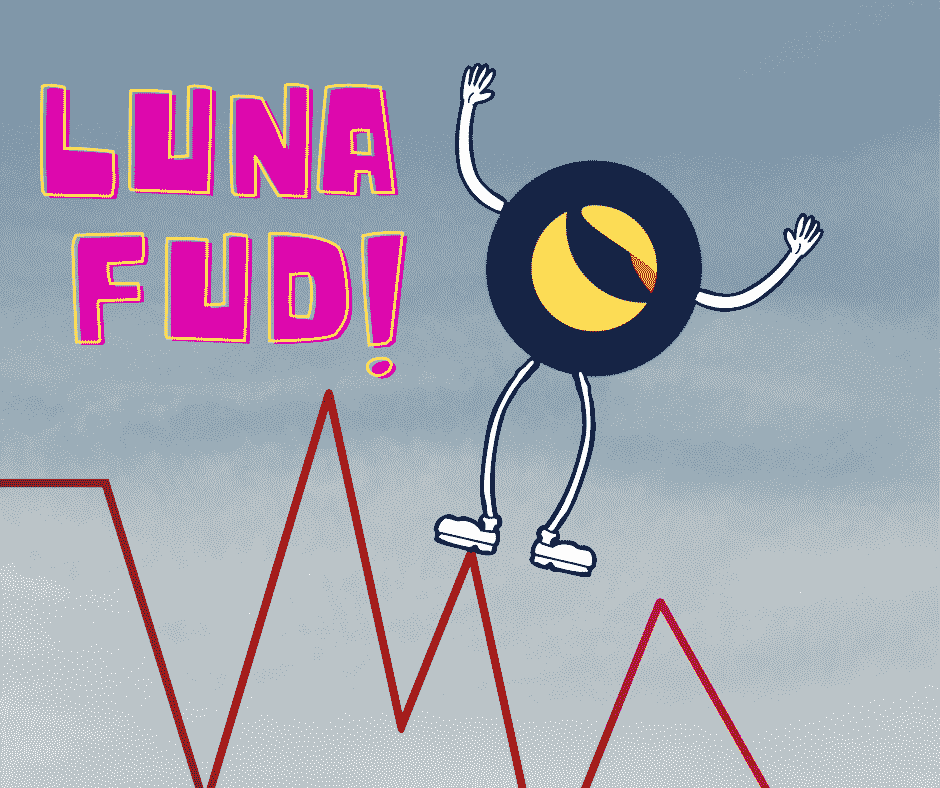

# 露娜怎么了？

> 原文：<https://medium.com/coinmonks/whats-wrong-with-luna-fc901515207e?source=collection_archive---------2----------------------->

## 我们应该爱上这个卢娜·FUD 吗？

Designed by [Author](https://www.quora.com/profile/Sudarsan-Karki-SuperSudar)

如果你在 2021 年 2 月投资了 LUNA，你就会知道 3 美元的 LUNA 对大多数[加密货币投资者来说是一枚](/coinmonks/5-questions-to-ask-yourself-before-investing-in-cryptocurrencies-d79d251d01ef)[昂贵的硬币](https://qr.ae/pGEuOf)。

除了像我一样知道这种隐藏宝石的潜力的少数疯子，没有人对购买[露娜](https://qr.ae/pGEubJ)感兴趣。