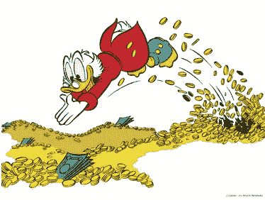
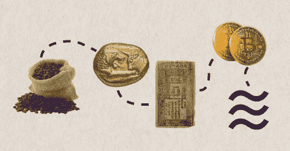
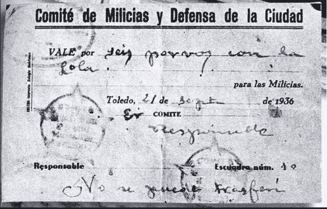

# 钱怎么了？

> 原文：<https://medium.com/coinmonks/whats-wrong-with-money-5ea6cd4ce45f?source=collection_archive---------19----------------------->

**讨伐金钱，一次次失败。**

自从我对经济学产生热情以来，最让我兴奋的领域之一就是*金钱。*

是的，我爱钱，但我的意思不是很多人一开始可能会想到的那样。在把自己想象成“史高治·麦克老鸭”，在我的金库里积累了过多的黄金之后，我会稍微清醒一些。

在这篇文章中，我会谈论很多关于钱的内容，但不会过多地提及硬币或纸币。我会更进一步，将*金钱*定义为符合以下 3 个基本特征的一切:

1.价值储存手段

2.交换媒介

3.记账单位(表示价格的单位→ €)

除了这三个基本要素，还增加了一些与它们有密切关系的其他要素，甚至改善了它们的属性(可移动性、可分性、稀缺性等)。).

卡尔·门格尔在他的书《政治经济学原理》中，对货币随时间演变的形式进行了历史回顾，另一个非常有趣的来源是“比特币标准”。令人惊讶的是，牛、某种石头、盐，当然还有黄金，都是历史上的货币。我指的不是易货商品，不，是一种商品，它本身就是一种记账单位和交换媒介，并保持其价值。为了更好地理解这一点，牛是过去一些社会的货币。正如你所看到的，虽然金币是货币，但不是任何一种货币都是金币或纸币，这是我从一开始就想弄清楚的。

[Historia del dinero](https://www.ameliarueda.com/multimedia/breve-historia-dinero)

我想强调这些特性，因为一段时间以来，我一直被其他一些想法或短语困扰着:

*《金钱腐蚀人类》*

*《金钱使人贪婪》*

我们一生中可能至少听过(或想过)一次类似的事情。在某种程度上，他们可能有一些确定性，但在我看来，除了非常不集中，他们还被许多人用作教条式的理由，甚至为废除货币辩护。在我看来，这种行为是天真、无知、幼稚的，而且还带有明显的专制倾向，我们来看看为什么:

*   **无知:**

> 你可以无视现实，但你不能忽视无视现实的后果。
> 
> 安·兰德。

那些想到摧毁某样东西的无知之人，虽然没有意识到某样东西可以变成任何东西，但他们的目标是摧毁一切，甚至不自知。这个案例适用于金钱。

*   **极权主义:**

当西班牙内战在 1936 年开始时，这个国家分成了两派，一派是国民派，即反叛派，另一派是共和派。国民党赢得了这场冲突，这主要归功于其内部不同派系的团结。更加分裂的共和党是我们要关注的一方。

战争开始后不久，内部的共和党派系开始把每个人拉到自己一边，一些像共产主义者或无政府工团主义者试图在他们控制的领土上进行革命。在无政府主义者中，他们将工厂、土地集体化，甚至在事实上废除了货币。尽管如此，其他支付手段出现了，当然更伦理或道德优越。

“A voucher for having sex with Lola, valid for 6 uses”

不难解释为什么共和国的比塞塔遭受了严重的通货膨胀，其经济一直萎靡不振，直到 1939 年战争结束。

> 结果是，直到 1939 年 3 月，以 1936 年 7 月为基数 100，共和党领地的通货膨胀率为 14，285%，而在国家领地为 138%。
> 
> [https://www . lainformacion . com/economia-nego CIOs-y-finan zas/ASI-acabo-la-Guerra-civil-con-la-peseta-republicana-hace-ahora-o chenta-anos/6496979/](https://www.lainformacion.com/economia-negocios-y-finanzas/asi-acabo-la-guerra-civil-con-la-peseta-republicana-hace-ahora-ochenta-anos/6496979/)

1917 年布尔什维克革命后，俄罗斯也发生了类似的事情:

> 正如彼得·博特克(Peter Boettke)在他的《那个时期的经济史》(economic history of the period)中指出的那样，1918 年 8 月的一项法令“决定所有交易都应该通过会计票据进行，而不使用货币。”所有的货物都要通过配给卡来分发。
> 
> 劳伦斯·H·怀特,《经济观念的冲突》。

这种措施是毁灭性的。为了给我们一个概念，它们包括消除价格，价格是“经济的石油”,不要忘记，它们是告诉我们某样东西是贵还是便宜，是稀缺还是丰富等等的指标。不仅如此，这意味着用一个简单而可怕的法令或规则一下子抹去任何人的部分财富。显然这只能通过胁迫个人来实现。

这些措施的一些经济后果是，例如，俄罗斯 1920 年的工业生产是其 1916 年产出的 20%。

> 加入 Coinmonks [电报集团](https://t.me/joinchat/Trz8jaxd6xEsBI4p)，了解加密交易和投资

*   **孩子气:**

几个月前，我读了一篇文章，它为人们积累金钱的事实提供了解决方案，并提出了一个替代方案，即只有一种货币的社会，一种人们可以使用的*数字令牌*(强制的)，但它会随着先前编程的时间的流逝而消失。这保证了一个更加平等的社会，消除了遗产继承的祸害，当然，一切都是公平合法的。

做梦是免费的。

**结论:**

最后，我想解释一下，与金钱的斗争不值得，没有意义，最重要的是，这是浪费时间。我们将会淘汰一项必要的技术，使我们变得更加贫穷和原始。摧毁货币是不可能的，因为它只不过是一种工具，顺便说一下，还是一种非常有用的工具。钱是手段，本身不是目的。让我们补充一下，它并不像我们所看到的那样具有独特的形状。

金钱可以让我们在一段时间内储存我们所做的努力，从而能够在未来的某个时间利用它，或者如果我们发现自己处于需要的情况下，它可以让我们在很长一段时间内保持价值，完全由我们支配。

所有这些都至关重要，如果你试图强迫人们使用一种他们无法长期积累的货币，你将是在荒野中布道。这些人会试图获得能保值的商品或财产，这是纯粹的人性。这将是像试图禁止音乐一样疯狂的事情，为此你将不得不抹去人类的足迹，如果这还不够，它很可能迟早会自发地重新出现。总而言之，接近生活在一个没有钱的世界的理想的唯一方法，就是极权主义，就这么简单。

*希望这篇文章有趣，如果你有任何其他看法或意见，请在评论中告诉我，另外，不要忘记分享这篇文章，如果你喜欢它，请鼓掌！*