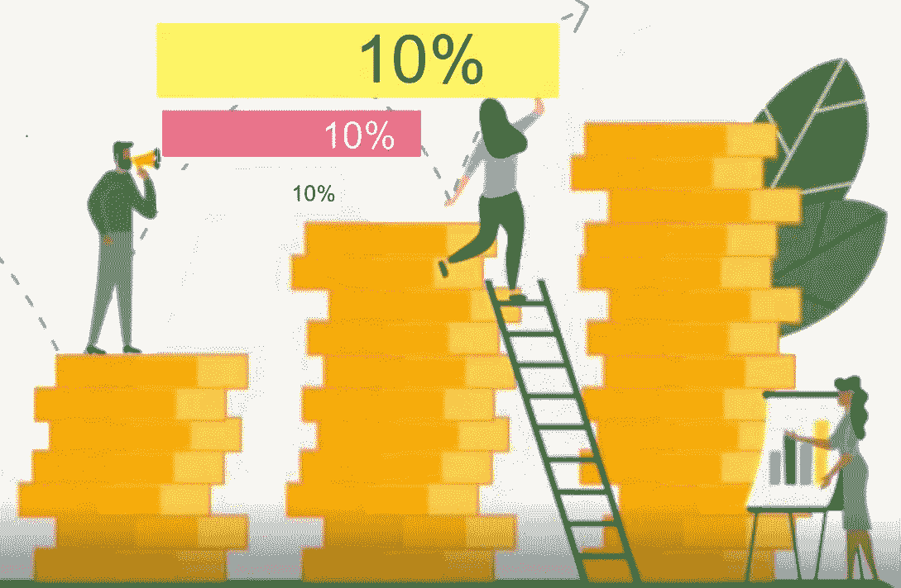
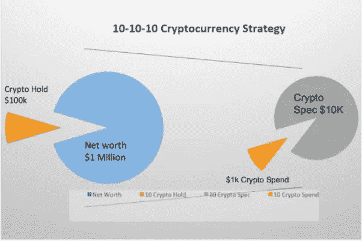

# 你的 10-10-10 BTC 战略是什么？

> 原文：<https://medium.com/coinmonks/whats-your-10-10-10-btc-strategy-284fe8b19e9a?source=collection_archive---------63----------------------->

如果你有时间，听听迈克尔·塞勒的最新播客#276 。你将听到迈克尔谈论加密经济中的交易速度与最终结算的法定经济相比:“通过加密经济的货币速度比消费经济中的货币速度快 10，000 倍。”令人惊讶，但并不奇怪，因为仅 BTC 一地就有 35 万笔交易。

这个庞大的交易量也解释了为什么在我写这篇文章的时候，比特币已经上涨了 300，000%,也解释了为什么我认为它在未来 5 年内至少会上涨 10 倍。(这顺便让我很保守。)下一个目标是翻转黄金，突破 10 万亿美元市值。今天还不到 1 万亿美元。

我们还将看到 NFT 和支持它们的底层加密货币成为现实，为它们提供效用。目前，基本的技术标准相当于 2003 年左右，当时我正拿着一部运行 Palm 操作系统的[京瓷 6035](https://en.wikipedia.org/wiki/Kyocera_6035) 智能手机到处跑。然而，由于微软和 GameStop 都进入了 NFTs，这将肯定是一件事和一种方式，不仅是为了身份，也是为了加密经济中的身份。

虽然整个秘密经济在很大程度上是蛮荒的西部和早期，但当你考虑所有这些因素时，它不需要 10 年就能完全破坏我们所知道的商业。甚至与我交谈过的怀疑论者，如四大咨询公司的合伙人，也同意这个技术周期在 2003 年将比智能手机发展得更快。就其本身而言，在可预见的未来，比特币将继续成为安全港、最终结算和价值储存手段——特别是在它继续迈向 10 万亿美元市值的道路上。

这让我想到了这篇文章的标题:10-10-10。很久以前，当我第一次进入销售行业时，我了解到明智的做法是把薪水的 10%存起来以备不时之需，因为你可能会有一段时间没有薪水。

简单地说，未来 10 年，10%的净财富应该是比特币，作为长期价值储存手段。在这 10%的篮子中，你可能想在其他加密货币上进行 10%的短期投机，如以太坊和索拉纳，这些货币支持 [NFTs](https://www.investopedia.com/non-fungible-tokens-nft-5115211) 、 [Web3、](https://en.wikipedia.org/wiki/Web3)和 [Defi](https://www.investopedia.com/decentralized-finance-defi-5113835) 最后，在你的加密经济游戏中注入一些乐趣:再拿 10%开始花你的比特币。去买一个轻薄的 NFT，作为游戏、俱乐部或社交媒体炫耀的一部分。用比特币支付和朋友的午餐，(注意，我总是事后补货。)或者开始寻找支持艺术家和工匠的新方式:从 crypto 的街头小贩那里购买街头艺术。甚至送一些密码到非洲，直接支持新兴经济体、艺术家、制造商和家庭。

10% Networth Strategy

如果你和我一样，你可能想持有 20%或更多的加密股份，这在我看来实际上是一种更保守的方法。像今天网飞股市下跌 35%的可能性接近于零。也许下降了 10-15 %,但是如果你能在未来几年内坚持每周、每月和每年的价格波动，你会更加财务安全。

我们仍处于这一突破性经济的早期，其发展速度是传统消费经济的 1 万倍。[趁早不晚。在短短的 10 年里，你会很高兴你做出了这一举动。](/coinmonks/bitcoin-its-not-too-late-to-be-early-eae365c0388b)

祝一切顺利，

吉姆(人名)

> 加入 Coinmonks [电报频道](https://t.me/coincodecap)和 [Youtube 频道](https://www.youtube.com/c/coinmonks/videos)了解加密交易和投资

# 另外，阅读

*   [WazirX vs CoinDCX vs bit bns](/coinmonks/wazirx-vs-coindcx-vs-bitbns-149f4f19a2f1)|[block fi vs coin loan vs Nexo](/coinmonks/blockfi-vs-coinloan-vs-nexo-cb624635230d)
*   [BlockFi 信用卡](https://coincodecap.com/blockfi-credit-card) | [如何在币安购买比特币](https://coincodecap.com/buy-bitcoin-binance)
*   [火币交易机器人](https://coincodecap.com/huobi-trading-bot) | [如何购买 ADA](https://coincodecap.com/buy-ada-cardano) | [Geco。一次复习](https://coincodecap.com/geco-one-review)
*   [加密复制交易平台](/coinmonks/top-10-crypto-copy-trading-platforms-for-beginners-d0c37c7d698c) | [五大 BlockFi 替代方案](https://coincodecap.com/blockfi-alternatives)
*   [CoinLoan 点评](https://coincodecap.com/coinloan-review)|[Crypto.com 点评](/coinmonks/crypto-com-review-f143dca1f74c) | [火币保证金交易](/coinmonks/huobi-margin-trading-b3b06cdc1519)