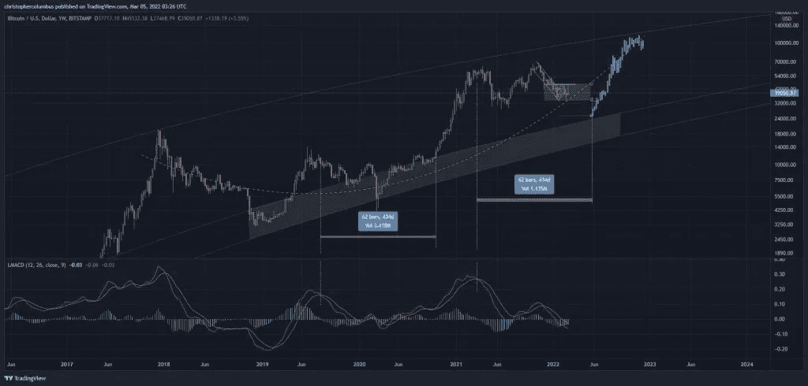
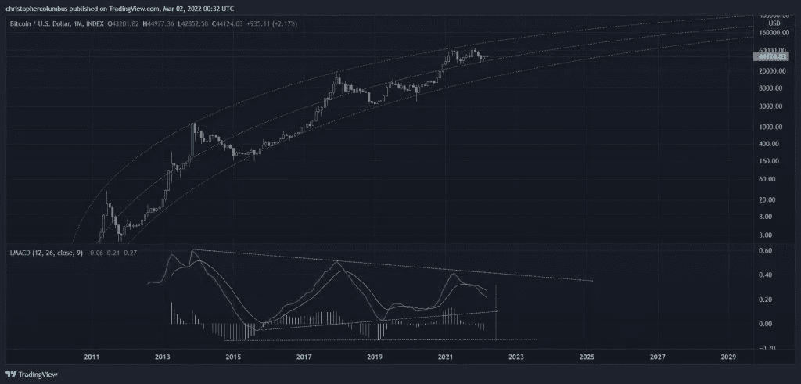

# 当一位专家说比特币将在 2021 年崩溃时，他为比特币的发展制定了一个计划

> 原文：<https://medium.com/coinmonks/when-an-expert-said-bitcoin-would-collapse-in-2021-he-made-a-plan-for-how-it-would-go-forward-30a13a2c3af1?source=collection_archive---------54----------------------->

**Visit our website:-** [**https://bitcoinsupports.com/**](https://bitcoinsupports.com/)

加密货币分析师正确预测了比特币在 2021 年 5 月的灭亡，揭示了 BTC 今年达到六位数大关的可能路径。据匿名分析师戴夫·波(Dave the Wave)称，比特币今年仍有望达到 10 万美元——但有一个警告。

“这是给公牛的。调整微观和宏观尺度。今年，10 万美元唾手可得……”

**Visit our website:-** [**https://bitcoinsupports.com/**](https://bitcoinsupports.com/)

虽然 Dave the Wave 的图表预计今年晚些时候将大幅反弹至约 120，000 美元，但它也预测在任何看涨运动开始之前，将会严重下跌至 25，000 美元左右。

当被问及欧盟战争、供应链受限和油价上涨等地缘政治原因是否会对比特币造成压力时，加密分析师断言，这些情况实际上可能对加密货币有利，使其摆脱投机阴影。你可能是对的，但在这种情况下，BTC 作为一种替代货币也可能会复兴虽然加密研究员认为比特币在未来几个月有上涨的潜力，但他认为加密货币目前在长期基础上是负面的。戴夫·波指出，BTC 的月度移动平均趋同背离(MACD)仍在闪烁红色。MACD 是一个趋势跟踪指标，表明看涨或看跌势头的强度。

**Visit our website:-** [**https://bitcoinsupports.com/**](https://bitcoinsupports.com/)

更有可能的是，MACD 将重置为零或接近零，而不是价格以相同的角度下降。"

**访问我们的网站:-**[**https://bitcoinsupports.com/**](https://bitcoinsupports.com/)

**免责声明:以上为作者观点，不应视为投资建议。读者应该自己做研究。**