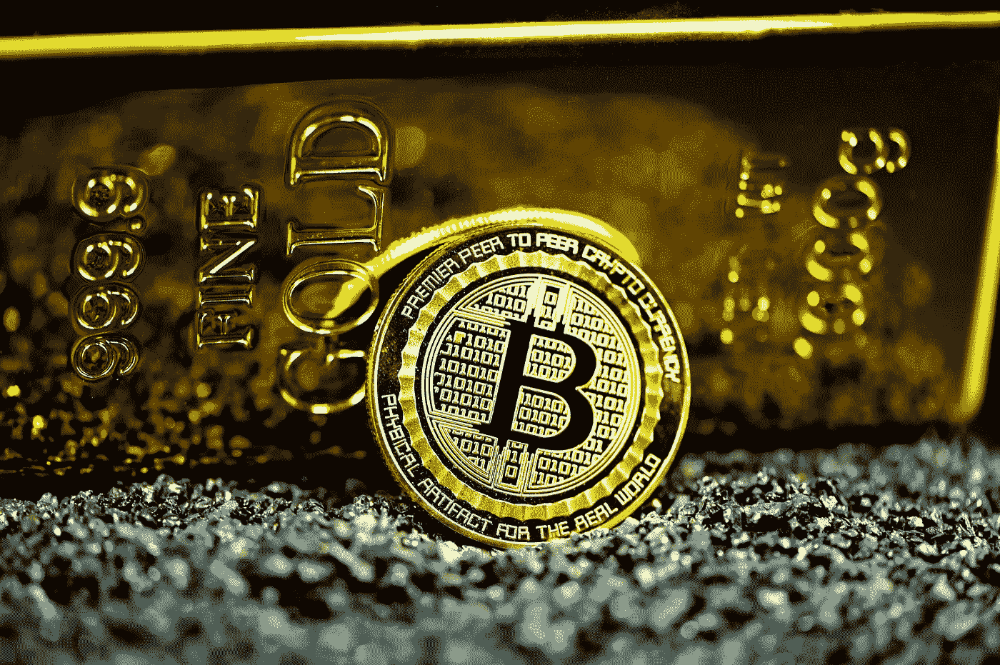

# 当比特币遇到通货膨胀

> 原文：<https://medium.com/coinmonks/when-bitcoin-meets-inflation-dae12b564110?source=collection_archive---------32----------------------->

Source photo Unsplash.com

从技术上来说，比特币应该是一种很好的通胀对冲工具，那么为什么在最近的市场中，比特币的价格没有表现出这样的作用呢？

## 观察证据

美国的通胀率目前徘徊在 7.9%，欧元区为 5.8%，印度为 6.0%，英国为 5.5%。地缘政治的不确定性推高了能源和大宗商品价格…