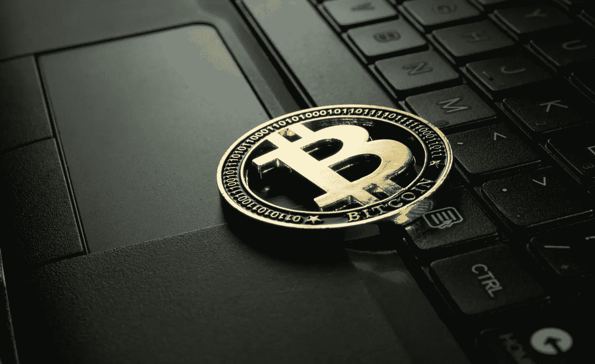

# 当名人投资者凯文·奥利里认为比特币可能达到 30 万美元时

> 原文：<https://medium.com/coinmonks/when-celebrity-investor-kevin-oleary-believes-bitcoin-may-hit-300-000-43a3b20acfa5?source=collection_archive---------6----------------------->

Image via [Unsplash.com- Jievani Weerasinghe](https://images.unsplash.com/photo-1622630998477-20aa696ecb05?ixlib=rb-1.2.1&ixid=MnwxMjA3fDB8MHxwaG90by1wYWdlfHx8fGVufDB8fHx8&auto=format&fit=crop&w=1246&q=80)

## Crypto 最近一直在挣扎，但是一个著名的投资者相信下一个大的催化剂将是监管的后果

和其他加密技术一样，[比特币(BTC)](https://www.coinbase.com/price/bitcoin) 最近几个月也在苦苦挣扎。在年初达到 69，000 美元的历史高点后…