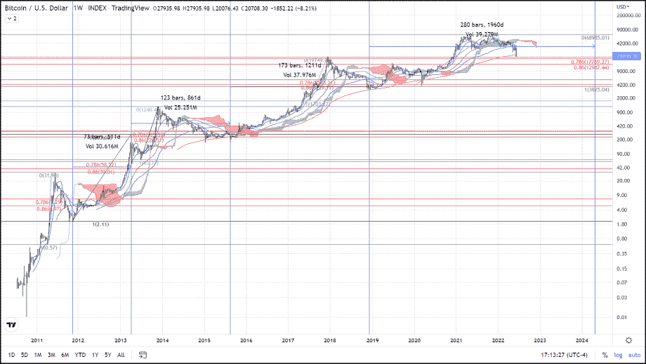
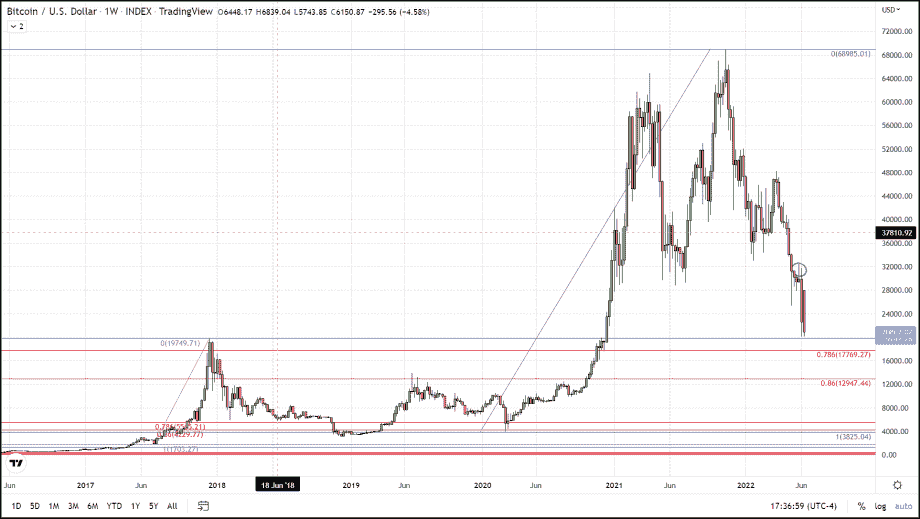
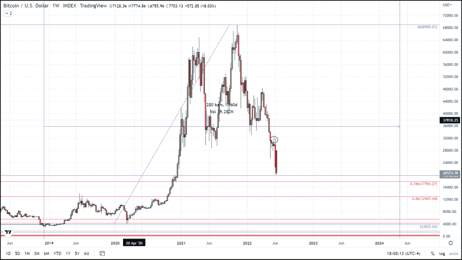
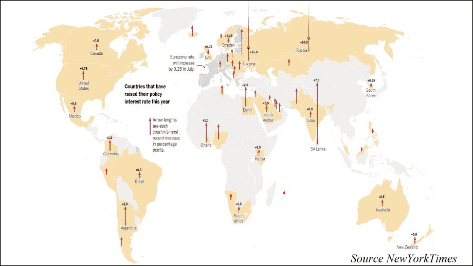

# 比特币什么时候能找到底部？

> 原文：<https://medium.com/coinmonks/when-could-bitcoin-find-a-bottom-e3084cfec03e?source=collection_archive---------49----------------------->

比特币只是在做它一直在做的事情，追溯到 2011 年 BTC 从大约 0.50 美元飙升至 32 美元的每一次抛物线反弹后，随后都有一次回调，在另一轮牛市开始前抹去了至少 78%-86%的涨幅。

这种行为的一个有趣的方面是，每次比特币这样做，它都需要更长的时间到达底部。如果你看看比特币达到这一修正水平所需的时间，并乘以 1.618，你会得到一个非常接近下一次抛物线反弹到达这一区域所需时间的数字。例如，如果你查看第一次抛物线反弹(2011 年 8 月 1 日)后 78%-86%回撤的日期，并标记下一次出现的时间，你得到的总距离是 511 天。如果你将 511 乘以 1.618，你会得到 826，这与比特币在下一次抛物线反弹后见底的时间相差不到 40 天。然而，这个等式越往前走越不精确，例如，下一次发生的时间范围是 1，211 天，但是上面使用的等式将给出 1，393 的答案，这与实际数字相差 182 天。

当我们做这个等式来尝试并确定比特币何时会在当前的修正中找到底部时，我们得到 1959 天，这使得底部发生在 2024 年 4 月，接近下一次减半事件的时间。不管这是不是比特币找到底部的日期，我们可以肯定的一点是，每次比特币找到底部都需要更长的时间，我们已经超过了上次从底部到底部的时间框架，即 1211 天。我不认为我们已经到了底部，因为我们还没有到达 78%-86%的关键回撤区域，以美元计算是 17，769-12，947 美元。

尽管我们可能很容易在当前价格找到一些临时支持，因为它与 2017 年底达到的上一个周期的顶部 20，000 美元相匹配，但我不认为这是我们真正触底的地方。宏观经济因素表明，不仅美国，而且全世界都可能出现衰退，全球各国央行都在竞相试图通过加息来控制通胀。据《纽约时报》报道，“在美联储采取行动的几个小时内，巴西、沙特阿拉伯和其他国家宣布了利率变化。周四上午，瑞士和英国紧随其后。FactSet 的数据显示，到 2022 年为止，至少有 45 个国家提高了利率，还会有更多举措。

随着全球国内生产总值(GDP)的下降，股票将会跟随下跌，股票和比特币之间的相关性意味着比特币的价格也会受到拖累。这种“清洗”将淘汰许多弱者和机构，他们将从比特币中撤出资本，只留下真正的信徒来抵御风暴，并从下一轮牛市中获利，我们预测下一轮牛市将在 2024 年春夏发生。

尽管我们可能很容易在当前价格找到一些临时支持，因为它与 2017 年底达到的上一个周期的顶部 20，000 美元相匹配，但我不认为这是我们真正触底的地方。宏观经济因素表明，不仅美国，而且全世界都可能出现衰退，全球各国央行都在竞相试图通过加息来控制通胀。据《纽约时报》报道，“在美联储采取行动的几个小时内，巴西、沙特阿拉伯和其他国家宣布了利率变化。周四上午，瑞士和英国紧随其后。FactSet 的数据显示，到 2022 年为止，至少有 45 个国家提高了利率，还会有更多举措。

*最初发表于*[T5【https://thegoldforecast.com】](https://thegoldforecast.com/crypto/2022/when-could-bitcoin-find-bottom)*。*

> 加入 Coinmonks [电报频道](https://t.me/coincodecap)和 [Youtube 频道](https://www.youtube.com/c/coinmonks/videos)了解加密交易和投资

# 另外，阅读

*   [加密货币储蓄账户](/coinmonks/cryptocurrency-savings-accounts-be3bc0feffbf) | [YoBit 审核](/coinmonks/yobit-review-175464162c62)
*   [Botsfolio vs nap bots vs Mudrex](/coinmonks/botsfolio-vs-napbots-vs-mudrex-c81344970c02)|[gate . io 交流回顾](/coinmonks/gate-io-exchange-review-61bf87b7078f)
*   [CoinFLEX 评论](https://coincodecap.com/coinflex-review) | [AEX 交易所评论](https://coincodecap.com/aex-exchange-review) | [UPbit 评论](https://coincodecap.com/upbit-review)
*   [AscendEx 保证金交易](https://coincodecap.com/ascendex-margin-trading) | [Bitfinex 赌注](https://coincodecap.com/bitfinex-staking) | [bitFlyer 审核](https://coincodecap.com/bitflyer-review)
*   [Bitget 评论](https://coincodecap.com/bitget-review)|[Gemini vs block fi](https://coincodecap.com/gemini-vs-blockfi)cmd |[OKEx 期货交易](https://coincodecap.com/okex-futures-trading)
*   [AscendEx Staking](https://coincodecap.com/ascendex-staking)|[Bot Ocean Review](https://coincodecap.com/bot-ocean-review)|[最佳比特币钱包](https://coincodecap.com/bitcoin-wallets-india)