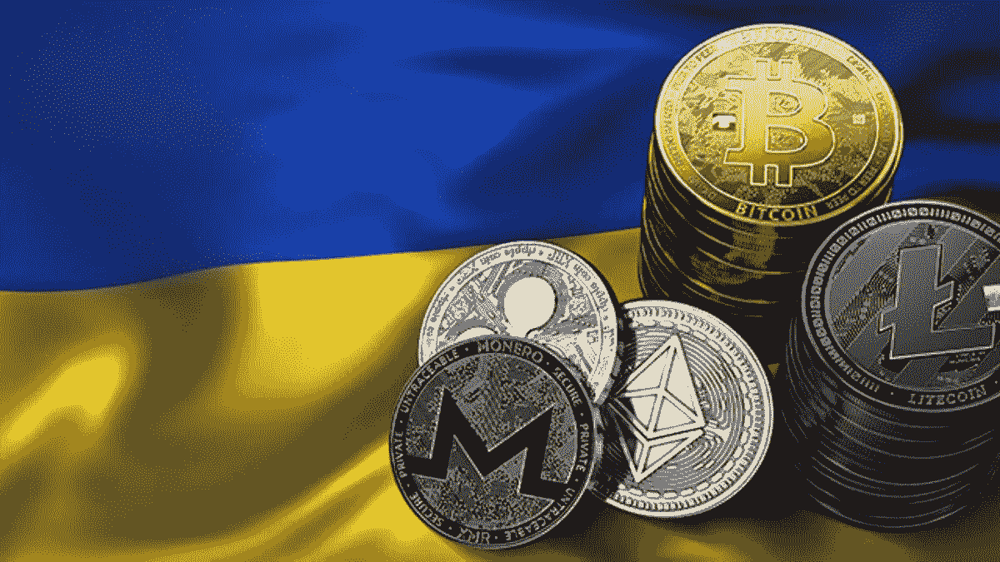

# 当加密进入医疗保健领域

> 原文：<https://medium.com/coinmonks/when-crypto-comes-to-healthcare-8215b3952971?source=collection_archive---------35----------------------->

Credit: Bitcoinist

乌克兰和俄罗斯之间的冲突有很多说法。当然，对世界上大多数人来说，这被认为是一种侵略，一场两国之间的战争。对俄罗斯来说，这是一项“维和”任务。然而，我无法忘记的描述是，我相信*《华盛顿邮报》*《首先使用了:这是世界上第一场密码战争。

一名前美国情报官员[告诉尼克·比尔顿](https://www.vanityfair.com/news/2022/03/russias-invasion-of-ukraine-puts-cryptocurrencies-at-the-heart-of-war)“乌克兰战争感觉有些不同。“我们以前见过推特上记录的战争和互联网上分享的图像，但这一次不只是炸弹和子弹；这场战争从上到下都是数字化的。”比尔顿先生说:“中心是加密货币。”

如果加密已经开战，医疗保健还会远吗？

《华盛顿邮报》的文章是在战争初期，主要关注俄罗斯可能如何试图使用加密技术来减轻已经实施的许多金融制裁的影响。这仍然是一个令人担忧的问题，但此后发生的事情让许多人对加密的使用大开眼界。据区块链分析公司 Elliptic 称，乌克兰已经筹集了大约 6000 万美元的加密捐款，这些捐款直接捐给了乌克兰政府和“活着回来”非政府组织。这些捐款不仅用于物资和人道主义救援，也用于购买军事装备。乌克兰在一定程度上利用加密技术为这场战争筹集资金。

Credit: Good Word News

加密已经成为最受欢迎的捐款方式，因为这种交易比银行或其他更传统的方式更快、更便宜，即使银行或其他金融机构可能受到网络或物理攻击(或者，如果他们在俄罗斯，已经受到制裁)，也可以这样做。加文·布朗教授写道:“通过直接面向世界人民，乌克兰政府已经能够在不需要金融中介的情况下快速筹集资金。”

Elliptic 首席科学家汤姆·罗宾逊[告诉*美国消费者新闻与商业频道*](https://www.cnbc.com/2022/03/03/ukraine-raises-54-million-as-bitcoin-donations-surge-amid-russian-war.html)

*Axios* [的丹·普里马克断言](https://www.axios.com/russia-ukraine-war-crypto-cdade191-7e94-4cea-a580-f3a62fa81506.html)“这是密码行业的关键时刻。”

“近十年来，”他继续解释道，“加密鼓吹者一直表示，这项技术最大的好处之一是帮助用户避免宏观经济混乱……俄罗斯对乌克兰的战争，包括对两国的金融影响，是他们心中所想的。”他认为，测试将是实用性和接受度。

乌克兰尤其准备好了一场秘密战争。甚至在冲突之前，chain analysis[已经将](https://blog.chainalysis.com/reports/2021-global-crypto-adoption-index/)乌克兰列为欧洲顶级加密货币适配器，世界第四。去年九月，它将加密货币合法化，并且已经开始试用电子货币电子格里夫纳。它有一个数字转型部，其 31 岁的副部长 Alex Bornyakov 正在掀起很大的波澜。

加密货币并不总是以其稳定性而闻名，但如果你是一名乌克兰难民，携带现金可能会被视为有风险，因此将你的钱放在数字钱包中可能是一种谨慎的策略。同样，如果你是一名俄罗斯公民，他的银行正在崩溃，卢布价值正在崩溃，万事达卡和维萨卡已经失效，将你的钱投入加密货币突然变得很有意义。

普里马克表示:“但即使是最顽固的勒德分子，也很难不怀疑储存一点“数字黄金”是否明智，以防他突然发现自己生活在下一个乌克兰或俄罗斯。”

这似乎与医疗保健相去甚远。美国没有处于战争状态(除非你把网络攻击算在内)，我们的医疗体系不缺乏赚钱的途径。没有人真的喜欢医疗保健支付机制的工作方式，每个人都同意它们非常低效，但是，到目前为止，没有人大声疾呼将加密货币引入其中。哦，当然，有一些初创公司[声称提供健康加密货币](https://www.techtimes.com/brandspin/265282/20210912/five-leading-health-based-cryptocurrencies-work.htm)，但它们不会对任何支付者或医疗支付中介构成威胁。

但是，加密技术正在进入医疗保健领域。

Credit: TechBullion

美国仍处于发展数字货币战略的早期阶段；例如，上个月，美联储发布了一份关于央行数字货币的报告。美联储主席杰罗姆·鲍威尔(Jerome Powell)曾表示:“我认为正确行事比快速行事更重要。”。国会已经举行了听证会，无疑[会举行更多的](https://www.pymnts.com/cryptocurrency/2022/ubs-no-united-states-crypto-regulations-anytime-soon/)。支持数字货币的人指出，数字货币可以降低交易成本，并有可能帮助没有银行账户的人。

大多数人认为有必要进行监管，但参议院财政委员会主席罗恩·怀登参议员警告说:“很明显，(关于更严格的监管)存在争议，但我想站在创新者一边，”他将当前的加密环境与互联网的早期进行了比较。

这就是问题的关键。我们不知道加密货币将被用于什么——谁想到它会成为实际战争的关键部分？—但我们无疑想得不够多。交易成本更低？你好，医疗支付！没有银行账户的人？你好，没有保险的人！绕过中介？再见，健康保险公司！

让我们只希望医疗保健对加密技术的应用不会像对互联网那样缓慢(而且最初也不多见)。

乌克兰战争并不出人意料。几个星期以来，美国一直在告诉全世界普京总统将要做什么，他做到了。但是，正如 Alex Bornyakov [上周](https://techcrunch.com/2022/03/02/ukraine-deputy-minister-talks-it-army-and-deploying-25m-in-donated-crypto/?tpcc=tcplustwitter)告诉 *TechCrunch* 的那样，“战争不是四天前开始的。这已经持续了八年，”指的是俄罗斯 2014 年占领克里米亚。乌克兰在这八年中准备的方法之一是为加密做好准备，现在他们正在受益。

同样，没有人会相信我们目前的医疗体系能够继续下去。该是秋天了。它必须变得更便宜、更快、更高效、更公平。加密不是解决方案，但它将是解决方案的一部分。我们应该做好准备。

所以:为乌克兰欢呼，如果可以的话，向它捐款，如果你关心你的健康或你的钱包，开始更认真地思考加密对我们的医疗保健系统意味着什么。