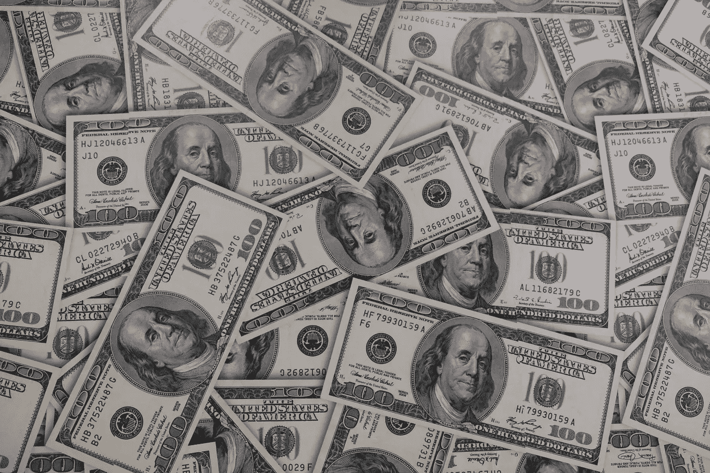

# 当加密支付美元…

> 原文：<https://medium.com/coinmonks/when-crypto-pays-dollars-b0ba2f788ba9?source=collection_archive---------24----------------------->

如果你关注加密市场，你会发现所有加密货币目前都在下跌。

如果你的钱包里有密码，你会意识到在过去的几个月里，密码的价值几乎下降了一半。如果我们回顾一下自 2009 年比特币诞生以来的历史，就会发现一直都有这样的动向。比特币下跌，然后它作为一个大浪潮回来，并制动所有…