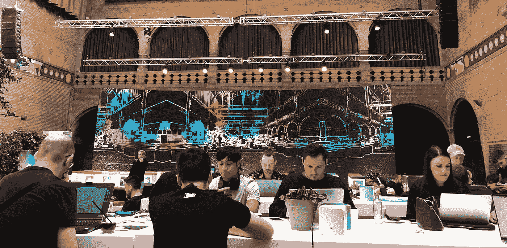
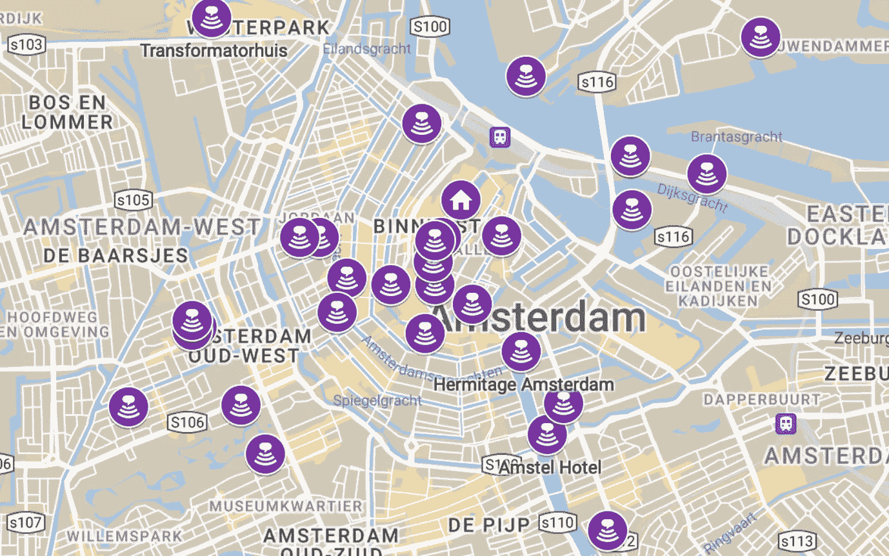
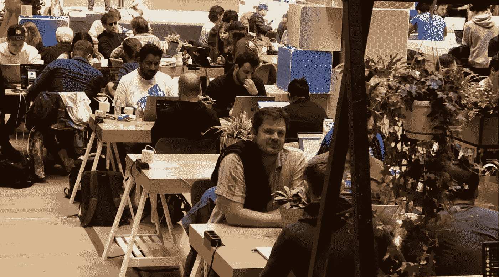
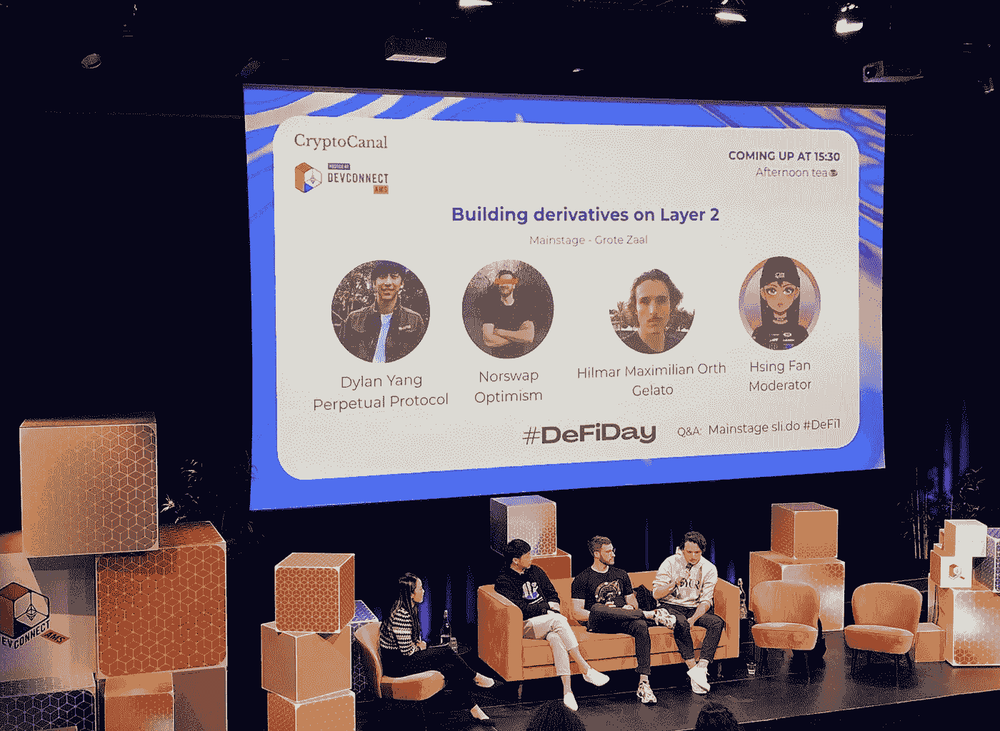
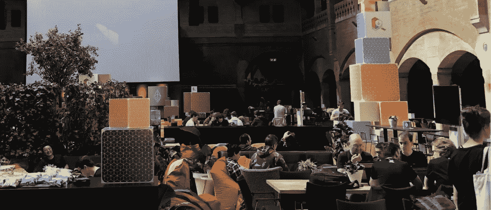
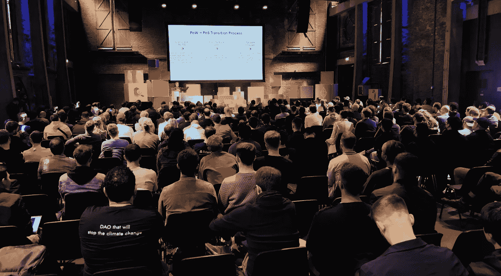
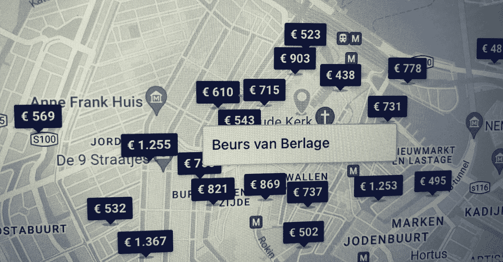

# 当 ETH 来到镇上

> 原文：<https://medium.com/coinmonks/when-eth-comes-to-town-977389592395?source=collection_archive---------9----------------------->

*当地社区对 Devconnect 的看法*

米 *阿尔滕* [*探索区块链*](https://www.linkedin.com/in/maartensmakman/) *，启动 NFT——探索工程* [*难道是哥白尼？*](https://isitcopernicus.art) *并且是* [*布洛克登*](https://www.meetup.com/Permissionless-Society/events/vqmtrsydchbpb/) *的成员，一个阿姆斯特丹的区块链爱好者社区。如果你对他对 Devconnect 的迷人世界的思考有任何补充，* [*让他知道*](http://msmakman@me.com) *！*

**1)** **开发者**

然后以太坊突然在阿姆斯特丹登陆。一群好奇的人在你自己城市的街道上游荡了八天。充满惊奇、有趣和特别的人的一周。难忘的一周。还有一周的学习时间。

从阿姆斯特丹的角度思考 Devconnect。

Co-creation @ the Beurs van Berlage

**2)撞击**

evconnect 是同类产品中的第一款。以太坊基金会旨在进一步发展其生态系统，并超越以开发者为中心的敌无双。因此，Devconnect 的概念应运而生:*‘一周，由每个人建立并为每个人服务’。*

在 2021 年底宣布之后，Devconnect 似乎只不过是阿姆斯特丹的又一场活动。对我所在的 Blockdam 社区来说很棒，这个由大约 25 名区块链爱好者组成的团体在过去的五年里每周三在 Beurs van Berlage 有自己的合作聚会。经历了几年的熊市，聚会上经常有相同的面孔，两年的 Covid，甚至没有社交，以太坊基金会选择我们的城市是很特别的…所以来吧！

当信息在三月底开始流传时，整个马戏团，官方活动页面上不超过 20 个活动，似乎并不那么令人兴奋。

但是从四月初开始，事情突然变得很快。一场附属活动和派对的海啸开始启动，直到 4 月 18 日开始，规模如此之大，甚至以太坊基金会似乎都应接不暇。

先进的分散组织。

The Devconnect Venues

数以千计的游客(粗略估计从 5000 到 8000)，60 多个官方活动和 150 多个非官方(“非以太坊”)活动，极大地满足了人们的期望。

特别提及并感谢 Beurs van Berlage 的中央合作空间。一个可容纳约 1500 人的蜂箱，游客可以在 10 分钟内到达周围场馆的任何活动场所。安静而且没有广告！—此外，还指回去工作或与人见面的地方。这对所有人都是免费的(嗯，入场费 1 欧元)。一个辉煌的发现！

除此之外，还有各种各样的优质演讲者，有机会与来自世界各地的有事业心的梦想家会面和合作，在城市最美丽的地方举行聚会(作为当地人，我不知道阿姆斯特丹有这么多屋顶酒吧)，步行或骑着特殊的 Devconnect 自行车进行更长距离的参观，所有这些都与可爱的天气(18 度的阳光明媚的春天氛围)有关。

它提供了非凡的 Devconnect 体验。第一，从整体性价比来看，i.m.o .很容易将一个公认的阿姆斯特丹科技盛会(如 Next Web)甩在身后。

**3)学习、想法、网络**

这么多好奇的人在一起竟然是我能想象到的最大的智力糖果店。在一周时间里，你能从哪里从顶尖专家那里学到以太坊的扩展(@ETH-Day)、道治理(在全球治理聚会上)、去中心化金融的来龙去脉(@DEFI-Day)、的最新状态、经济、去中心化身份等？第一个 Devconnect 上知识和新想法的泛滥是无与伦比的。

A panel @ DefiDay

在知识和想法之上是创造的网络。一方面，与来自世界各地的人有着鼓舞人心但稍纵即逝的联系，但尤其是与新建立的本地联系。阿姆斯特丹对密码好奇的人比预期的要多得多。例如，在阿姆斯特丹的场景中，在 Devconnect 上完成所有连接后，已经开始讨论创建一个永久的区块链共同工作空间(例如在 Beurs van Berlage )!

**4)盛传**

这可能是 Devconnect 最重要的个人收获。与公众观点相反(环境污染、毒贩、劣质艺术等等等等)，我一直对区块链聚会的氛围印象深刻。

Devconnect 当然也不例外..参与者非常放松、合作和热情。以太坊社区也被证明是一个非常多样化的社区。希望建立一个更美好的世界，并从中获得乐趣。在我看来，这是 Devconnect 最大的财富！

虽然看起来很矛盾，但这也让我们想到了需要改进的地方。

**5)**上一个关键音符

因为不仅仅是阳光。还有一些需要改进的地方和组织的建议，特别是从当地社区的角度。以太坊基金会和密码社区的教育和娱乐，他们很高兴在自己的城市举办以下 Devconnect:

*慢慢来*

原则上，在宣布(2011 年 12 月底)和执行(2012 年 4 月底)之间有足够的间隔。原则上。但是因为似乎没有人完全掌握事件发展的规模，许多活动只是在最后一分钟才被计划。来不及组织好*和*与合适的受众沟通好。

在我的阿姆斯特丹现实中，这导致了许多不集中的行动。这些社区在不知道具体为谁做的情况下迅速组织了活动，并与场地持有者成为朋友，这些场地持有者被机会主义的秘密风气弄得不知所措，不知道他们最终会去哪一个狂野的西部(“我在这里有一个组织——一个协议？！？—他们想在 8 天内预订 350 人的房间，预算没有问题。这些人是谁？？!').

虽然这是加密精神的一部分，但事实证明，让大多数自愿的社区聚会变得正确太短暂了。机会主义也被证明很难融入更为传统的会议议程。

给任何主办 Devconnect 的当地社区的提示:做好准备，不要低估即将来到你的城市的规模。准备好你的冲浪板，迎接海浪的到来！

***打开***

只有 10 到 15 名阿姆斯特丹学生(自愿)参与了该组织，而几乎所有荷兰加密播客(几乎)都忽略了对 Devconnect 的关注，这让我们想到了第二点:Devconnect 泡沫中的良好氛围值得触及主办城市/国家的更大一部分。

A panel @ Eth Day

在采用方面，Crypto 仍然有相当多的心和思想要赢得，尽管 Devconnect 是否打算这样做还值得怀疑，但确实存在的机会可以比在阿姆斯特丹做的更好地抓住。

Devconnect 为本地加密社区创造了独特的动力。让当地大学和学院参与进来，适当通知媒体，邀请政策制定者，及时让场馆参与进来，等等。等。Devconnect 提供的增加和加强当地社区的机会数不胜数，值得(最好)抓住。

***无权限停留***

然后最常听到的批评是(酒店)价格。从非西方世界的参与者的角度来看，这些简直是荒谬的。虽然很大一部分 crypto 场景认为阿姆斯特丹酒店的价格是理所当然的——有时远远超过 500 欧元——但当群体定居在这样一个昂贵的地方时，crypto 的民主化性质就受到了威胁。这是以太坊基金会的主要任务。

Permissionless hotels

这甚至与接触事件本身无关。他们大多可以自由进入，或者友好的微笑和真诚的好奇是你的入场券。对于每个感兴趣的人来说，更重要的是能够参加整个 Devconnect 周，尤其是当它在阿姆斯特丹这样的城市中心举行时。

解决方案不一定是一个不同的城市。中心位置、良好的基础设施和安全也是有价值的。但有了奖学金或酒店职位，钱包鼓鼓的人也能参加像 Devconnect 这样的活动。每个人都必须能够接触到知识、思想和网络的海啸。事实上，海啸也得益于每个人都能接触到它。

据说 Devconnect 是*‘一个星期，由每个人建立并为每个人服务’。*但是是吗？

**6) Devconnext**

经过这样的一周，过于强调批评感觉不太对。Devconnect 简直太棒了！

此外，也可能是我们的 Blockdam 社区的规模让我们大吃一惊，因为我们不是以太坊事件的永久追随者。这也是第一次 Devconnect，所以没有人确切地知道事件会涉及什么。但是根据我们现在所知道的，我们知道，至少它不能成为下一个 Devconnect 的借口😎。

不管这个群体走向何方，希望下一个 Devconnect 能让当地社区更好地了解他们的未来。可以让更多的人参与进来，以太坊群的影响会更有教育意义，更有趣，更可持续！

> 加入 Coinmonks [电报频道](https://t.me/coincodecap)和 [Youtube 频道](https://www.youtube.com/c/coinmonks/videos)了解加密交易和投资

# 另外，阅读

*   [印度最佳 P2P 加密交易所](https://coincodecap.com/p2p-crypto-exchanges-in-india) | [柴犬钱包](https://coincodecap.com/baby-shiba-inu-wallets)
*   [八大加密附属计划](https://coincodecap.com/crypto-affiliate-programs) | [eToro vs 比特币基地](https://coincodecap.com/etoro-vs-coinbase)
*   [最佳以太坊钱包](https://coincodecap.com/best-ethereum-wallets) | [电报上的加密货币机器人](https://coincodecap.com/telegram-crypto-bots)
*   [交易杠杆代币的最佳交易所](https://coincodecap.com/leveraged-token-exchanges) | [购买 Floki](https://coincodecap.com/buy-floki-inu-token)
*   [3 commas vs . Pionex vs . crypto hopper](https://coincodecap.com/3commas-vs-pionex-vs-cryptohopper)|[Bingbon Review](https://coincodecap.com/bingbon-review)