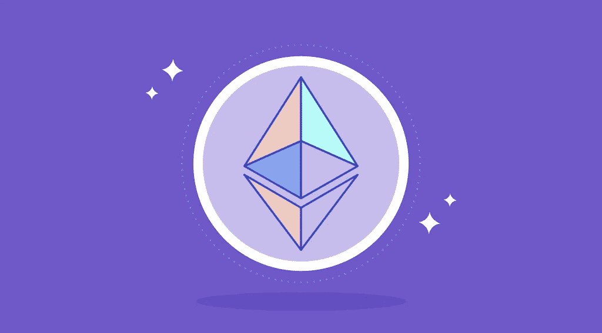
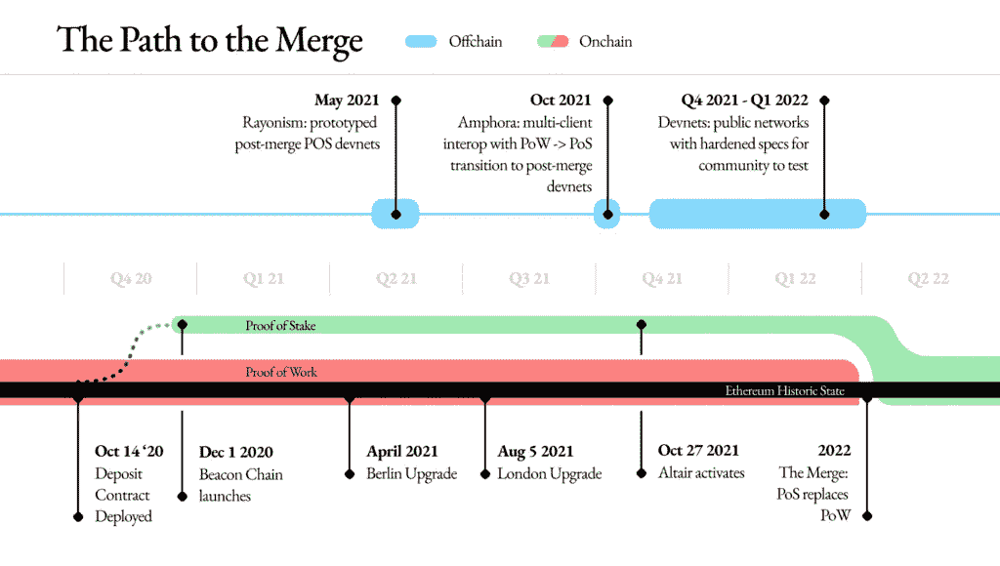
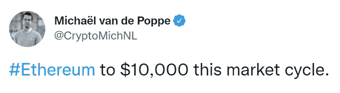

# 以太坊什么时候合并？从电源到 PoS 转换

> 原文：<https://medium.com/coinmonks/when-is-the-ethereum-merge-transition-from-pow-to-pos-136c2d145cf2?source=collection_archive---------5----------------------->

以太坊 2.0，也称为 Eth2 或 Serenity，是以太坊区块链的升级版。它旨在提高以太坊网络的速度、效率和可扩展性，以便它能够处理更多的交易并提供更高的安全级别。在新的 [StealthEX](https://stealthex.io/) 文章中阅读更多关于以太坊合并的内容。

[以太坊 2.0](https://stealthex.io/blog/2020/06/30/ethereum-2-0-why-how-and-then/) 正在分几个阶段推出，第一次更新被称为“信标链”，将于 2020 年 12 月 1 日生效。Beacon Chain 向以太坊区块链引入了本地 staking，这是网络向 PoS 共识机制过渡的一个关键特性。顾名思义，它是一个独立于以太坊主网络的区块链。

合并的第二阶段定于 2022 年。这次升级将意味着 Beacon Chain 和 Ethereum mainnet 的合并，这两家公司现在是分开运营的。随着合并的启动，工作证明算法的使用将结束，以太坊的新时代将开始，它基于信标链中使用的利益证明技术。

# 合并以太坊是什么时候？

几个月来，加密社区一直在等待以太坊合并，这是对以太坊主网络的一次重要更新。确切的以太坊 2 合并日期不得而知，但开发者假设它将在 2022 年夏天实现。

*Source: Ethereum Foundation Blog*

# 以太坊合并是什么？

以太坊目前并行运行工作证明和利益证明链。两个链都有验证器，但是只有 PoW 处理用户的交易。随着升级，以太坊将移动到一个名为信标链的 PoS 链。由于 ETH 的合并，采矿将失去其相关性——相应地，基础设施将变得更加环保。

测试成功后，更新即将推出。2022 年 3 月 14 日，研制人员启动了窑炉测试网，这应该是主网切换到 PoS 之前的最后一步。合并将是 2022 年以太坊发展中最重要的阶段。总体来说，以太坊功能完善的过程包括五个阶段。在合并的集成之后，将实现分片。前两个阶段对以太坊来说是最重要的。

# 等待合并

今年 3 月，ConsenSys 的创始人、以太坊的创建者之一约瑟夫·卢宾(Joseph Lubin)表示，并非所有国家的当局和监管机构都对以太坊持积极态度。他解释说他们误解了项目的实质。

Lubin 提醒公众即将到来的 ETH 合并更新:过渡到 Proof-of-Stake 将增加吞吐量，并消除关于高功耗成本的批评。他补充说，升级将使以太坊巩固其作为新兴分散金融基础设施的关键部分的地位。

4 月初，亿万富翁、著名以太坊支持者马克·库班表示，他对 ETH 2.0 合并持乐观态度。

> 我很看好。
> 
> 马克·库班

据他说，电力开采需要巨大的计算能力，并对环境有不利影响。随着向 PoS 的过渡，以太坊的能耗将降低 99%。此外，库班指出，升级将减少 90%的 ETH 发放量，相应的费用降低将使 ETH 的供应量每年减少 5%。乙醚作为通缩资产，可以成为避险资产。

库班表示，过去有一些领先的加密货币可供新手投资者寻找，但以太坊的潜力最大。

> *作为投资，我觉得以太坊最有上升空间。*
> 
> 马克·库班

他敦促人们在投资加密资产时关注价值主张，并过滤掉“噪音多、收益少”的项目根据他的说法，以太坊的特点是智能合约的存在，允许开发者创建各种 dApps。

在更新之前，燃烧以太币的过程正在加剧:超过 50 亿美元的以太币已经退出流通。由于燃烧减少了以太坊的总体供应，这可能会对价格产生积极影响，推动替代硬币的反弹。因此，密码分析师迈克尔·范·德·波普认为以太坊的价格可以涨到 1 万美元。

四月，著名的密码分析师亚瑟·海斯解释说，今年对以太坊来说将是非常重要的一年。据他介绍，升级后，合并后的以太坊将起到商品债券的作用，这将为投资者提供有利条件。相应的，转型后，赌注者的收益可以是每年 8% -11.5%。

这位商人还强调了以太坊的大量开发者，网络的相对廉价，以及与竞争对手相比的高性能。考虑到这些因素，Hayes 假设 ETH 在 2022 年底的交易价格将超过 10，000 美元。

FXStreet 专家预测以太坊的价格将上涨 20%。

不仅分析师，而且谷歌趋势数据也证实了 ETH 可能增加到 4000 美元。据谷歌趋势报告显示，最近几周“以太坊合并”的搜索查询量大幅增加。

# 合并将如何影响以太坊的价格？

一些分析师认为，过渡到 PoS 将伴随着较高的 ETH 波动性。在更新之后，加密货币的汇率可能会立即出现短期下降，然后急剧上升。

专家解释说，发行的 ETH 硬币数量将减少，这将导致市场供应短缺，这将导致硬币价格上涨。

也有可能扩大以太坊社区由于时尚为“绿色”的趋势，PoS 是著名的，不涉及能源密集型开采。

因此，由于以太坊合并有可能提高 ETH 的安全性、吞吐量和价值，加密货币社区迫不及待地期待这一重要升级。

如果你决定加入加密社区，你可以开始在[即时加密交易所 StealthEX](https://stealthex.io/) 购买自己的硬币。这项服务免注册，不将用户的资金存放在平台上。

## [如何用信用卡购买密码？](https://stealthex.io/blog/2021/03/23/how-to-buy-crypto-with-credit-card/)

就去 [StealthEX](https://stealthex.io/?from=btc&to=eth&amount=0.1) 。打开[购买密码](https://stealthex.io/?amount=100&from=usd&to=btc)窗口，而不是自动加载的交易所。

1.  然后选择法定货币，并选择您想要购买的加密货币。比如 USD 对 [ETH](https://stealthex.io/coin/ethereum) 。
2.  输入您的加密钱包地址。
3.  同意 StealthEX 的服务条款。首次购买 crypto 时，您需要确认您的身份并输入 Mercuryo 系统要求的数据。一旦所有提供的信息将被确认，您将能够购买加密，而无需通过这一程序了。
4.  发送菲亚特，等待您的购买通过！

在 [Medium](https://stealthex-io.medium.com/) 、 [Twitter](https://twitter.com/Stealthex_io) 、 [Telegram](https://t.me/StealthEX) 、 [YouTube](https://www.youtube.com/channel/UCeES_XBesX76ge7xf1meuSw) 和 [Reddit](https://www.reddit.com/user/Stealthex_io) 上关注我们，获取 [StealthEX.io](https://stealthex.io/) 更新和关于加密世界的最新消息。对于所有请求，请通过 support@stealthex.io 给我们发消息。

此处表达的观点仅代表作者个人观点。每一次投资和交易都有风险。做决定时，你应该进行自己的研究。

非常欢迎您访问 [**StealthEX 交易所**](https://stealthex.io/) **，看看它有多快多方便**。

> 加入 Coinmonks [电报频道](https://t.me/coincodecap)和 [Youtube 频道](https://www.youtube.com/c/coinmonks/videos)了解加密交易和投资

# 另外，阅读

*   [3 商业评论](/coinmonks/3commas-review-an-excellent-crypto-trading-bot-2020-1313a58bec92) | [Pionex 评论](https://coincodecap.com/pionex-review-exchange-with-crypto-trading-bot) | [Coinrule 评论](/coinmonks/coinrule-review-2021-a-beginner-friendly-crypto-trading-bot-daf0504848ba)
*   [莱杰 vs Ngrave](/coinmonks/ledger-vs-ngrave-zero-7e40f0c1d694) | [莱杰 nano s vs x](/coinmonks/ledger-nano-s-vs-x-battery-hardware-price-storage-59a6663fe3b0) | [币安评论](/coinmonks/binance-review-ee10d3bf3b6e)
*   [Bybit Exchange 审查](/coinmonks/bybit-exchange-review-dbd570019b71) | [Bityard 审查](https://coincodecap.com/bityard-reivew) | [Jet-Bot 审查](https://coincodecap.com/jet-bot-review)
*   [3 commas vs crypto hopper](/coinmonks/3commas-vs-pionex-vs-cryptohopper-best-crypto-bot-6a98d2baa203)|[赚取加密利息](/coinmonks/earn-crypto-interest-b10b810fdda3)
*   最好的比特币[硬件钱包](/coinmonks/hardware-wallets-dfa1211730c6) | [BitBox02 回顾](/coinmonks/bitbox02-review-your-swiss-bitcoin-hardware-wallet-c36c88fff29)