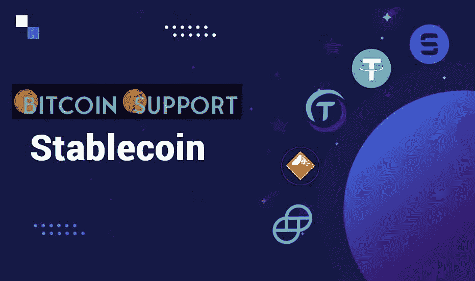

# 说到稳定的硬币分配，多少才算多？

> 原文：<https://medium.com/coinmonks/when-it-comes-to-stablecoin-allocation-how-much-is-too-much-b80f8ab29b0c?source=collection_archive---------53----------------------->

**Visit our website for full blog:-**[**https://bitcoinsupports.com/when-it-comes-to-stablecoin-allocation-how-much-is-too-much/**](https://bitcoinsupports.com/when-it-comes-to-stablecoin-allocation-how-much-is-too-much/)

Stablecoins allow investors to sit on the sidelines while earning a passive income on their investments, but not all stablecoins are made equal.

Because cryptocurrencies are notorious for being volatile assets, skilled traders will find lots of possibilities in this market. If investors plan to hold for a long period, they should expect to be taken on a wild trip. Stablecoins, a type of cryptocurrency that provides price stability tied to the value of fiat currencies, provide a safe haven for investors during market instability, but they may also represent wasted opportunities over time.

Several experts told that ordinary investors should approach cryptocurrencies with a “pay yourself first” mentality, and that a cryptocurrency allocation of up to 5% should be relatively “secure” while allowing for “marginal return.” Stablecoins are different: there is no “marginal return” from just keeping an asset pegged to the value of the US dollar, while returns employing decentralised finance (DeFi) protocols can approach double-digit annual percentage rates (APRs). These measures, on the other hand, increase the risk.

**Different stablecoins come with varying risks**

Stablecoins aren’t all made equal. USD Coin (USDC), Tether (USDT), and Binance USD (BUSD) are the three most popular stablecoins on the market, all of which are backed 1:1 by cash or assets of similar value held by centralised companies. This indicates that there is a dollar in cash, monetary equivalents, or bonds in custody for every token in circulation.

Other stablecoins, such as Dai (DAI) and TerraUSD (UST), have other processes. DAI is crypto-collateralized and overcollateralized, ensuring that it can keep its peg. It has economic mechanisms in place to encourage supply and demand and bring the price down to $1.

UST, on the other hand, is an algorithmic stablecoin that is not collateralized. It is not backed by an underlying asset, as it maintains its peg by algorithmic expansion and supply contraction. Terra, the blockchain that powers UST, has been steadily accumulating reserves for the stablecoin. It has already purchased almost 40,000 BTC worth more than $1.6 billion, as well as more than $200 million in Avalanche (AVAX).

According to Marissa Kim, general partner at Abra Capital Management, which manages the assets of crypto investment firm Abra, “USDC and other U.S.-regulated stablecoins are as safe as keeping reserves in a bank account,” because they are “required to prove on a regular basis that they are fully collateralized.”

Decentralized stablecoins like DAI and UST, according to Kim, may “offer other risks,” such as DAI losing its USD peg due to unpredictable markets. “The MakerDAO community regulates this protocol,” she noted, “and nobody knows who holds and governs this protocol or where voting power may be concentrated.” The “role of USDC and USDT” in the cryptocurrency world, according to Adam O’Neill, chief marketing officer at cryptocurrency trading platform Bitrue, is “synonymous to the position of the US dollar in the traditional financial environment.”

Investors should use stablecoins “as a go-to hedge while trading and keeping their assets,” according to O’Neill. He continued, “

**“Stablecoin’s security viewpoint should not be compared because both the centralised and decentralised versions are secure in their own right.” However, it is also uncommon for hackers to take advantage of flaws in protocols designed to offer products, causing problems for both classes of stablecoin tokens.”**

According to O’Neill, how much money investors should put into stablecoins is a personal choice that relies on their financial objectives. While each stablecoin has its own risk profile, Kent Barton, tokenomics lead at ShapeShift DAO, told that there are a few factors investors should bear in mind.

For one thing, centralised stablecoins like USDC and USDT can be readily converted back into USD, but the companies behind them might “possibly block particular addresses, for example, in response to legal entities’ demands.” While there have always been doubts about the USDT’s support, according to Barton, it has kept its peg thus far:

**“USDT has the advantage of being time-tested: it is the longest-running stablecoin. It has a lot of liquidity on controlled exchanges and on a lot of decentralised platforms.”**

Because of the nature of the blockchains they are founded on, decentralised stablecoins like DAI and USDT, according to Barton, are more transparent. However, there are other dangers, such as turbulent markets endangering DAI’s over-collateralization.

The security of each stablecoin, according to Olexandr Lutskevych, founder and CEO of crypto exchange CEX.io, is determined by how security is defined. Technical assessments should cover the dangers of more vulnerable stablecoins in terms of coding, but most have been known to fit the purpose in terms of reliability of transporting funds from point A to point B. When it comes to stablecoins’ ability to keep their peg against the dollar, Lutskevych believes that how that peg is maintained should be the primary concern of investors.

**DeFi yields on stablecoins: Are they too good to be true?**

While simply keeping stablecoins protects bitcoin investors from market volatility, it also means that they aren’t earning any money unless they put their stablecoins to use. When it comes to stablecoins, there are numerous choices, such as lending them out on controlled exchanges or using blue-chip decentralised finance protocols, which result in minimal yields — frequently around 5% — that are reasonably safe. Moving to riskier procedures or using complicated tactics to increase yield could result in larger rewards but also higher risk.

For example, Waves’ Neutrino USD (USDN) stablecoin, which recently broke its peg and fell below $0.80 before starting to rebound, can be found with yields above 30%. When questioned whether investors should lend their stablecoins or contribute them to the liquidity pools of decentralised exchanges (DEXs) to earn return, Kent Barton of ShapeShift DAO pointed out that DeFi protocols introduce smart contract risks, which must be examined.

**Visit our website for full blog:-**[**https://bitcoinsupports.com/when-it-comes-to-stablecoin-allocation-how-much-is-too-much/**](https://bitcoinsupports.com/when-it-comes-to-stablecoin-allocation-how-much-is-too-much/)

巴顿说，已经实施了“几个月以上，并有保护数十亿美元价值的记录”的协议“相当安全”。然而，“未来的安全和稳定没有保证”是存在的。他声称，回报更高的协议风险更大。根据 Lutskevych 的说法，投资者应该首先准确把握他们投资的东西:

**“仅仅因为它是 DeFi 并不意味着投资原则不适用。”其中一个核心投资理念是“在提出任何策略之前，你应该彻底了解一个人的风险选择和独特情况。”Lutskevych 说，当决定是留在原地还是移动稳定的债券来获得利息时，投资者应该评估他们的资本、时间跨度、雄心和风险承受能力。根据奥尼尔的说法，Stablecoins 应该“通常被用来利用贷款平台的收入”，但投资者应该“准备好抓住任何投资机会。”部分得益于 DeFi 空间，Stablecoins 为投资者提供了各种区块链的丰富选择。在集中交易之外使用它们可能需要一些特定的理解，如果没有这些理解，投资者就有可能因为将资金发送到错误的地址而损失资金。投资产品发行机构 21Shares 的研究分析师卡洛斯·贡萨雷斯·坎波告诉记者，稳定的股票让投资者接触到一个“全球价值转移网络”，类似于互联网如何创造了一个“全球和开放的信息网络”

据 Campos 报道，美国二月份的消费者价格指数(CPI)统计数据显示，与去年同期相比上涨了 7.9%，这意味着个人购买力正在以四十年来从未有过的速度下降。分析师表示，投资者如何处理他们的稳定资产，取决于他们的风险厌恶和知识水平，因为 DeFi 系统中允许用户被动获利的“用户体验”目前“仍然缺乏”Campos 继续说:

**“最明显的例子就是 seed 短语，这是不可行的，不太可能获得广泛的采用。这就是为什么像 Vitalik Buterin 这样的行业领袖强调了广泛采用社会恢复钱包的重要性，这种钱包依赖于监护人而不是种子词。凯西资本管理公司的玛丽莎·金似乎同意坎波斯的观点，她说在 DeFi 协议中，漏洞和其他利用是可行的，这些协议通常在协议的本地令牌中支付更高的收益。“他们经常很不稳定，可能不是很流动，”根据制造商。根据玛丽莎的说法，一些投资者可能准备好承担额外的风险，而另一些投资者则“更关心本金的保全”无论投资者选择哪种方法，稳定的硬币都是比特币生态系统中不可否认的重要元素。更多规避风险的投资者可能会发现，前景有限的最透明的中央稳定银行是他们唯一信任的银行，而更具冒险精神的投资者可能希望获得更多收益和更高风险。**** 

**访问我们的网站获取完整博客:-**[**https://bitcoinsupports . com/when-it-comes-to-stable coin-allocation-how-mud-is-too-much/**](https://bitcoinsupports.com/when-it-comes-to-stablecoin-allocation-how-much-is-too-much/)

**免责声明:以上为作者观点，不应视为投资建议。读者应该自己做研究。**

> *加入 Coinmonks* [*电报频道*](https://t.me/coincodecap) *和* [*Youtube 频道*](https://www.youtube.com/c/coinmonks/videos) *了解加密交易和投资*

# 另外，阅读

*   [有哪些交易信号？](https://coincodecap.com/trading-signal) | [Bitstamp vs 比特币基地](https://coincodecap.com/bitstamp-coinbase) | [买索拉纳](https://coincodecap.com/buy-solana)
*   [ProfitFarmers 回顾](https://coincodecap.com/profitfarmers-review) | [如何使用 Cornix Trading Bot](https://coincodecap.com/cornix-trading-bot)
*   [十大最佳加密货币博客](https://coincodecap.com/best-cryptocurrency-blogs) | [YouHodler 评论](https://coincodecap.com/youhodler-review)
*   [my constant Review](https://coincodecap.com/myconstant-review)|[8 款最佳摇摆交易机器人](https://coincodecap.com/best-swing-trading-bots)
*   [MXC 交易所评论](/coinmonks/mxc-exchange-review-3af0ec1cba8c) | [Pionex vs 币安](https://coincodecap.com/pionex-vs-binance) | [Pionex 套利机器人](https://coincodecap.com/pionex-arbitrage-bot)