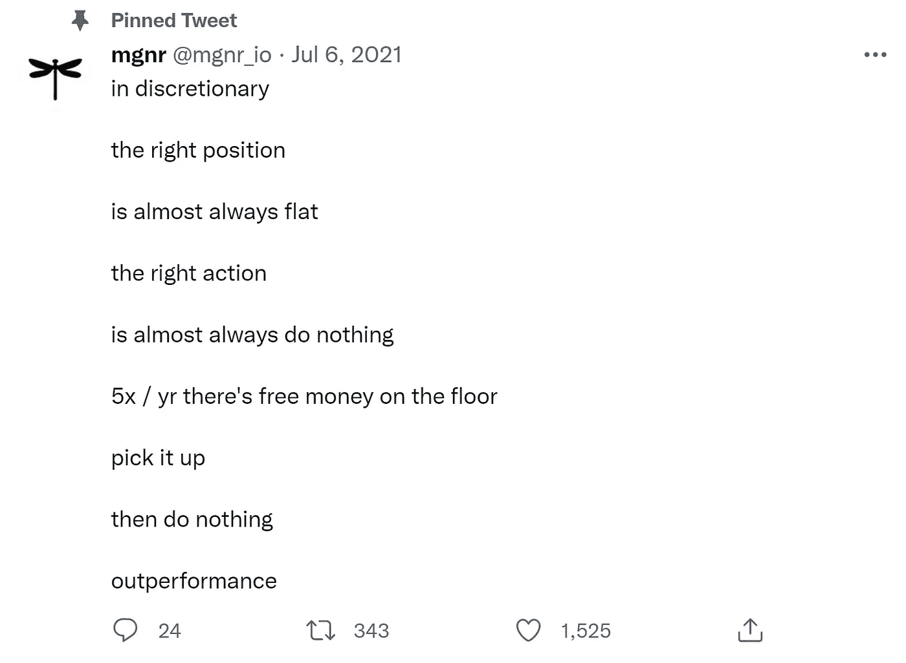
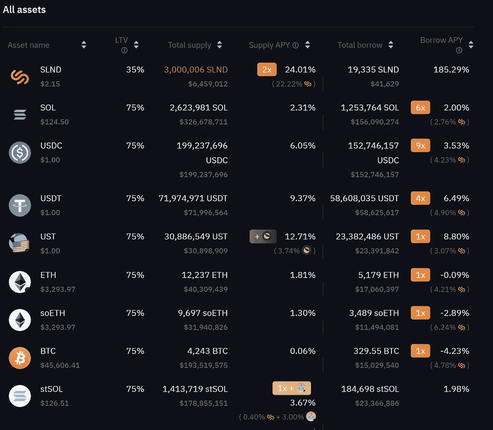
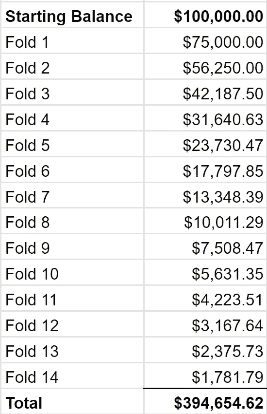
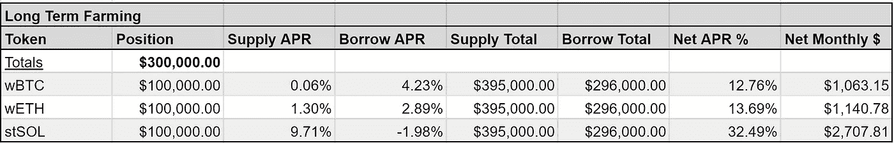

# 当钱长在树上时，你就去摘

> 原文：<https://medium.com/coinmonks/when-money-grows-on-trees-you-pick-it-a02d7f3df5a9?source=collection_archive---------22----------------------->

我是 Slater，Zero1 Capital 的管理成员和加密乐观主义者。Zero1 是一只专注于 DeFi 的数字资产基金。我每隔几周就写一次，目的是帮助人们理解密码市场和 DeFi 策略。以下任何内容都不应被视为对某项战略的认可或用作财务建议，它们仅供参考。

**被钉的推文来自** [**詹姆斯**](https://medium.com/u/5647d5603347?source=post_page-----a02d7f3df5a9--------------------------------)**@**[**mgnr _ io**](https://twitter.com/mgnr_io?s=20&t=_qZ8uQ4orumMArc-qwP4lw)**上的推文:**

除非你只是一个外部观察者或仅仅是一个长期买入并持有的投资者，否则如果你买卖加密货币，你在某种程度上就是一个全权交易者。我认为詹姆斯在很大程度上是正确的，至少在加密方面是正确的。大多数时候，作为一个自由交易者，正确的决定是长期持有稳健且有可能增长的资产。

偶尔，市场会明显超卖，而且普遍情况不会像价格反映的那样糟糕:

长期市场领导者和趋势类别。

偶尔，市场会严重过热，情况会充满泡沫:

考虑对冲持有的衍生空头头寸。

除此之外，密码的关键尤其在于耐心、信念和对闪亮新事物的抵制。

幸运的是，当显然+EV 交易不可用时，加密世界有时确实会在我们无聊时发放免费的钱。DeFi 协议让我们可以将长期持有的股票用于赚取额外收入，而不必预测短期价格行为的方向性，排放增加了火箭燃料，使不切实际的收益率成为现实。

## **当钱长在树上的时候**

*(以下是一个借出/借入折叠策略，允许用户在不卖出的情况下获得高收益。与许多 DeFi 策略一样，也存在相关风险，包括智能合同风险、oracle 故障和黑客攻击。您是否对所有相关风险进行了研究，并且不认为这是对策略的建议。)*

一个我不记得的 Twitter 用户曾经说过这样的话:

人们可以在 DeFi 中获得 20-50%的基本无风险年利率，甚至没有人这样做，因为对加密人来说，这不够高，对正常人来说，高得令人难以置信。

我认为这在 2020-2021 年比现在更正确，但问题仍然存在。起初，我也对尝试 DeFi 犹豫不决，主要有两个原因:

1.  我不明白收益率是从哪里来的，感觉是骗局。
2.  我对所涉及的风险理解得不够透彻。

在我开始为可能有这些顾虑的人制定策略之前，我想对这两个问题做一些说明。

## 产量来源

收益有三个来源:贷款利息、互换费用和排放。我可能会在另一篇文章中讨论指数和掉期费用，但在这篇文章中，我们讨论的是风险相对较低的借贷 DeFi 协议。借出/借入的收益来自您借出的令牌的利息以及协议令牌的排放。

排放的概念通常就像它听起来的那样。协议发出它们的协议令牌来激励它们平台上的行为。他们真的印出了新的钞票。那么谁来买单呢？令牌持有者。投资者实际上是付钱让你使用他们的平台(web 3 是个美好的东西)。

这对持有者来说是不利的，因为排放本质上是通货膨胀的，除此之外，农民通常出售他们获得的排放权。有时，协议能够创造需求飞轮，可以覆盖抛售压力，并随着时间的推移创造一个普遍向上的价格轨迹(如曲线)，但在大多数情况下，这就是为什么长期持有 DeFi 令牌是一个坏主意。

大多数排放项目也不会永远持续下去，但是我们仍然可以在它们持续的时候利用它们。几乎每周都有一个新的第一层生态系统激励计划，所以为什么不在我们还能吃的时候吸走风投补贴呢？

## 风险

这些是我认为的主要风险，但我不是所有 DeFi 相关风险的权威。在投资之前，请仔细阅读您正在使用的任何协议的文档。

1.  **智能合约风险**

智能合约有时会失败或存在导致资金损失的漏洞。但是，如果协议经过审核，您可以验证它们是否按预期工作。因为它关系到我将要进入的战略，协议已经被审核:【https://docs.solend.fi/protocol/audit。我建议对尚未通过审核的早期协议要格外小心。

**2。黑客风险**

DeFi 协议，甚至一些最大的协议，经常被黑客攻击。除非你自己是高度技术性的，否则这总是一个难以评估的风险。这就是为什么最好不要投资你输不起的钱，不要把所有的鸡蛋放在一个篮子里。也就是说，我试图评估一些事情来减轻这种风险:投资者(大多数时候，大资金投资者的支持者会为用户补充被黑客攻击的资金)，审计，以及协议有效/未被攻击的时间长度。

**3。甲骨文风险**

由于我们在这个策略中使用了一些杠杆，从技术上来说，存在平仓的风险。如果为智能合约获取市场数据以进行操作的价格 oracle 失败，协议可能会错误地假设价格与实际价格不同，并清算您的头寸。然而，这只能发生在软件故障的情况下。过去在我使用的协议 Solend 上每次发生这种情况，他们都会补充用户资金。

## 战略

许多借出/借入协议提供有补贴的借出/借入活动。 [AAVE](https://aave.com/) 是以太坊的市场领导者，[索伦德](https://solend.fi/)是索拉纳的市场领导者，我最近注意到和谐一号(一个更新的第一层生态系统，但拥有我见过的最高产量)上一个名为[宁静](https://www.tranquil.finance/)的新协议。

我喜欢 Solend 的收益率，因为它位于值得信赖的区块链，有大投资者，有良好的客户待遇历史(补充损失的资金)，所以它是我的借贷农场的选择。

我最大的长期持股是 BTC、瑞士联邦理工学院和 SOL，所以我们将专注于这三家。

## 折叠策略

“折叠”是指重复借出和借入同一资产，以提高你的持有量。弃牌是一个很好的策略，因为你没有价格风险，因此不会被清算。

在正常情况下，假设我拿出 10 BTC 的抵押品，并以此为抵押获得 50%的贷款。如果 BTC 下跌 50%(或更少，取决于协议)，我的立场得到清算。

假设我借了 5 个 BTC 来对抗 10 个 BTC。价格比率将保持不变，所以我不应该受到清算。因此，通过弃牌来提高我的收益率是有意义的。

索伦德:假设你以 75%的贷款价值比(LTV)从我们正在处理的三项资产中借款。

这意味着我可以通过折叠 14 次来提升大约 3.95 倍。

现在我开始有 10 万美元，但我提供 39.5 万美元，我借 29.6 万美元。

下面是这对潜在收益的影响**(参见净四月与基本四月)**:

单边押注的这些收益相当疯狂，远远好于我所知的任何不会增加非永久性损失风险的替代方案。

请注意，在一个有效的借贷市场中，借贷的成本高于借贷的收入，因此折叠无利可图。但同样，那些漂亮的排放(加上低效的市场参与者)。

请注意，SOL 的收益率增加了，因为你实际上是在折叠 stSOL，这是一个可以通过利多金融收购的 SOL 的股份版本。当您使用此代币进行借贷时，它会自动赢得 6.1%的 SOL 赌注奖励。

这只是许多看似疯狂的策略中的一个，这些策略都是由无许可融资促成的。谁知道这些活动会被资助多久，但这是多么美好的时光啊，我说的对吗？

快乐农业，

斯拉特尔

> 加入 Coinmonks [电报频道](https://t.me/coincodecap)和 [Youtube 频道](https://www.youtube.com/c/coinmonks/videos)了解加密交易和投资

# 另外，阅读

*   [CoinFLEX 评论](https://coincodecap.com/coinflex-review) | [AEX 交易所评论](https://coincodecap.com/aex-exchange-review) | [UPbit 评论](https://coincodecap.com/upbit-review)
*   [AscendEx 保证金交易](https://coincodecap.com/ascendex-margin-trading) | [Bitfinex 赌注](https://coincodecap.com/bitfinex-staking) | [bitFlyer 审核](https://coincodecap.com/bitflyer-review)
*   [麻雀交换评论](https://coincodecap.com/sparrow-exchange-review) | [纳什交换评论](https://coincodecap.com/nash-exchange-review)
*   [支持卡审核](https://coincodecap.com/uphold-card-review) | [信任钱包 vs MetaMask](https://coincodecap.com/trust-wallet-vs-metamask)
*   [Exness 回顾](https://coincodecap.com/exness-review)|[moon xbt Vs bit get Vs Bingbon](https://coincodecap.com/bingbon-vs-bitget-vs-moonxbt)