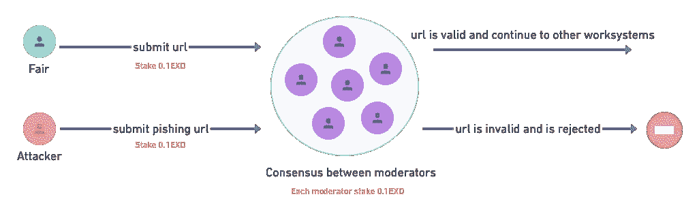
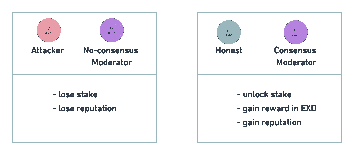

# 当 web3 创建 Exorde 时

> 原文：<https://medium.com/coinmonks/when-the-web3-creates-exorde-5eda2973f908?source=collection_archive---------11----------------------->

[🇫🇷](/@ExordeLabs/quand-le-web3-fait-naître-exorde-1a1a17cfafae)

Photo by [Lukas](https://www.pexels.com/fr-fr/@goumbik?utm_content=attributionCopyText&utm_medium=referral&utm_source=pexels) coming from [Pexels](https://www.pexels.com/fr-fr/photo/photographie-aerienne-des-pins-verts-574190/?utm_content=attributionCopyText&utm_medium=referral&utm_source=pexels)

# 越来越受欢迎的想法

让我们回到 2020 年 3 月。法国进入一级防范状态，开始面对 covid 19，将我们的社会关系转化为虚拟关系。

在这些讨论中，在这些自由思考的时间里，在这种快乐的世界末日气氛中，我们问[自己](https://exorde.network/team)一个简单的问题:我们如何快速访问我们在社交网络上阅读的来源，我们如何知道信息来自哪里？

covid 危机加剧了这种需求，因为我们可以阅读关于疾病和疫苗接种的一切及其对立面，从而对所有信息产生不信任，使支持者和反对者两极分化，并在这一巨大的喧嚣中提供更清晰的愿望。

因此，我们动用了我们的工程知识来试图回答这个问题。
如果我们在深度学习、区块链、数据和软件开发方面的技能能够让我们跟踪网络上信息的传播并获取尽可能多的内容，那会怎么样？如果基于区块链和加密货币技术的新网络 [web3](https://twitter.com/ExordeLabs/status/1456615794314465280) 给了我们这样做的工具，会怎么样？

于是诞生了 Exorde:可以在网络丛林中扫清道路的 web3 协议。

# 跟上网络步伐

我们必须面对的第一个问题是能够跟上网络的步伐。在互联网上流通的数据流确实是巨大的(2021 年[每天 7.7 艾字节](https://www.cisco.com/c/dam/m/en_us/solutions/service-provider/vni-forecast-highlights/pdf/Global_2021_Forecast_Highlights.pdf))。

那么，我们如何才能成功地实时跟踪社交网络和网络上流传的信息呢？这种野心可能看起来很疯狂，但我们确信，Exorde 是今天唯一能够实现这一目标的解决方案。

因为我们的方法使用了一个在过去被忽视的工具:去中心化。通过创建一个非常大的开发者和数据科学家社区，他们将从网络上收集和链接信息，然后我们可以扩大规模，跟踪越来越多的信息。

通过使用我们贡献者关于标准化网络数据处理协议的技术知识，然后我们联合每个人的技能和机器人来对抗错误信息。

但是，围绕 Exorde 聚合许多贡献者并非没有困难，这就是 web3 的优势所在:创建一个能够组织和资助我们的生态系统的经济的可能性和简单性。

因此，我们决定创建我们的加密货币 EXD，这将使我们能够奖励贡献者的工作，并激励尽可能多的人参与 Exorde 协议。

# 不要喂巨魔

这个令牌是我们系统的核心，因为它也允许保护我们的协议。事实上，任何对《议定书》的参与都受到利益攸关和协商一致机制的制约。

在协议的每个步骤(称为工作系统)中，一个步骤允许贡献者提交他们的工作，下一个步骤选择其他贡献者来检查这项工作是否有效。

在每一个阶段，你都必须押上少量的 EXD 来证明你的诚意。

Stake and consensus mechanism

例如，如果这个 URL 是一个淫秽的 URL 或者色情视频，那么你输掉了你的赌注，你没有拿回放入游戏中的 EXD，并且你失去了名誉。

相反，如果 URL 是有效的，那么你可以拿回你的股份以及对你的贡献的相关奖励，并且你在系统中获得声誉。

对于诚实的贡献者和与大多数其他版主做出相同选择的版主来说，赌注是解锁的(这是共识机制)。

Rewards after stake

信誉允许解锁协议中更关键的步骤，并限制已经证明其完整性的贡献者的访问。

# 处处透明

Exorde 不是一种新的基础设施，而是一种基于现有分散技术的数据协议。因此，我们将依赖一个经过验证的区块链，它能够以非常低的交易成本非常迅速地处理《议定书》的各种交易。

我们尚未做出选择，我们正在对几个候选人进行比较:

*   第一层基础设施，如 [Solana](https://solana.com/) 或 [Fantom](https://fantom.foundation/)
*   基于[以太坊](https://ethereum.org/)区块链的 [Skale](https://skale.network/) 或 [Metis](https://www.metis.io/) 等第二层基础设施

区块链的概念是基本的，因为它允许跟踪所有的交易，并允许任何人审计我们的系统。

贡献者发送的数据将存储在 [IPFS](https://ipfs.io/) 上，并通过 [Filecoin](https://filecoin.io/) 进行组织。

这是 web3 和 Exorde 的另一大优势:允许以完全透明的方式处理信息。

# 分散权力以避免利益冲突

我们遇到的另一个问题是创建一个不会被指责为利益冲突的系统。作为 Exorde 的创始人，我们对经济或政治问题的意见不应以任何方式影响和改变对协议信息的处理。

在这里，由于有了[道](https://cointelegraph.com/ethereum-for-beginners/what-is-a-decentralized-autonomous-organization-and-how-does-a-dao-work)的概念，web3 再次帮了大忙。DAO(分散自治组织)允许建立一个完全分散的组织，为 Exorde 的未来做出所有重要决定。

贡献者的声誉和专家意见的数量越大，他们在 DAO 决策中的权重就越大。

因此，Exorde 注定完全属于其贡献者。

我们的私人公司 Exorde Labs 只是作为服务提供商围绕 Exorde 进行通信，并围绕协议数据推出产品和服务。

任何个人或公司也将能够使用这些数据，销售新产品和服务，创造一个新的信息经济。

# 最后

如果没有 web3，Exorde 是不可能被创建的。

事实上，现在可以通过加密货币创造新经济，通过使用区块链透明地发布数据，通过下放治理权力限制利益冲突。

所有这些资产让我们相信，Exorde 能够实现其雄心，成为第一个能够实时获取网络信息的分散式协议。

 [## Exorde 在网络丛林中扫清道路。

### Exorde 是 web3 协议，它使开发者能够抓取和链接 web 上的所有公共数据。

exorde.network](https://exorde.network/) 

如果你喜欢这篇文章，并想了解更多关于 exorder 的信息，你可以访问[我们的网站](https://exorde.network)，加入我们在不同网络上的 Exorders 社区( [twitter](https://twitter.com/ExordeLabs) 、 [discord](https://discord.com/invite/5XdUGbThaw) 、 [telegram](https://t.me/exorde) 、 [reddit](https://www.reddit.com/r/Exorde) )。

然后，你可以成为 Exorde 协议中的一个重要节点，并参与我们这个时代的一场主要战斗:减少困扰我们社会的错误信息。

> 加入 Coinmonks [电报频道](https://t.me/coincodecap)和 [Youtube 频道](https://www.youtube.com/c/coinmonks/videos)了解加密交易和投资

# 另外，阅读

*   [BigONE 交易所点评](/coinmonks/bigone-exchange-review-64705d85a1d4) | [电网交易 Bot](https://coincodecap.com/grid-trading)
*   [氹欞侊贸易评论](https://coincodecap.com/anny-trade-review) | [CoinSpot 评论](https://coincodecap.com/coinspot-review)
*   [新加坡十大最佳加密交易所](https://coincodecap.com/crypto-exchange-in-singapore) | [购买 AXS](https://coincodecap.com/buy-axs-token)
*   [投资印度的最佳加密软件](https://coincodecap.com/best-crypto-to-invest-in-india-in-2021) | [WazirX P2P](https://coincodecap.com/wazirx-p2p)
*   [7 个最佳零费用加密交易平台](https://coincodecap.com/zero-fee-crypto-exchanges)