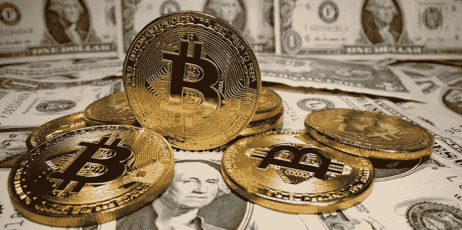

# 当他们问你“为什么是比特币？”

> 原文：<https://medium.com/coinmonks/when-they-ask-you-why-bitcoin-d54f52c12e45?source=collection_archive---------75----------------------->

比特币是人们通过互联网汇款的一种方式。数字货币旨在提供一种替代支付系统，这种支付系统将不受中央控制，但在其他方面可以像传统货币一样使用。

以下是为什么应该采用比特币作为国际货币的一些原因；

1.比特币是一种去中心化的货币，这意味着它不受央行或政府的控制。

2.比特币是一种全球货币，这意味着它可以被世界上任何地方的任何人使用。

3.比特币是一种安全的货币，具有强大的加密协议，难以伪造或黑客攻击。

4.比特币是一种透明货币，所有交易都在区块链公开记录。

5.比特币是一种抗审查的货币，这意味着没有人能阻止你发送或接收比特币。

6.比特币是一种稀缺货币，限量供应 2100 万个比特币，永远不会增加。

7.比特币是一种可分割的货币，这意味着你可以将每个比特币分成更小的单元(称为 satoshis)。

8.比特币是一种抗通胀货币，因为比特币的供给是有限的，而需求是不断增加的。

9.比特币是一种便携式货币，这意味着你可以轻松地存储和运输你的比特币。

10.比特币是一种私人货币，这意味着你可以选择保持交易和身份的私密性。

如果你喜欢这篇文章的内容，请花点时间点击我个人资料上的关注按钮，然后点击这篇文章底部的掌声按钮。

11.比特币是一种可替代货币，这意味着每个比特币都可以与另一个比特币互换。

12.比特币是一种开放的货币，这意味着任何人都可以在比特币网络上开发应用程序。

13.比特币是一种可编程货币，这意味着你可以创建智能合约和其他复杂的交易。

14.比特币是一种无国界货币，这意味着你可以在世界任何地方发送和接收比特币。

15.比特币是一种数字货币，这意味着它可以很容易地以电子方式存储和转移。

16.比特币是一种全球货币，这意味着它可以被世界上任何地方的任何人使用。

17.比特币是一种安全的货币，具有强大的加密协议，难以伪造或黑客攻击。

18.比特币是一种透明货币，所有交易都在区块链公开记录。

19.比特币是一种抗审查的货币，这意味着没有人能阻止你发送或接收比特币。

20.比特币是一种稀缺货币，限量供应 2100 万个比特币，永远不会增加。

*比特币，通常被描述为加密货币、虚拟货币或数字货币——是一种* ***完全虚拟*** *的货币类型。这就像是网络版的现金。你可以用它来购买产品和服务，但还没有多少商店接受比特币，一些国家已经完全禁止了比特币。*

> 加入 Coinmonks [电报频道](https://t.me/coincodecap)和 [Youtube 频道](https://www.youtube.com/c/coinmonks/videos)了解加密交易和投资

# 另外，阅读

*   [如何在 FTX 交易所交易期货](https://coincodecap.com/ftx-futures-trading) | [OKEx vs 币安](https://coincodecap.com/okex-vs-binance)
*   [CoinLoan 评论](https://coincodecap.com/coinloan-review) | [YouHodler 评论](/coinmonks/youhodler-4-easy-ways-to-make-money-98969b9689f2) | [BlockFi 评论](https://coincodecap.com/blockfi-review)
*   《XT.COM 评论》的[《币安评论》的](https://coincodecap.com/profittradingapp-for-binance)|
*   [SmithBot 评论](https://coincodecap.com/smithbot-review) | [4 款最佳免费开源交易机器人](https://coincodecap.com/free-open-source-trading-bots)
*   [比特币基地僵尸程序](/coinmonks/coinbase-bots-ac6359e897f3) | [AscendEX 审查](/coinmonks/ascendex-review-53e829cf75fa) | [OKEx 交易僵尸程序](/coinmonks/okex-trading-bots-234920f61e60)