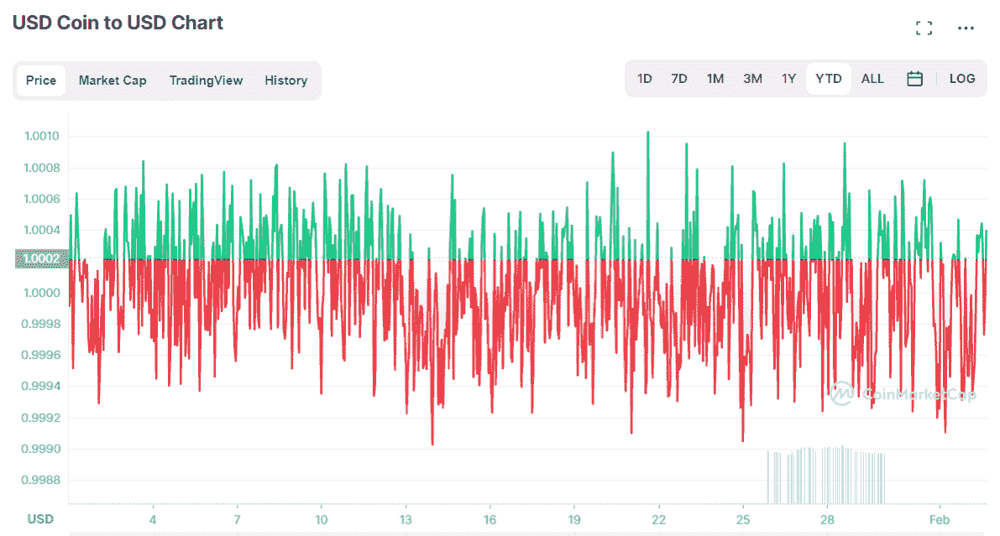
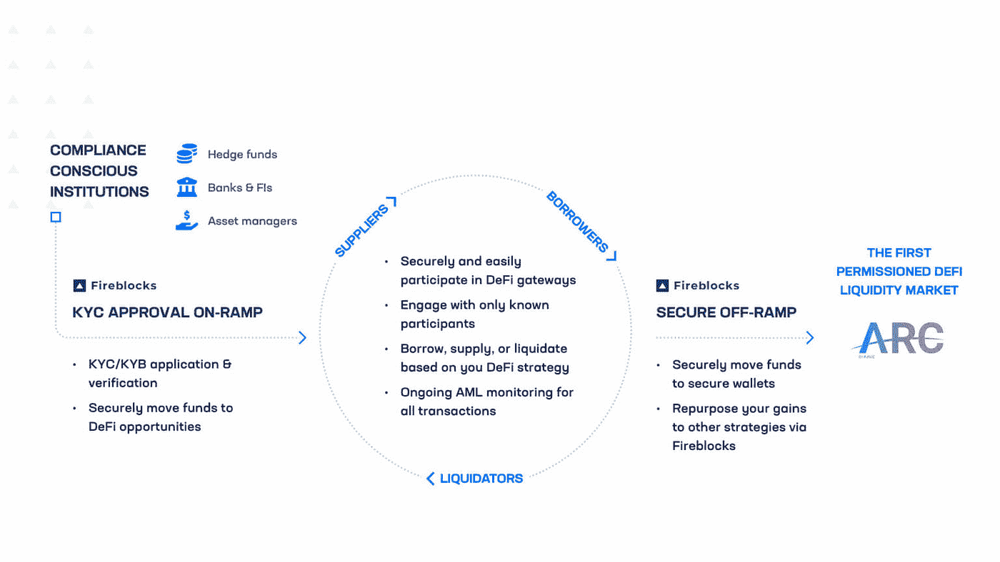

# 资产管理公司何时推出 DeFi 基金？

> 原文：<https://medium.com/coinmonks/when-will-asset-managers-launch-defi-funds-63e331af1996?source=collection_archive---------7----------------------->

区块链行业在 2021 年经历了梦幻般的一年。其增长最快的领域之一是分散融资(DeFi)，其锁定的总价值(TVL)从 1 月份的 180 亿美元上升到年底的 2400 亿美元，增长了 13 倍以上！尽管 TVL 股市飙升，随之而来的是有利可图的投资机会，但到目前为止，大多数散户投资者都参与了 DeFi。资产管理公司何时推出第一个 DeFi 投资解决方案，以便机构资金能够进入这个领域？

Photo by [Towfiqu barbhuiya](https://unsplash.com/@towfiqu999999?utm_source=unsplash&utm_medium=referral&utm_content=creditCopyText) on [Unsplash](https://unsplash.com/?utm_source=unsplash&utm_medium=referral&utm_content=creditCopyText)

显然，保守的机构投资者已经不再关注一些 DeFi 协议的本地代币或加密货币的价格波动。然而，参与 DeFi 并不一定要求投资者暴露于高价格波动。像和戴这样的稳定投资者被创造出来作为加密投资者的安全港，他们的价值被固定在一美元。Stablecoins 提供了加密(快速、全球、廉价结算)的好处，而没有缺点(价格波动)，并且越来越多地被用作商品和服务的结算。

The chart shows the price of USDC hovering around 1 USD, with only small deviations of about 0.1% (coinmarketcap.com)

机构投资者最感兴趣的 DeFi 应用之一可能是通过蓝筹协议(如 Aave 和 Compound)进行的 **stablecoin lending** 和**借款**。截至 2 月 2 日，和戴的这些协议的供应率约为每年 2.6%。与此同时，在大多数经济体中，银行账户和货币市场工具的存款利率为零或为负。在这种情况下，**将投资者持有的一小部分现金分配给稳定的货币借贷**似乎很有吸引力。然而，像 Aave 或 Compound 这样的 DeFi 协议的使用仍然不是非常用户友好，并且需要设置钱包和处理私钥的技术知识。对于所有仍希望**使用 DeFi 协议的非加密本地人(和机构)来说，一个补救办法可能是投资稳定硬币借贷的传统投资工具**(如共同基金)。如果资产管理公司负责技术设置，例如建立 DeFi 协议的接口，他们可以向投资者提供“**稳定的货币借贷资金**”，投资者可以像购买任何其他证券一样购买这些资金。这种基金将在贷款协议中部署其投资者的资本，并产生**可变回报流(利息收入)**。虽然这种 DeFi 基金的投资将通过区块链协议进行，但回报的特征与资产类别*现金和现金等价物*最密切相关。本文的其余部分将专门讨论 DeFi 基金的潜在需求以及监管问题。

**潜在投资者**

真的会有人买一只 DeFi 投资基金，它提供稳定的货币贷款，预期年回报率在 3%左右吗？虽然目前 DeFi 的大多数参与者都是精通技术的散户投资者，但非加密个人和机构在接受这项技术时面临很高的障碍。希望加入 DeFi 的每一方都可以承担非保管钱包的设置和私钥的处理，这是不合理的。尽管不精通技术的个人也可能是 DeFi 基金的潜在投资者，但本文的剩余部分主要关注机构投资者，因为他们拥有全球管理资产(AuM)的最大份额。

一些机构投资者，如养老基金和保险公司，必须遵守许多关于其合格投资的监管要求，因此(还)不能投资 DeFi/crypto。另一方面，**监管较少的投资者，如私营企业、家族理财室、大学捐赠基金和主权财富基金**，可能更容易涉足秘密水域。在货币市场工具的零利率或负利率环境下，这些投资者可能希望**用一小部分现金替代稳定的货币借贷基金**。由于期限非常短，这些基金既不需要锁定期，也不会面临利率风险。由于尚未推出 DeFi 基金，**资产管理公司面临着客户流失到创新创业公司的风险**。例如，成立于 2021 年的*喵*，将公司国债与加密市场连接起来，并承诺为企业储蓄账户提供高达 4%的可变年利率。该公司表示，它可以为那些担心通胀风险的人提供一种*“替代方法，以及提供菲亚特(美元)的加密来源收益率，这是公司财务人员习惯的操作方式。”*

澄清一下，**资产管理公司已经推出了大量的加密基金**。然而，这些基金要么采用买入并持有策略来跟踪加密货币(主要是 BTC ETH)的价格，要么采用更复杂的量化交易策略。后者主要由通常位于开曼群岛的加密对冲基金使用。**这些现有的加密基金非常不稳定，无法提供稳定的收入流，而稳定的货币借贷则可能带来稳定的收入流**。

**投资基金条例**

如何监管投资基金，什么样的工具适合稳定的货币借贷？投资业务在德国受到严格监管，法律规定了不同类型投资基金的合格资产:

*   ***【UCITS】***:在整个欧盟，面向散户投资者的开放式共同基金可能属于欧洲 UC its 监管框架(可转让证券的集体投资承诺)的范围。德国投资法规(193–198 KAGB)强调了 UCITS 基金在德国的合格资产。目前，UCITS 基金不允许直接投资加密货币或 DeFi 。但是，UCITS 基金可以投资于跟踪加密货币表现的证券，如交易所交易商品&货币(ETC)、交易所交易票据(ETN)和证书。
*   ***【AIF】***:不属于 UCITS 框架的欧盟共同基金被列为另类投资基金(AIF)。他们的合格投资领域比 UCITS 基金更广。然而，无论是开放式 AIF ( 219，221 KAGB)还是封闭式 AIF ( 261 KAGB)目前都没有资格直接投资于加密货币或 DeFi。
*   ***特殊-AIF*** :这些基金是德国监管最少的投资基金类型，因为它们不面向散户投资者，只面向(半)专业投资者。自 2021 年德国颁布《基金管辖权法案》(Fondsstandortgesetz)以来，开放式特别 AIF 有资格将其投资组合价值的 20% **投资于 crypto** ( 284 KAGB)。
*   ***【委托】*** :这不是投资基金，而是投资组合经理代表(富裕)客户或法人实体投资资产的合同协议。**在这种情况下，投资加密是允许的。**

简而言之，由于监管原因，**目前无法在欧盟为散户投资者推出稳定的货币借贷投资基金**。专门面向(半)专业投资者的特殊 AIF，最多只能将投资组合价值的 20%分配给 stablecoins(加密)。投资委托书目前是资产管理公司向机构客户提供纯稳定的货币借贷策略的唯一框架。

**KYC 银行业&反洗钱法规**

另一个有趣但尚未回答的问题是:当局将如何监管稳定的货币贷款？这是否属于德国银行法 ( 1 KWG)中的**贷款**的定义，因此只能由受监管的银行进行？如果资产管理公司向他们的客户提供稳定的货币借贷产品，他们需要什么许可证(如果有的话)？有趣的是，比特币基地在德国持有密码保管执照(但没有银行执照！)为其德国客户提供稳定的外币贷款产品(戴通过复合协议)。

可能阻碍机构投资者在稳定的硬币借贷协议中配置资本的进一步关键问题是**了解你的客户&反洗钱**要求。目前 DeFi 的绝大多数用户都是匿名的。为机构投资者引入独立资金池的首批 DeFi 协议之一是借贷协议 **Aave** 。通过 **Arc，** Aaave 在 2022 年初推出了他们协议的许可“机构版本”，要求所有参与者首先通过 KYC &反洗钱检查。Aave 社区投票将公司 **Fireblocks** 列为 Arc 的第一个官方白名单。预计其他第三方也将被批准作为白名单。

Fireblocks is Aave Arc’s first whitelister and serves as an on-ramp & off-ramp for institutions (fireblocks.com)

**结论【TL；【T9 博士】**

随着 DeFi 基础设施的快速发展，欧盟的监管环境提供了越来越多的指导，金融机构对数字资产的采用也在加速。虽然许多投资者目前的重点是购买和持有 BTC 和 ETH 等波动性较大的加密货币，但 stablecoin lending 提供了基于非波动性本金(如 USDC)的收入流。尽管 3%左右的预期年收益率使得用稳定的货币基金替代投资者的一小部分现金似乎很有吸引力，但资产管理公司尚未推出相应的投资解决方案。鉴于 100%投资组合分配给 stablecoin 借贷目前在德国不允许任何投资基金类型，**唯一可行的解决方案(到目前为止)是全权投资组合管理(又称委托)**。由于各种各样的技术障碍，从所需的接口到借贷协议(API)，到进出匝道，到加密以及资产的安全保管，资产管理公司大多还没有准备好启动这种 DeFi 投资。**为了降低失去企业客户的风险，并及时提供 DeFi 投资解决方案，** **资产管理公司可能会被建议与一家金融科技初创公司合作，该公司充当加密的一站式商店。**

*来源(2022 年 1 月/2 月访问的所有链接):
-*[*https://www . ive . one*](https://www.ive.one/) *-*[*https://defillama.com/*](https://defillama.com/) *-*[*https://coinmarketcap.com/*](https://coinmarketcap.com/) *-*[*https://meow.co/*](https://meow.co/) *-*pdf
-[*https://www . gesetze-im-internet . de/kagb/index . html # bjnr 198110013 bjne 037603123*](https://www.gesetze-im-internet.de/kagb/index.html#BJNR198110013BJNE037603123) *-*[*https://block works . co/aave-arc-to-provide-30-financial-institutions-access-to-private-pools-of-defi-liquidity*](https://blockworks.co/aave-arc-to-provide-30-financial-institutions-access-to-private-pools-of-defi-liquidity/)

> 加入 Coinmonks [电报频道](https://t.me/coincodecap)和 [Youtube 频道](https://www.youtube.com/c/coinmonks/videos)了解加密交易和投资

## 另外，阅读

*   [eToro vs robin hood](https://coincodecap.com/etoro-robinhood)|[MoonXBT vs Bybit vs Bityard](https://coincodecap.com/bybit-bityard-moonxbt)
*   [有哪些交易信号？](https://coincodecap.com/trading-signal) | [Bitstamp vs 比特币基地](https://coincodecap.com/bitstamp-coinbase)
*   [ProfitFarmers 回顾](https://coincodecap.com/profitfarmers-review) | [如何使用 Cornix 交易机器人](https://coincodecap.com/cornix-trading-bot)
*   [如何在势不可挡的域名上购买域名？](https://coincodecap.com/buy-domain-on-unstoppable-domains)
*   [印度的加密税](https://coincodecap.com/crypto-tax-india) | [altFINS 审查](https://coincodecap.com/altfins-review) | [Prokey 审查](/coinmonks/prokey-review-26611173c13c)
*   [赢取注册奖金——10 大最佳加密平台](https://coincodecap.com/earn-sign-up-bonus)
*   [Blockfi vs 比特币基地](https://coincodecap.com/blockfi-vs-coinbase) | [BitKan 评论](https://coincodecap.com/bitkan-review) | [Bexplus 评论](https://coincodecap.com/bexplus-review)