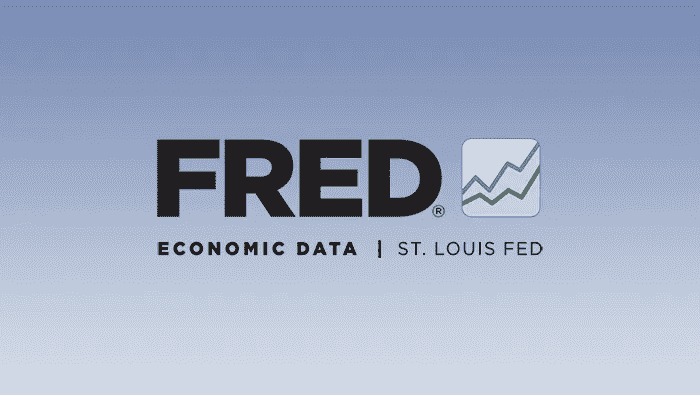

# 熊市何时结束？

> 原文：<https://medium.com/coinmonks/when-will-the-bear-market-end-4f4c67496e6a?source=collection_archive---------38----------------------->

## 在再次做多股票之前，我在寻找什么。

# 熊市的忧郁

随着市场一跌再跌，我的假设是我们将迎来一波反弹。

在那次反弹之后，我们有可能会走低。

所以，当我坐在这里，迫不及待地想进入每一个交易日时，我想我应该写下我是谁，什么是大钱，在做多和乘坐下一个牛市之前要寻找什么。

现在，并不是所有这些因素都一定会让我们开始在市场中上升，所以关注我的每周“市场状况”或做你自己的每周分析是很重要的。

但如果这些因素中的一些开始变得更加“绿灯”，那么向上的压力和大资金重返的理由就会开始形成。

因此，让我们来看看那些糟糕透顶的“红灯”信号，这些信号目前是熊市将按时恢复的强烈标志。

> 交易新手？试试[加密交易机器人](/coinmonks/crypto-trading-bot-c2ffce8acb2a)或者[复制交易](/coinmonks/top-10-crypto-copy-trading-platforms-for-beginners-d0c37c7d698c)

# 美联储数据

首先是美联储的数据。

理解，这个数据是向后看的，理解，在这个数据看起来完美之前，市场会移动(市场是向前看的)。

但与此同时，我们现在正处于森林深处，没有迹象表明情况会很快好转。

## #1 — CPI 和通货膨胀数据

不管我们是否认同通胀数据有多准确，通胀数据至少需要显示出一个转折。在 5 月份 CPI 之前，市场似乎仍抱着希望，认为我们可能会在轻微擦伤的情况下度过难关。

然后，五月来了，这些机会基本上变成了零。

🔴最新 CPI 通胀打印: **8.6% |** 🔴

[[5 月 CPI 数据](https://www.bls.gov/news.release/pdf/cpi.pdf)

通货膨胀上升到 1981 年以来的最高水平。主要红灯。

## # 2——联邦利率上调

目前，美联储正在提高利率来对抗通货膨胀。这给经济增长带来压力。

🔴—最新加息: **0.75% |** 🔴

[ [当前联邦基金利率](https://www.bankrate.com/rates/interest-rates/federal-funds-rate/)

## #3 —经济和 GDP 增长放缓

最新的 GDP 数据对经济来说也是一个非常糟糕的读数。负 GDP。

🔴—最新 GDP 数字: **(-1.5)% |** 🔴

[ [历史 GDP 图表和衰退](https://fred.stlouisfed.org/series/A191RL1Q225SBEA)

## #4 —联邦资产负债表缩减

现在，除此之外，我们还有美联储从系统中抽走流动性。在所有这些负面因素的基础上，这只是美联储拥有并正在使用的另一种紧缩工具。

🔴—美联储当前资产负债表趋势:**紧缩|** 🔴

【[美联储资产负债表](https://www.federalreserve.gov/monetarypolicy/bst_recenttrends.htm)

# 股票市场指数

现在我们来看一些股市数据。

**SPY(S&p500)**
-同比下跌(-9%)
-低于 50 日移动平均线
-低于 200 日移动平均线
🔴**|强势下跌趋势|** 🔴

**QQQ(纳斯达克 100)** -同比下跌(-16%)
-低于 50 日移动平均线
-低于 200 日移动平均线
🔴**|强势下跌趋势|** 🔴

**NDAQ(纳斯达克综合指数)**
-同比下跌(-10%)
-高于 50 日均线
-低于 200 日均线
🟡**|潜在的双底反转|** 🟡

**NYA(纳斯达克综合指数)、DJI(道琼斯)、IWM(罗素 2000)** ——同比下跌
——低于 50 日移动平均线
——低于 200 日移动平均线
🔴**|全部下降趋势|** 🔴

**(20 年期以上国债)** -同比下跌(-30)
-低于 50 日移动平均线
-低于 200 日移动平均线
🔴**|强势下跌趋势|** 🔴

**BTCUSD(比特币)** -同比下跌(-39)
-低于 50 日移动平均线
-低于 200 日移动平均线
🔴**|强势下跌趋势|** 🔴

由于美国国债看起来像一种加密货币，股票也大幅下跌(指数隐藏了许多剧烈的痛苦)，真的没有什么地方可藏。

# 特殊环境

现在，在所有这些之上，世界上发生了一些非常情况，对我们的情况没有帮助。

## **乌克兰与俄罗斯冲突:潜在战争**

随着俄罗斯入侵乌克兰，许多国家被卷入帮助和/或选择阵营。这开始在全球范围内引起一些不安。

如果有核国家卷入其中，对全球经济和股票市场都将是毁灭性的。

在取得一些有意义的进展之前，这将是笼罩在更广泛的股票市场上的一个潜在的“不确定性”。

🔴**|俄乌冲突:不确定性|** 🔴

## 乌克兰和俄罗斯冲突

最重要的是，俄罗斯是世界石油和天然气的主要供应国，尤其是欧洲，欧洲正开始感受到痛苦。

随着石油和天然气价格飙升，美国制造商没有增加勘探和生产的动力，这仍然是企业潜在成本的另一个不确定性。

🔴**|油气短缺:不确定性|** 🔴

## 供应链问题和短缺

关于供应链问题已经谈了很多，而且还在继续。由于 COVID，半导体和其他材料的短缺，中国的港口被关闭，供应链问题仍然使企业难以衡量未来的生产率和一致性。

这意味着不确定性。

🔴**|供应链问题:不确定性|** 🔴

## 全球粮食短缺

最重要的是，乌克兰是小麦的主要出口国。此外，[俄国控制着世界 20%的氮肥](https://www.nationalgeographic.com/environment/article/global-food-crisis-looms-as-fertilizer-supplies-dwindle)——现代农业的一个关键成分。

这意味着我们正面临全球粮食短缺。用美国的话来说，由于通货膨胀已经上涨的食品成本可能会继续上涨，这意味着消费者支出减少，这意味着股票收益减少，这意味着股价下跌。

另一个不确定性。

🔴**|全球粮食短缺:不确定性|** 🔴

# 包装它

所以，好吧。让我们在这里喘口气，结束这一切。市场的现状不是很好。而且，如果我要打赌的话，我认为最好的情况是趋势持平，最坏的情况是继续下行。

然而，并非所有这些问题都需要解决——股票市场总是在展望未来——但我确实相信，在市场上涨并最终打破历史高点之前，这些问题中的许多都需要开始朝着正确的方向发展。

## 我目前的方法

所以，我并不想在这里为底部计时。正如罗斯柴尔德男爵所说:

> “如果你愿意，我可以告诉你我的秘密。这就是:我从不在底部买入，也总是过早卖出。”
> *——罗斯柴尔德男爵*

我确实相信市场会再次上涨，我对那一天感到兴奋。但在经济和政治有所缓解之前，我认为经济还没有触底。

或者，通常情况下，每个人都是错的，我们在上周触底。

但在赔率游戏中，我认为更大的下跌空间非常有利于暂时的熊市反弹，这种反弹会让所有卖空者融化成蜡质树桩。

如果你必须交易，进场，获利，止损——这是一个摇摆交易者的市场。

祝你好运！

—

**由每日交易冠军赞助——有史以来最伟大的交易者免费提供每日交易灵感和动力。**

**现在就报名吧—**[**【TradingChampionsDaily.com】**](http://tradingchampionsdaily.com/)