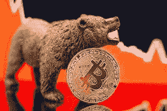
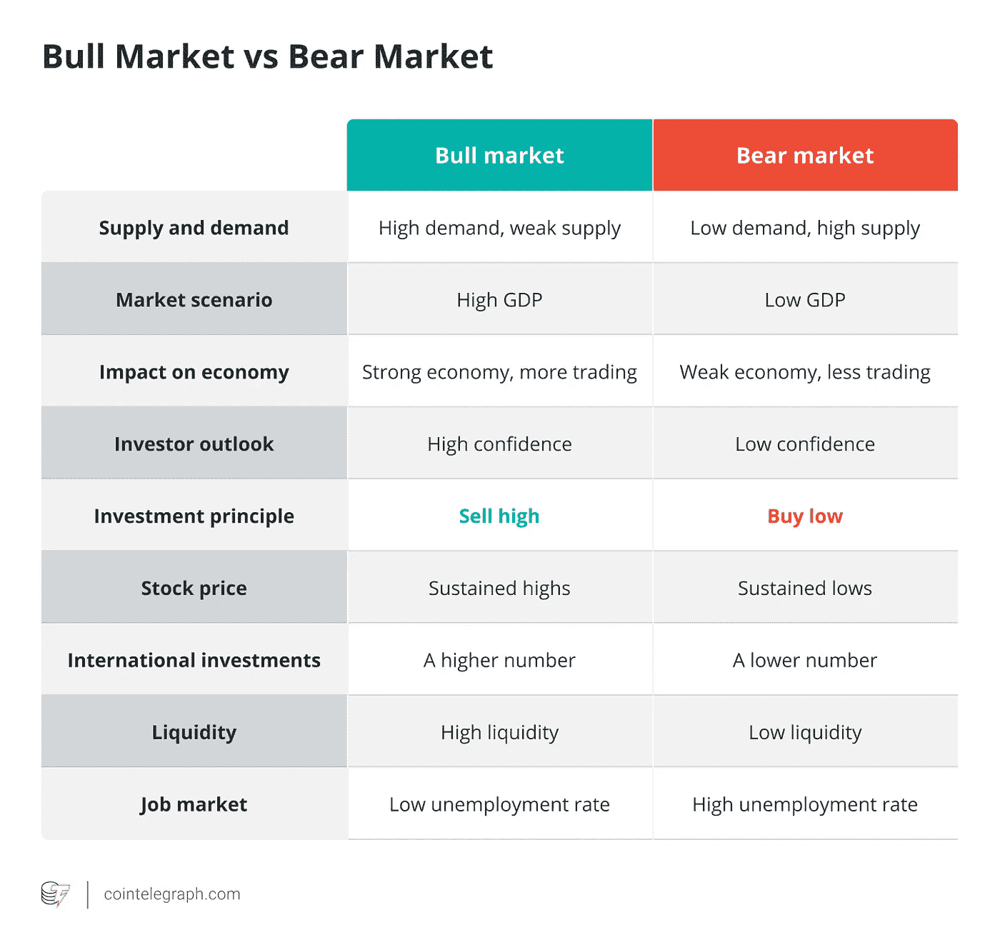
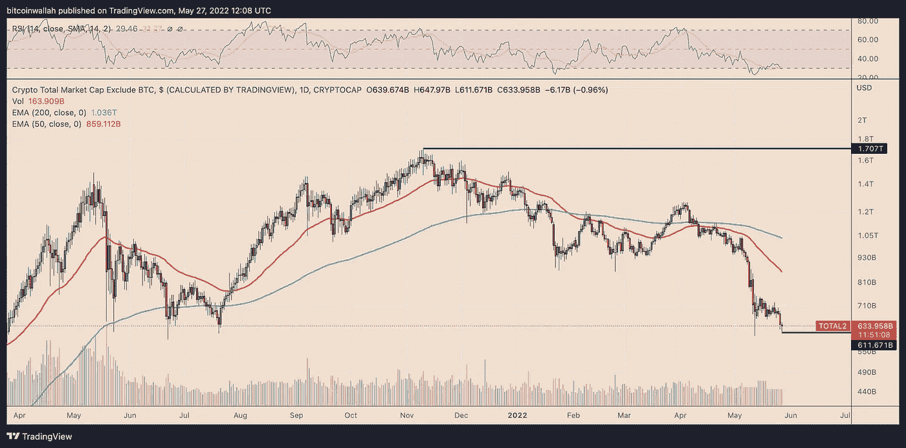
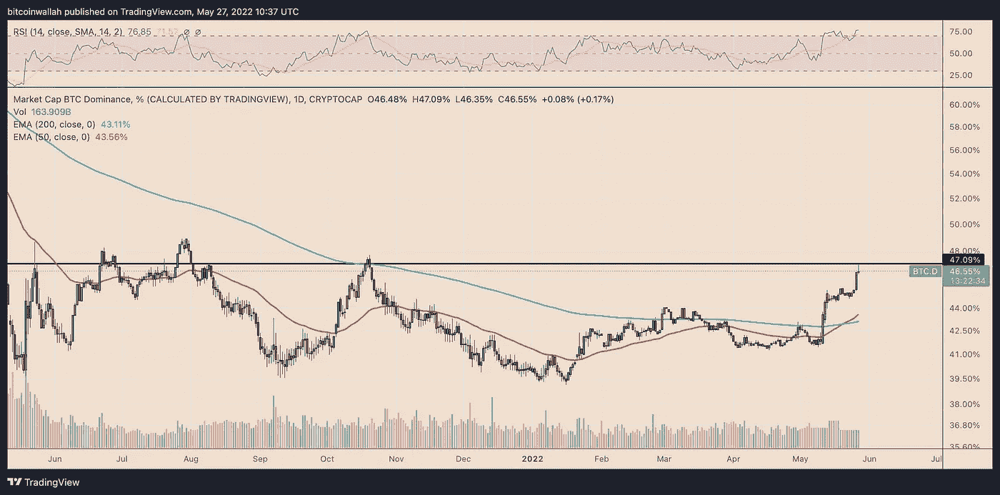
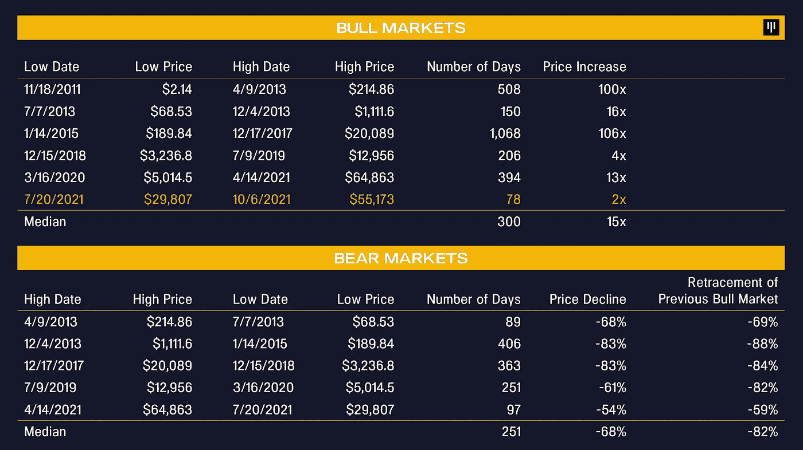

# 隐秘的熊市何时结束？

> 原文：<https://medium.com/coinmonks/when-will-the-crypto-bear-market-be-over-f25a3b04cab3?source=collection_archive---------27----------------------->

*   ***回到 2021 年 11 月，比特币的交易价格超过 69000 美元，超过 50%的跌幅代表着重大损失。***
*   ***虽然价格可能会回到之前的水平，但也可能会进一步下跌***
*   封锁、全球供应链和不断上升的通胀等因素可能会导致目前的熊市持续很长时间。

“熊在华尔街野餐”。对我来说，这是对 2022 年前几个月市场下跌严重程度最恰当的总结。根据去年的高点，几乎没有人能够预测到这一点，但现实是，股市正处于动荡之中，没有人能肯定地说这场灾难何时会结束。

截至 5 月，抛售从标准普尔 500 指数中抹去了超过 7 万亿美元，该指数自 12 月底以来下跌了 18%，另一方面，纳斯达克同期下跌了约 27%。尽管股市最近略有回升，但还没有人松一口气。

专家预测，如果美联储继续宣布进一步加息，未来几个月的形势可能会变得更加严峻。上个月，为应对飙升的通胀，该利率上调了 50 个基点。

但是很明显，熊在秘密领域留下了最可怕的印象。自去年 11 月以来，加密市场市值飙升至逾 3 万亿美元的历史高点，代币价格达到前所未有的水平，价值已下跌近 60%，抹去了 2021 年的大部分涨幅。

因此，随着抛售压力继续将市场推向极限，投资者的投资组合已经被撕裂。Terra 的全面崩溃加剧了加密崩溃，几天之内损失了 400 多亿美元。那些持有 Terra 和 UST 股票的人惊恐地看着他们的股票被减少到零。

Bear market

尽管比特币在周图上获得一根绿蜡烛后，最终结束了迄今为止最糟糕的熊市走势，但专家警告称，风暴远未结束，因为市场仍处于抛售情绪中。

现在，每个人都在拼命寻找答案的问题是，熊市何时会结束？。

**什么是熊市？**

在我们深入研究手头的问题之前，让我们先来定义一下什么是熊市。传统上，熊市是价格长期下跌的时期。

它不仅常用于加密货币领域，也常用于传统市场，如股票、债券、房地产和商品。这种下滑通常是由于投资者对市场价格和指数的整体表现失去信心而产生的悲观情绪。

Bear vs Bull market

如果证券和大宗商品在一段持续的时间内(比如两个月或更长时间)下跌 20%或更多，就可以认为它们处于熊市。但在加密环境下，价格下跌 20%是很平常的，因此可能不是熊市的信号。

“在加密市场，20%以上的下跌经常发生，通常是修正的一部分，随后是更广泛的上涨。在整个 2016 年和 2017 年，我们有 6 次 30%以上的修正，”分散资本市场 AllianceBlock 的联合创始人 Amber Ghaddar 解释说。

> 加入 Coinmonks [电报频道](https://t.me/coincodecap)和 [Youtube 频道](https://www.youtube.com/c/coinmonks/videos)了解加密交易和投资

**是熊市的密码**

尽管一些专家认为，在比特币价格跌破上一轮牛市的峰值(2 万美元)之前，加密市场不能说是处于熊市，但其他人却持相反观点。

*Altcoin market cap daily chart. Source: TradingView*

然而，大多数密码专家似乎都同意，由于长期低迷，我们实际上处于熊市。自 2021 年 11 月比特币达到超过 69，000 美元的最高峰以来，其价格持续暴跌，目前徘徊在 31，000 美元左右，这是比特币历史上最长的熊市趋势。

> **在加密环境下，价格下跌 20%是常见的，因此可能不是熊市的信号**

此外，对市场的信心正处于多年来的最低点，因为投资者担心监管不确定性、供应链危机和当前的地缘政治动荡，纷纷回避加密货币，转而青睐风险较低的资产。

Coinglass 最近的一份报告强调了市场信心的缺乏，该报告表明投资者目前非常害怕加密货币。

尽管比特币在抛售环境中表现出了一点弹性，因为它略微提高了其市场价值[的主导地位](https://cointelegraph.com/news/3-reasons-why-bitcoin-is-regaining-its-crypto-market-dominance)，但许多替代币就没有这么幸运了；有些人可能永远无法从崩溃的影响中完全恢复。

*Bitcoin Market Dominance daily chart. Source: TradingView*

**熊市历史的隐秘**

在其历史进程中，比特币已经被宣布死亡超过一千次。因此，这并不是 crypto 第一次遭遇熊市。2012 年 1 月，比特币诞生四年后，在持续 180 多天的抛售中，其价格下跌了 40%，至 4.22 美元。

然而，在 2012 年，又出现了一轮熊市周期，价格在 8 月至 12 月间下跌了近 40%。2013 年，比特币的价格在 7 天内翻了一番，达到了 1000 美元的新高。华尔街分析师被这一壮举所激动，预测代币价值可能达到 98，000 美元。

但在同年 11 月，看涨情绪消失了，导致了持续 185 天的漫长寒冷冬季，并使市场陷入瘫痪，BTC 暴跌 83%，跌至 200 美元以下。

2018 年又出现了一次低迷，从市场上抹去了创纪录的 7000 亿美元。在 2018 年的加密冬天之前，到 2017 年 12 月，比特币已经飙升至近 20，000 美元，但到了 2018 年的熊市结束时，它的售价约为 5000 美元。

**为什么这次熊市不一样**

尽管在此之前我们也有过隐秘的冬天，但现在的情况却大不相同。

尽管投资者状况等因素因大规模零售和机构采用率而显著改善，但自 2012 年以来，全球宏观经济环境变得比以往任何时候都更具挑战性。停工、全球供应链和通胀上升等因素可能会导致目前的熊市持续很长时间。或许比比特币问世以来我们见过的时间都长。

**下跌会持续多久**

过去几天，传统股票市场出现了一些强劲反弹，但 crypto 仍在苦苦挣扎。一些专家预测，加密的冬天可能会持续到今年年底，比特币价格可能会进一步下跌到大约 20，000 美元，这是上一轮牛市的峰值。

然而，顶级加密交易员彼得·勃兰特(Peter Brandt)最近描绘了一幅更加悲观的画面，他认为 BTC 的下跌可能低至 12，000 美元。这些预测是基于这样一个事实，即经过数周的相关性之后，crypto 最近与股票市场向下脱钩。

那么是什么造成了市场持续的抛售压力呢？经常被引用的主要原因之一是投资者没有足够的信心通过投资加密资产来承担额外的风险，因为预期市场可能会进一步暴跌。这可能与 Terra 内爆不无关系，它让投资者感到恐惧。

其次，那些足够勇敢的人，由于通货膨胀和其他宏观经济的不确定性，投资不足以引发持续的上涨趋势。第三个原因很简单，crypto 正处于熊市。仅此而已。

然而，不要搞错，crypto 还远未死亡，不管 Crypto 的冬天持续多久，它肯定会达到极限，为多头让路。

一些人打赌，预计在 8 月份进行的以太坊合并可能会制造足够的炒作来引发飙升。如果失败，人们预计下一次比特币减半将把市场从螺旋式下降中拯救出来。

通常熊市是人们加深密码知识的好机会。如果你是加密新手，我建议你访问像 [NewsCrypto](https://newscrypto.io/) 这样的教育平台来加深你的知识。

**购买蘸酱是个好策略吗？**

人们普遍认为，熊市是投资者以可承受的价格买进和囤积加密资产的好机会。“逢低买入”的概念是基于一种假设，即价格下跌是短暂的异常，会及时自我修正。“抄底者”希望利用价格下跌，以折扣价买入，并在价格再次飙升时获得回报。

crypto bear market

加密市场不稳定，所以无论以什么价格购买加密货币都是有风险的。虽然长期来看价格可能会反转，但也可能会进一步下跌，让你的投资血本无归。

在 Belfrics Group 的创始人兼首席执行官 Praveen Kumar 看来，这些是投资者开始建立稳健的加密货币投资组合的绝佳入门水平。投资者应该继续购买一些知名加密货币如比特币、以太坊、莱特币等的长期基本面。仍然相当强大。

如果你需要关于如何在熊市交易的有价值的信息，请参考我的[以前的](/coinmonks/how-to-survive-the-bear-market-as-a-crypto-trader-9894e892d857)文章。