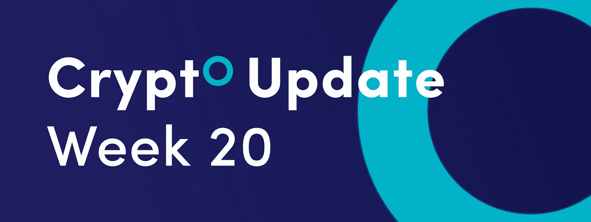
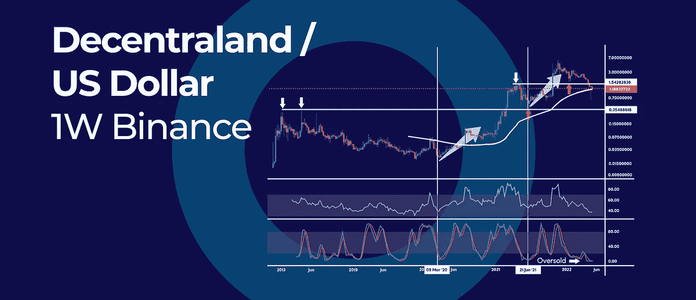
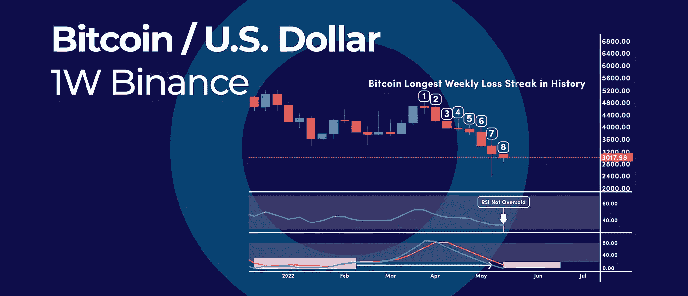

# 加密熊市何时结束？|以及本周加密更新中的更多内容。

> 原文：<https://medium.com/coinmonks/when-will-the-crypto-bear-market-end-and-more-in-this-weeks-crypto-update-7c8d06722214?source=collection_archive---------16----------------------->

*   分散化土地处于历史上最超卖的水平
*   比特币连续第八周下跌，我们超卖了吗？
*   加密熊市何时结束？

# 分散化土地处于历史上最超卖的水平

[分散地(MANA)](https://decentraland.org/) 价格处于历史上最超卖的水平。根据随机振荡指标，法力极度超卖。在最近的暴跌之后，随机指标的短期移动平均线和长期移动平均线都位于 0 读数。

# 随机超卖读数

虽然随机超卖读数实际上可能是反转的信号，并为我们提供了一个难得的机会，但危险是，MANA 的价格可能会在盘整中稳定下来，从而使随机指标脱离这些极端的超卖读数。

跌破 1.00 美元的心理数字是短暂的，但我们还没有走出困境。

在日线图和周线图上，大多数 RSI 振荡指标都低于 50-50 的中间水平，这是看跌的信号。对于情绪的转变，我们需要 RSI 动量在两个时间框架内突破 50 的中间水平。

最近两次 RSI 跌破 50 中位，马纳的价格见底，一个“V”形底部到位。此外，从 1.00 美元以下的强劲反弹使我们看起来像是在建立一个新的 V 形底部。

然而，目前的每周 RSI 读数是 2019 年 11 月以来的最低水平，这可能会阻碍可能的反转。

**展望:**法力的价格可以在 1.54 美元到 0.35 美元之间的大范围内稳定下来。

# 比特币连续第八周下跌，我们超卖了吗？

**比特币(BTC)** 有望连续第八周录得亏损，这是历史上最长的连续亏损。之前最大的连续周跌幅记录是在 2014 年 12 月，当时比特币价值数百美元，连续五周下跌。

# 比特币是否超卖？

尽管抛售严重，比特币仍未超卖，至少根据最流行的动量振荡指标来看是这样。比特币目前的每周 RSI 读数为 33.67，表明我们还没有超卖。RSI 振荡指标需要跌破 30 甚至 20 才能被认为超卖。

另一方面，随机振荡器已经进入超卖读数，但与 RSI 不同，它倾向于停留在超卖读数更长时间，因为它更不稳定，反应更快。

# 2014 年比特币被超售

相比之下，在 2014 年，在创纪录的周跌幅之后，比特币在反弹之前整合了 31 周。

当比特币的 RSI 跌至 30 以下，且周线随机振荡指标进入超卖读数时，比特币就超卖了。在超卖状态之后，价格开始盘整，在价格开始回升之前，这种调整又持续了两个月。

# 超卖是什么意思？

术语超卖是技术分析词典中的一个常用词，但它是什么意思呢？简而言之，超卖意味着一项资产被大举抛售，许多交易者已经平仓，这可能导致趋势暂时停顿。

超卖的情况可能是暂时的，当买家开始介入时，它可能会导致反弹。然而，超卖状态可以持续很长时间。至于目前的比特币修正，超卖条件可能导致回调和修正的暂停。然而，这种调整可能会长期持续下去。

**展望未来:**比特币抛售在不久的将来可能会放缓，我们可能会在 30，000 美元这个可观的整数附近看到一个暂时的底部。然而，从长期来看，这一调整可以一直延伸到 20，000 美元，这是一个巨大的支撑位，因为这是 2017 年牛市中达到的历史最高水平。跌至 20，000 美元也会让 RSI 振荡指标达到超卖读数。

# 加密熊市何时结束？

熊市是指比特币从最高价下跌 70%。在这个定义下，比特币迄今为止经历了 4 次熊市。

比特币(BTC)于 13 年前推出，尽管存在时间短暂，但已经经历了 4 次熊市。因此，我们需要放眼全局，分析各种熊市，以洞察未来。

我们现在要分解最近四次主要的比特币熊市周期，以及我们能从中学到什么。

# 比特币熊市

自 2009 年问世以来，比特币的价格在 2011 年暴跌了 92%。然而，以美元计算，当前的熊市是最糟糕的，加密货币市场的市值超过 1.4 万亿美元。

最近 4 次主要熊市有以下特征:

**熊市#1:** 从 2011 年 6 月到 2011 年 11 月，BTC 的价格暴跌了 92%，从 30 美元的历史高点跌至 2.5 美元的低点。第一次熊市持续了 53 天。

**熊市#2:** 从 2013 年 4 月到 2013 年 7 月，BTC 的价格暴跌了 75%，从 268 美元的历史高点跌至 65 美元的低点。这次熊市持续了 87 天。

**熊市#3:** 从 2013 年 11 月到 2015 年 1 月，BTC 的价格暴跌了 83%，从 1149 美元的历史高点跌至 197 美元的低点。这次熊市持续了 415 天。

**熊市#4:** 从 2017 年 12 月到 2018 年 12 月，BTC 的价格暴跌了 83%，从 19764 美元的历史高点跌至 3148 美元的低点。这次熊市持续了 365 天。

总之，比特币的熊市往往平均持续 230 天，在此期间，BTC 往往会损失平均 83%的价值。因此，当前的熊市符合历史先例，不会是最后一次。

展望未来:虽然熊市最初往往时间较短，但目前主要熊市每四年出现一次。前两次长熊市始于 2013 年 11 月和 2017 年 12 月，分别持续了 415 天和 365 天。本轮熊市始于 2017 年 11 月，188 天下跌 55%。因此，我们可以预计价格将再下跌 200 天，从目前的历史高点再下跌 25%-30%。

# 熊市中不同的交易方式

虽然比特币不是唯一经历熊市的货币，但熊市期间仍有许多交易方式。

**DCA 或美元平均成本。**这包括每月购买一种加密货币，并持续购买。这样，即使价格下跌，你买的越多，你的平均进场价格就会越低。因此，你会在牛市中获得更多的利润。我们在 Cryptohopper 提供先进的自动化 DCA 工具，可以很好地配合您的交易策略。

**做空。做空是在熊市中赚钱的另一种方式。做空包括借入和卖出一枚你不拥有的硬币，并在硬币下跌时获利。这只能通过保证金或期货账户完成，比 DCA 风险大得多。这是因为你有可能被清算，甚至损失超过 100%的资金，实质上是欠交易所的债。尽管一些交易所对此提供了保护，但它仍然比 DCA 风险大得多。**

订阅我们的媒体每周博客和更新。
在[推特](https://twitter.com/cryptohopper) | [脸书](https://www.facebook.com/cryptohopper)|[Reddit](https://www.reddit.com/r/CryptoHopper/)|[insta gram](https://www.instagram.com/cryptohopper/?hl=nl)上关注我们

在 [Cryptohopper](https://www.cryptohopper.com/) 开始交易！

> 加入 Coinmonks [电报频道](https://t.me/coincodecap)和 [Youtube 频道](https://www.youtube.com/c/coinmonks/videos)了解加密交易和投资

# 另外，阅读

*   [Bookmap 点评](https://coincodecap.com/bookmap-review-2021-best-trading-software) | [美国 5 大最佳加密交易所](https://coincodecap.com/crypto-exchange-usa)
*   最佳加密[硬件钱包](/coinmonks/hardware-wallets-dfa1211730c6) | [Bitbns 评论](/coinmonks/bitbns-review-38256a07e161)
*   [新加坡十大最佳加密交易所](https://coincodecap.com/crypto-exchange-in-singapore) | [购买 AXS](https://coincodecap.com/buy-axs-token)
*   [红狗赌场评论](https://coincodecap.com/red-dog-casino-review) | [Swyftx 评论](https://coincodecap.com/swyftx-review) | [CoinGate 评论](https://coincodecap.com/coingate-review)
*   [投资印度的最佳密码](https://coincodecap.com/best-crypto-to-invest-in-india-in-2021)|[WazirX P2P](https://coincodecap.com/wazirx-p2p)|[Hi Dollar Review](https://coincodecap.com/hi-dollar-review)
*   [加拿大最佳加密交易机器人](https://coincodecap.com/5-best-crypto-trading-bots-in-canada) | [库币评论](https://coincodecap.com/kucoin-review)