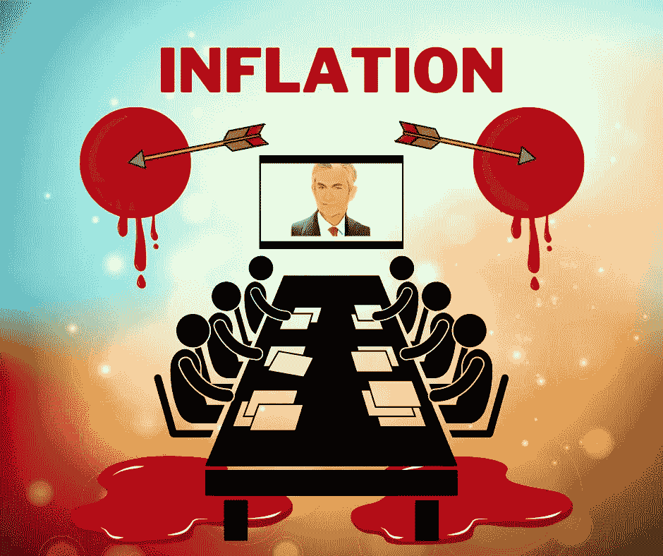

# 密码市场什么时候会停止流血？

> 原文：<https://medium.com/coinmonks/when-will-the-crypto-market-stop-bleeding-422586049920?source=collection_archive---------4----------------------->

## 即将到来的 FOMC 会议能给出答案吗？

Designed by [Author](https://www.quora.com/profile/Sudarsan-Karki-SuperSudar)

如果你认为比特币在 11 月 10 日创下的 69000 美元的历史新高不是 ATH，并继续买入，我不会责怪你。

如果你认为 B 计划对比特币的预测会成真，根据他的地板模型*达到 135，000 美元，或者根据他的股票-流量模型*至少达到 100，000 美元，我不…