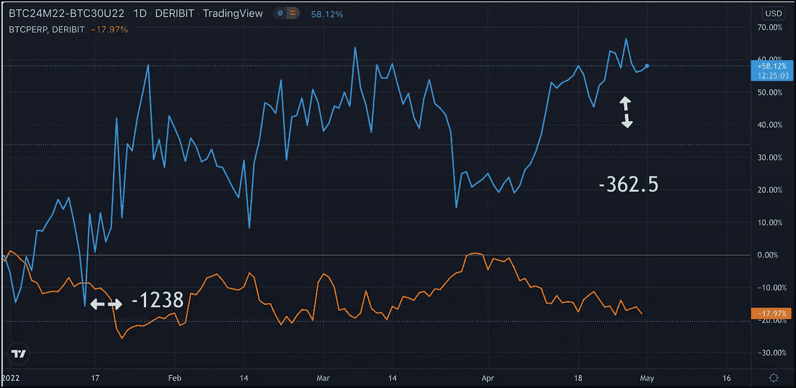

# 加密期货散布器在哪里？

> 原文：<https://medium.com/coinmonks/where-are-the-crypto-futures-spreaders-983187977dec?source=collection_archive---------19----------------------->

大约两个月前，我从全职的 TradFi 衍生品转向了全职的加密衍生品。毫无疑问，我还在学习。要学的东西很多，要做的事情很多。加密中肯定有一些令人挠头的领域，这适用于加密中常见的交易和缺失的交易。

在全口径加密领域，有一件事让我有些吃惊，那就是期货价差空间的不成熟，你看不到也听不到太多关于它的信息。

在 TradFi，我们读到和听到了许多与芝加哥商业交易所集团的 BTC 期货价差有关的谈话。围绕如何最好地向前滚动你的敞口以及期货曲线告诉我们什么，产生了大量的想法。这是伟大的，发人深省的材料。我期待着同样水平的分析进入加密期货传播空间。也许它已经在那里了。如果你在写关于 BTC 联邦储蓄银行期货差价的文章，请告诉我。我很乐意交换一些想法。

TradFi 和 crypto 利差之间的前景肯定是不同的。加密优先的交易所不支持日历差价，这使得滚动有点滑。 [Paradigm](https://www.linkedin.com/feed/#) 通过引入期货价差仪表板解决了这个问题，该仪表板以优于交易所的价格提供了期货价差的单击原子执行，但这不是本文的目的。我对加密期货差价的机会更感兴趣。

这里的图表突出了一个机会，我怀疑这个机会经常出现。这种交易无非是在[德里比特](https://www.linkedin.com/feed/#)买入 BTC 6 月对 BTC 9 月期货。这是日历跨页。我这里的数字可能有点不可靠。我们正在研究这些在年初到期的期货合约……大约在它们到期前的六个月和九个月。1 月初延期合约的流动性可能有限，但很可能你已经找到了一个市场。

我看到了价差和永久期货之间的巨大回报差异。随后，6 月/9 月息差从谷底反弹至高点约 3.5 倍。永续期货今年下跌，幅度不大。

日历利差往往会反弹。对于典型的期货曲线而言，延期合约的交易价格高于近期合约。他们处于期货溢价状态。递延溢价往往会随着时间的推移而消失；因此，日历利差趋于回升。

当然，可以做一些数学计算来量化交易，找到合理的价值，理解时机等。，但交易就在那里。为什么我们没有听到更多关于它的消息？

> 加入 Coinmonks [电报频道](https://t.me/coincodecap)和 [Youtube 频道](https://www.youtube.com/c/coinmonks/videos)了解加密交易和投资

# 另外，阅读

*   [如何在 FTX 交易所交易期货](https://coincodecap.com/ftx-futures-trading) | [OKEx vs 币安](https://coincodecap.com/okex-vs-binance)
*   [OKEx vs KuCoin](https://coincodecap.com/okex-kucoin) | [摄氏替代品](https://coincodecap.com/celsius-alternatives) | [如何购买 VeChain](https://coincodecap.com/buy-vechain)
*   [ProfitFarmers 点评](https://coincodecap.com/profitfarmers-review) | [如何使用 Cornix Trading Bot](https://coincodecap.com/cornix-trading-bot)
*   [如何匿名购买比特币](https://coincodecap.com/buy-bitcoin-anonymously) | [比特币现金钱包](https://coincodecap.com/bitcoin-cash-wallets)
*   [瓦济里克斯 NFT 评论](https://coincodecap.com/wazirx-nft-review)|[Bitsgap vs Pionex](https://coincodecap.com/bitsgap-vs-pionex)|[坦吉姆评论](https://coincodecap.com/tangem-wallet-review)