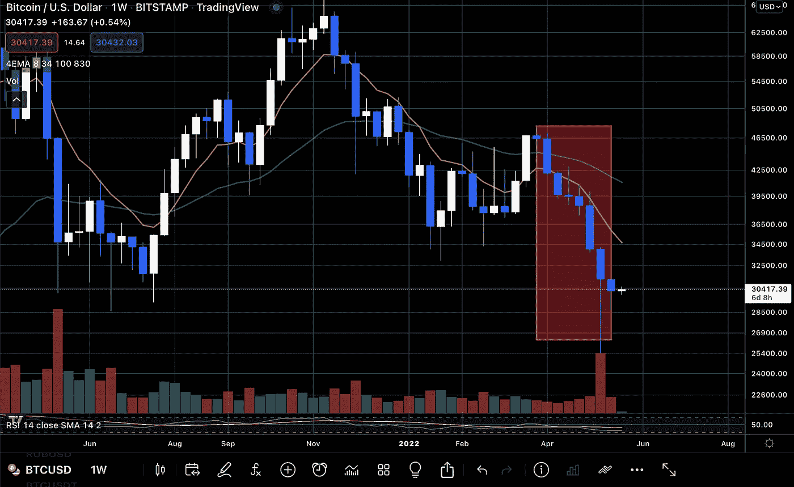

# 我们现在在哪里？—比特币价格分析

> 原文：<https://medium.com/coinmonks/where-are-we-now-bitcoin-price-analysis-e907f9f0fa8d?source=collection_archive---------40----------------------->

过去几天，比特币价格一直在 31，200 美元至 28，500 美元之间波动，昨日收盘时周线图上出现红烛，连续第八周收红。

**这是什么意思？**

在两周前从大约 34，000 美元到 25，000 美元区域的最后一次主要上涨之后，交易量一直在减少，市场犹豫不决的情况越来越多，因为…