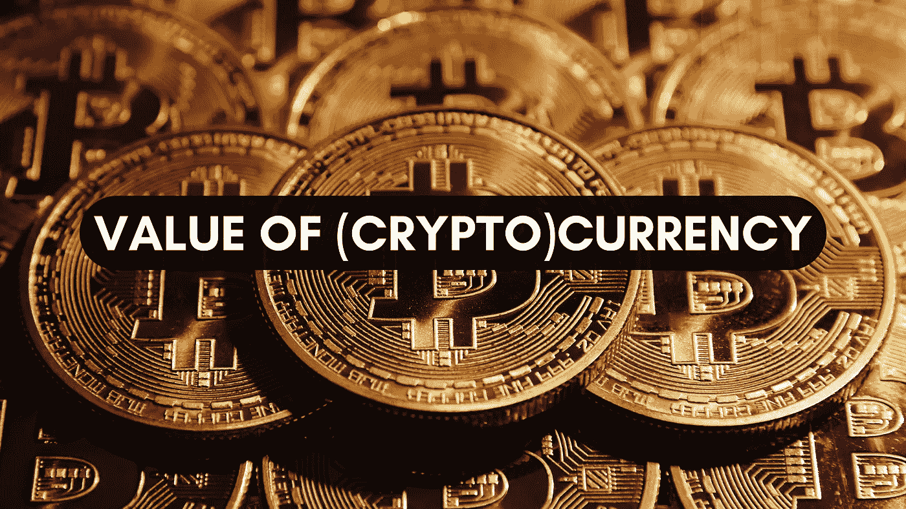
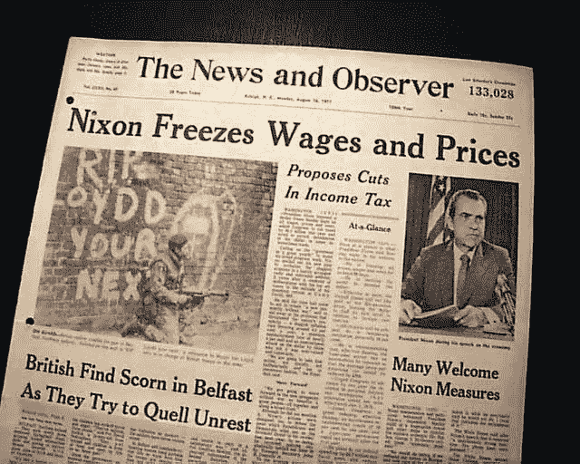
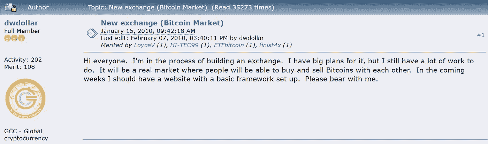
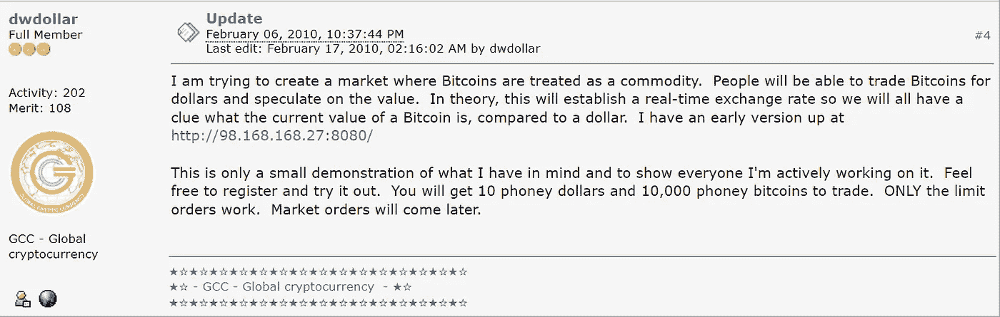

# (加密)货币的价值从何而来？

> 原文：<https://medium.com/coinmonks/where-do-crypto-currencies-get-their-value-from-90ab9f9eb882?source=collection_archive---------21----------------------->

你有没有想过 1 卢比的价值是从哪里来的？为什么今天 1 BTC 值 350 万卢比？谁决定 1 美元= 77 印度卢比？为什么它的值总是波动的？

如果你在寻找答案，请阅读这篇文章直到最后。

**免责声明**:这篇文章包含了许多过去发生的关于货币和趋势的事件。所以你的耐心和求知欲对于成功地阅读这篇文章并找到上述问题的答案是非常重要的。

首先，我们来谈谈市场上番茄价格的涨跌。

当市场上有大量的西红柿供应，而需求相当低/适中时，它们的价格通常较低。但是当供应短缺(比如说，由于恶劣的气候条件)而需求高的时候，价格就会很高。

货币的价值以类似的方式增长/收缩。

> 当对一种货币的需求增加，但供应有限时，它的价值**就会增加**。

假设一个国家，比如印度，与美国进行贸易。🚢为了从美国进口商品，印度必须用美元支付💲。印度通过银行将卢比兑换成等值的美元。现在，这使得一美元更有价值，因为它是有需求的💰。类似地，如果美国想购买印度商品，它会用美元兑换卢比。这增加了卢比的价值，因为对它有需求。

因此，对一种货币的需求是决定其价值的因素，并且随时都在变化。

但这(供需)并不是唯一的因素。

> 政治稳定、通货膨胀、利率、经济增长等也会对货币汇率产生影响。

这里有一段关于今天印度卢比价值的历史。

自从第二次世界大战*(所有国家都花在从美国购买武器上，并且他们的储备中没有黄金让他们的货币有任何价值)后，70%的世界黄金储备都在美国，美元与黄金的价值挂钩。根据布雷顿森林协议，该体系中的所有其他货币都与美元挂钩。*

*1971 年，布雷顿森林协定崩溃，美元不再与黄金挂钩，因为美国的黄金储备不足以覆盖流通中的美元数量。这是时任美国总统理查德·尼克松采取的措施，因此这一措施也被称为*尼克松冲击*。*

**

*那时，各国可以自由选择货币的任何兑换方法，除了将其价值与黄金价格挂钩。他们可以自由地将其价值与另一个国家的货币挂钩，或者让其自由浮动，让市场力量决定其相对于其他国家货币的价值(即*浮动汇率*)。*

> *印度卢比的价值是由外汇市场的供求关系决定的。这种制度被称为浮动汇率。*

*然而，由于印度央行干预美元/印度卢比货币市场，以保持对汇率的检查，据说印度遵循*管理/控制的浮动汇率*。*

*记住所有这些因素，外汇市场报价为 1 美元= 77.33 印度卢比，今天，创历史新低😔。*

*现在我们来谈谈加密货币。*

*为了了解加密货币如何获得其价值，有必要了解第一种加密货币，也是当今非常流行的一种货币——比特币。*

*这里有一个有趣的故事。*

*2010 年，拉兹洛·汉耶茨向一位 Bitcointalk 论坛用户支付 10，000 BTC 从棒约翰买了 2 个披萨的流行故事浮出水面。这是比特币首次被用于购买实物商品。今天，1 万 BTC 价值近 *3 亿* *美元* …*

*但是谁会知道…*

*如果你仍然想知道它是如何变得如此之大的，你必须和我一起挖掘比特币的历史。*

*以下事实是你会读到的关于比特币的最令人兴奋的事情。我打赌你还不想停止阅读。*

# *2008*

*匿名的中本聪发表了著名的[比特币白皮书](https://bitcoin.org/bitcoin.pdf)。*

# *2009*

*比特币在诞生时价值微乎其微。*

*2009 年 1 月，白皮书发布几个月后，中本聪在比特币区块链上创建了创世纪区块，美国开发者哈尔·芬尼收到了中本聪赠送的 10 BTC。*

# *2010*

*2010 年，***Bitcoinmarket.com***，一个名为 *dwdollar* 的个人在 [bitcointalk](https://bitcointalk.org/index.php?topic=20.msg100#msg100) 上提出了一个买卖比特币的市场。*

****

*一开始，1 个比特币的价值是 0.003 美元。*

*很快，一个名为 **Mt. Gox** 的新比特币交易平台出现了。它由杰布·麦卡勒创建，然后卖给了马克·卡佩斯。但该平台未能成功，因为它被黑客攻击了几次，损失了数千 BTC。*

# *2011*

*比特币的价值升至 1 美元，因为它经历了大量的交易。它主要用在**丝绸之路上，**一个为*毒贩和罪犯*在“黑暗网络”上运作的数字市场。它是由罗斯·威廉·乌尔布里切特于 2011 年创立的(他的名字是“恐惧海盗罗伯茨”)。丝绸之路帮助人们进行非法活动和交易，同时保持匿名。*

**

*Ross Ulbricht (Source: Google Images)*

# *2013*

*然而，在 2013 年，丝绸之路被美国政府关闭，此前美国联邦调查局(FBI)抓住了这家电子商务网站的 29 岁美国创始人，并指控他贩毒、电脑黑客和洗钱。他被判在监狱度过余生。你可以在这里阅读更多关于 Ulbricht 先生的信息。*

*与此同时，使用区块链技术的其他项目(如 Litecoin)正在开发中。比特币不仅被毒贩和罪犯交易，还被许多感兴趣的区块链开发商、矿工和投资者交易。*

# *之后…*

*从 2015 年的 200 美元，比特币在 2017 年 3 月达到了 1345 美元。*

*随着时间的推移，比特币在 2017 年 12 月迎来了价值超过 2 万美元的抛物线式增长，达到了历史新高。*

*盈利的投资者开始出售他们的资产来套现。他们开始收集其他加密货币，BTC 开始贬值。2018 年 12 月，它的价值只有 3500 多美元。但在 2019 年，比特币经历了一轮牛市，并设法涨到了 11，500 美元。*

*2020 年初，像大多数市场一样，比特币在新冠肺炎疫情期间再次跌至最低点，但到了 2020 年 12 月，它回升至 29000 美元，再创历史新高。*

*今年上半年，比特币再次在 2021 年创下历史新高，达到 64，000 美元，但在夏天跌至 30，000 美元。比特币再次创下 68000 美元的历史新高，但到 2022 年 1 月，它跌至 35000 美元。*

*众所周知，比特币的价值非常不稳定，但人们认为它有可能高达 100，000 美元！*

*我希望你现在明白了供给和需求是如何改变市场中的一切的，从一项毫无价值的资产到一切，反之亦然。*

*比特币在市场上以某种形式(在萌芽阶段的黑暗网络中)看到了它的用途，并很快成为一种拥有的酷资产，并通过媒体和当时感兴趣的投资者获得了人气。*

*这就是比特币的价值在一段时间内如何增长/缩水的。*

*此外，比特币的供应量上限为 2100 万。*

*根据 CoinMarketCap 的数据，在撰写本文时，比特币的**完全稀释市值**(即如果 2100 万 BTC 在流通，市值为**629，017，691，158 美元**。*

*这限制了比特币的供应，因此进一步增加了购买比特币的需求，希望有一天比特币会成为一种(更)有价值的储存手段。*

*话虽如此，我希望你现在明白像加密货币这样的资产是如何获得其价值的。这完全取决于交易所的数量和其他一些因素，如竞争、治理等。*

*如果你发现这篇文章内容丰富，请喜欢并分享。*

*[关注我](/@learnwithsiv)了解更多加密相关内容。*

> *加入 Coinmonks [电报频道](https://t.me/coincodecap)和 [Youtube 频道](https://www.youtube.com/c/coinmonks/videos)了解加密交易和投资*

# *另外，阅读*

*   *[Bookmap 点评](https://coincodecap.com/bookmap-review-2021-best-trading-software) | [美国 5 大最佳加密交易所](https://coincodecap.com/crypto-exchange-usa)*
*   *最佳加密[硬件钱包](/coinmonks/hardware-wallets-dfa1211730c6) | [Bitbns 评论](/coinmonks/bitbns-review-38256a07e161)*
*   *[新加坡十大最佳加密交易所](https://coincodecap.com/crypto-exchange-in-singapore) | [购买 AXS](https://coincodecap.com/buy-axs-token)*
*   *[红狗赌场评论](https://coincodecap.com/red-dog-casino-review) | [Swyftx 评论](https://coincodecap.com/swyftx-review) | [CoinGate 评论](https://coincodecap.com/coingate-review)*
*   *[投资印度的最佳密码](https://coincodecap.com/best-crypto-to-invest-in-india-in-2021)|[WazirX P2P](https://coincodecap.com/wazirx-p2p)|[Hi Dollar Review](https://coincodecap.com/hi-dollar-review)*
*   *[加拿大最佳加密交易机器人](https://coincodecap.com/5-best-crypto-trading-bots-in-canada) | [库币评论](https://coincodecap.com/kucoin-review)*