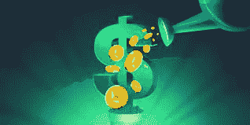
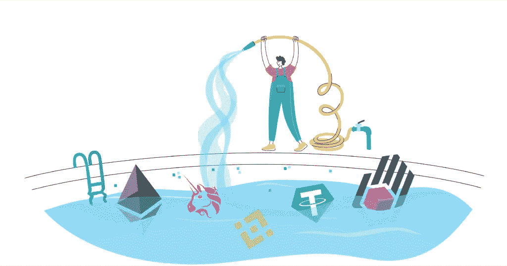
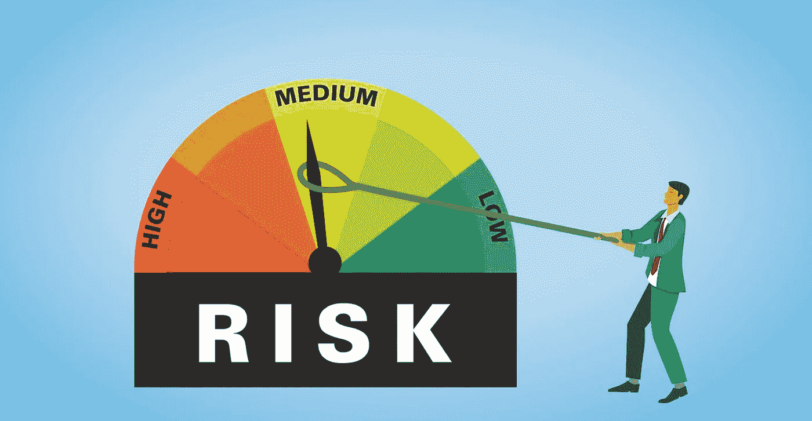
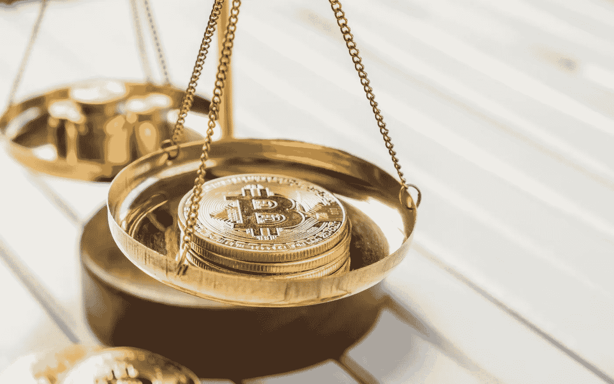

# 密码收益率从何而来？

> 原文：<https://medium.com/coinmonks/where-do-crypto-yields-come-from-e858c8a1d40c?source=collection_archive---------65----------------------->

它们是可持续的吗？

Crypto Yield

一个好的投资者会问这个问题“DeFi 协议如何产生收益？”

你一定参加过几个密码小组和社交媒体平台，尤其是新手，他们会问这个问题。

"密码产量从何而来？"

APY 越高，问题越严重。

对于那些 APY 高达 200%及以上的人来说，他们从哪里获得收益呢？

DeFi 协议是我们传统银行的加密版本。他们为投资者提供各种各样的 T2 农业机会。

DeFi 协议，如 AAVE、胰腺交换、曲线、复合等。经受住了时间的考验，现在是投资者的首选之地。如今，新项目如雨后春笋般涌现，高风险的 APY 吸引着新的投资者。

你必须明白，当一个新项目启动时，高 APY 是正常的，因为很少有投资者分享所产生的收益。但是当有更多的投资者时，它会急剧下降到一个更可持续的百分比。

所以今天，我将告诉你这些 DeFi 协议从哪里获得他们支付给投资者的收益。

你也会知道什么时候 DeFi 协议是一个庞氏骗局，标榜自己是一个 DeFi 协议。

**DeFi 协议向用户支付的收益来自哪里？**

1.  提供流动性。
2.  交换风险。
3.  分配股权。
4.  借贷的自然需求。

**提供流动性:**

A man providing liquidity into a pool

一个流动性提供商向一个平台提供他的加密资产，以帮助分散交易。他们从该平台的交易中获得报酬，这可以被视为被动收入。

为了提供流动性，必须有一对。假设我想在 Uniswap 这样的 DeFi 协议上提供流动性；我将购买 ETH 和 LINK，并将其添加到 Uniswap ETH/LINK 流动性池中。

在 Uniswap 上购买 ETH/LINK 的人，每笔交易收取 0.3%的交易费。

这笔来自交易费的交易在 ETH/LINK 的流动性提供商之间平均分配，以激励他们提供其加密资产。

**换汇风险:**

What is your risk appetite?

人们有不同的风险偏好。你可以承担高风险，并对此感到正常，而其他人可以承担小风险，并为此失眠。想象一下，Desmond 买了一辆车，如果他的车被盗或发生事故，他愿意向保险公司支付保险。

发生了汇兑风险。保险公司愿意承担风险并为此获得报酬，德斯蒙德愿意支付任何能为他承担这一风险的人。

在 DeFi 领域，Saffron finance 允许用户根据自己的风险偏好提供流动性。Saffron finance 有三个不同的面向用户的部分。

**AA 份额:**加入这一份额的有限合伙人(流动性提供者)赚取的利息较少，但作为回报，在平台风险和损失的情况下，本金得到保护。

**份额:**加入这一份额的有限合伙人赚取更多利息，但在平台风险的情况下损失部分或全部资本和利息。

**S 份额:**该份额中的 LP 与 AA 和 A 份额保持平衡，以保持份额利率乘数的平衡。

**分配股权:**

Distributing equity.

2020 年，Uniswap 向与其协议互动的社区提供了 400 个 UNI，为其协议提供了流动性和附加值。本可以作为 ICO 出售并用于支持项目的股权对其社区是免费的。

这也是 DeFi 协议通过将其令牌分发给为其协议增值的用户来产生收益的一种形式。

**借款的自然需求:**

Natural demand for borrowing

人们借钱解决问题，赞助项目，或者购买资产。必要时，企业会借钱支持自己的公司；银行借款满足预留要求；个人贷款建房，交学费等。

在 DeFi 领域，人们探索能够获得低利率资金池的机会，以便在不通过费力的系统的情况下利用。

当从 DeFi 协议中借钱时，要支付利息并用来维持协议的运行。

有了这些信息，你应该能辨别哪个 DeFi 协议伪装成庞氏骗局，等待着用可持续 DeFi 协议的投资资金爆炸。

Quincy 是一名密码研究者和作家，热衷于教育人们关于密码的知识。他也是一名技术人员和 Twitter 帖子作者。

> 加入 Coinmonks [电报频道](https://t.me/coincodecap)和 [Youtube 频道](https://www.youtube.com/c/coinmonks/videos)了解加密交易和投资

# 另外，阅读

*   [加密保证金交易交易所](/coinmonks/crypto-margin-trading-exchanges-428b1f7ad108) | [赚取比特币](/coinmonks/earn-bitcoin-6e8bd3c592d9) | [Mudrex 投资](https://coincodecap.com/mudrex-invest-review-the-best-way-to-invest-in-crypto)
*   [WazirX vs coin dcx vs bit bns](/coinmonks/wazirx-vs-coindcx-vs-bitbns-149f4f19a2f1)|[block fi vs coin loan vs Nexo](/coinmonks/blockfi-vs-coinloan-vs-nexo-cb624635230d)
*   [比斯勒评论](https://coincodecap.com/bitsler-review)|[WazirX vs coin switch vs coin dcx](https://coincodecap.com/wazirx-vs-coinswitch-vs-coindcx)
*   [7 大顶级副本交易平台](https://coincodecap.com/copy-trading-platforms) | [BuyCoins 审核](https://coincodecap.com/buycoins-review)
*   [XT.COM 评论](https://coincodecap.com/profittradingapp-for-binance)币安评论 |