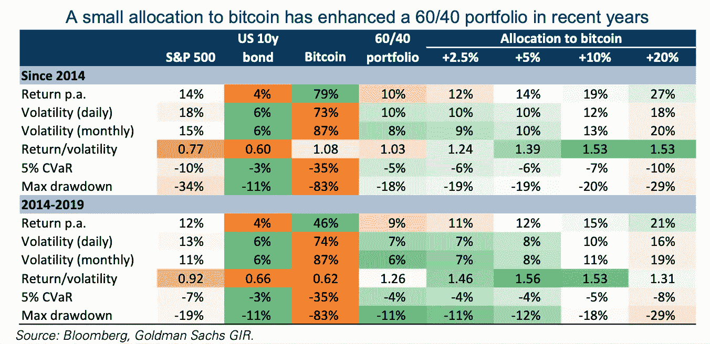
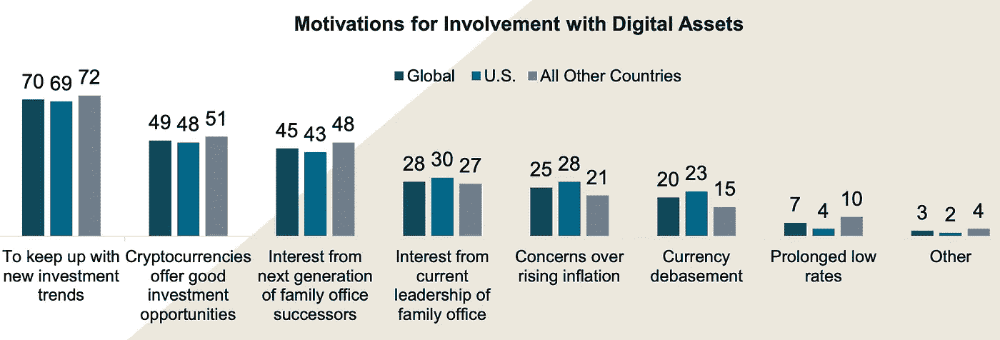
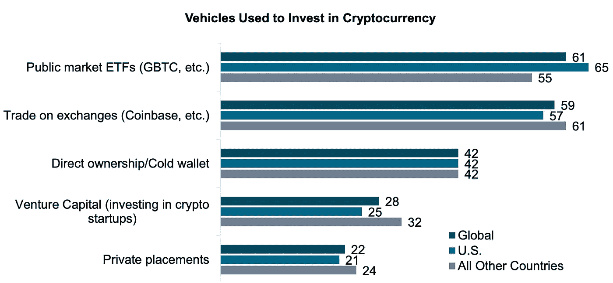

# 财富管理公司对加密的立场是什么？

> 原文：<https://medium.com/coinmonks/where-do-wealth-managers-stand-on-crypto-cdaf89b4362a?source=collection_archive---------22----------------------->

财富管理行业的新机遇。

# 什么是(加密)财富管理？

财富管理是管理家庭财富的艺术，以便为后代保存和建设财富。财富管理公司的客户通常是前企业家，他们卖掉了自己的企业，希望为自己和子女获得稳定的收入。当他们的财富超过 100 万美元时，他们被称为高净值个人，当财富超过 3000 万美元时，他们被称为超高净值个人。

高资产净值人士的典型投资组合主要包括股票和固定收益，还有一些房地产、艺术品或大宗商品的另类投资。最近还加密了。

> 根据 2021 年凯捷[世界财富报告](https://worldwealthreport.com/resources/world-wealth-report-2021/), 75%的富裕人士已经投资了加密技术

财富经理每天管理他们 HNW 客户的投资组合，以确保它不受市场变化的影响，并从新趋势中受益。与向其金融产品提供投资的资产管理公司或基金管理公司不同，财富管理公司不仅管理资产，也是客户值得信赖的顾问，并根据个人目标和兴趣优化他们的财务规划(如子女的大学学费、慈善事业或马匹收藏)。

新的趋势是**的秘密财富管理公司**，他们专门从事秘密资产的管理。加密理财经理有权访问客户钱包，并代表客户投资各种代币、赌注、收益农业和其他定义。加密理财经理拥有深厚的投资和技术知识，因为他们能够区分各种加密货币、代币和 DeFi 协议，并识别最有利可图和最安全的机会。

## 密码是一种新的资产类别

各种研究表明，加密货币与任何其他资产类别都不相关。加密资产既不是货币，也不是商品。

有超过 10，000 种加密货币(查看其他博客文章就知道为什么了)，但是加密“机会”不仅限于购买和持有。

**赌注**是一种“冻结”你的加密货币一段时间以换取固定回报的形式。在此期间，您的代币将用于改进加密货币(例如 ETH staking、Polkadot staking)。赌注不是完全(但主要)无风险的，也不是所有加密货币都提供(例如，没有比特币赌注)。

DeFi 代表**去中心化金融**，描述所有使用区块链技术构建的金融创新。DeFi 是革命性的，因为它允许在没有任何集中中介(如银行、存管机构、发行机构等)的情况下提供金融服务。简单地说，交易对手(例如借款人和贷款人)通过名为**智能合同**的计算机程序直接相互交流。下一篇文章将详细解释 DeFi 是如何工作的。

## 财富管理公司采用加密技术

如今，所有加密资产的总市值为 2.5 万亿美元，低于最大的财富管理公司瑞银(UBS)的总资产 2.6 万亿美元。然而，加密资产令人难以置信的增长(从 2019 年的 0.1 万亿美元)让它们如此有趣。

> 根据 BNY 梅隆财富管理公司的数据，77%的家族理财室对加密感兴趣

然而，加密采用率相对较低:

> 根据高盛的报告，到目前为止，只有 15%的家族理财室投资于加密

Onramp Invest 的首席执行官贾斯汀·卡斯特利(Justin Castelli)表示，“加密的流行创造了一种独特的情况，许多客户对该资产类别的了解超过了他们的财务顾问——顾问们正在迎头赶上。”

阻碍更广泛采用加密技术的主要原因是法规和基础设施。加密货币的监管方面，更不用说 DeFi 不清楚了，税收也是一样。专业的加密投资需要新的基础设施——区块链钱包，这通常不是私人银行提供的，而是财富管理公司(及其客户)的银行。

## 财富管理公司的下一步

财富经理对加密感兴趣的原因有很多，其中最主要的原因包括:

1.  富裕人士热衷于加密
2.  加密是一种新的资产类别，它与 DeFi 一起提供了新的多样化和收入机会
3.  加密是可以/应该积极管理的新资产的来源

BNY Melon Wealth Management 2022

加密理财经理如何进入加密？

1.  直接通过交易所交易基金进行，从而暴露于加密
2.  通过与已经拥有专业技术的加密财富管理公司合作
3.  建立内部加密知识并直接管理客户的加密钱包

BNY Melon Wealth Management 2022

未来将会显示，加密和传统财富管理是趋同还是趋异。富裕人士希望有一个值得信赖的顾问来咨询传统和加密资产。但有可能由一位财富经理在这两个领域提供专家建议吗？请在评论中分享你的观点。

请继续关注下一篇文章系列，它将一步一步地解释如何设置和管理加密钱包。

**加密理财系列文章:**

1.  财富管理公司对 Crypto 的态度如何？
2.  [加密如何提升财富管理](/@cyanustech/how-crypto-increases-the-role-of-wealth-managers-d2149f9d17c4)
3.  Defi 的幕后。财富经理简介
4.  从 TradeFi 到 deFi？财富经理入门指南

**Stablecoin 文章系列:**

1.  [终极稳定币分类](/coinmonks/ultimate-stablecoin-classification-bd70db1ae3f3)

参考资料:
1)凯捷，2021 年，世界财富报告
2) BNY 甜瓜财富管理，2022 年，转变视野:洞察家族理财室如何应对快速的经济&社会变革
3)高盛，2021 年，加密:一种新的资产类别？

> 加入 Coinmonks [电报频道](https://t.me/coincodecap)和 [Youtube 频道](https://www.youtube.com/c/coinmonks/videos)了解加密交易和投资

# 另外，阅读

*   [币安 vs FTX](https://coincodecap.com/binance-vs-ftx) | [最佳(SOL)索拉纳钱包](https://coincodecap.com/solana-wallets)
*   [比诺莫评论](https://coincodecap.com/binomo-review) | [斯多葛派 vs 3Commas vs TradeSanta](https://coincodecap.com/stoic-vs-3commas-vs-tradesanta)
*   [Capital.com 评论](https://coincodecap.com/capital-com-review) | [香港的加密借贷平台](https://coincodecap.com/crypto-lending-hong-kong)
*   如何在 Uniswap 上交换加密？ | [A-Ads 评论](https://coincodecap.com/a-ads-review)
*   [WazirX vs coin dcx vs bit bns](/coinmonks/wazirx-vs-coindcx-vs-bitbns-149f4f19a2f1)|[block fi vs coin loan vs Nexo](/coinmonks/blockfi-vs-coinloan-vs-nexo-cb624635230d)