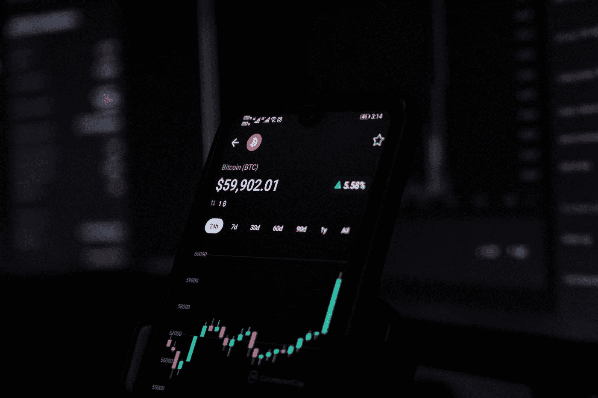

# 加密货币现在处于什么位置

> 原文：<https://medium.com/coinmonks/where-does-cryptocurrency-stand-now-f685e3dff36a?source=collection_archive---------37----------------------->

我们会看到另一轮牛市吗？

Photo by [Sajad Nori](https://unsplash.com/@sajadnori?utm_source=medium&utm_medium=referral) on [Unsplash](https://unsplash.com?utm_source=medium&utm_medium=referral)

免责声明:你在下面看到的都不是财务建议，你的资本在投资时总是有风险的。

比特币目前正在测试一个关键价格，这可能决定我们是否能看到新的历史高点。截至发稿时，比特币的价格目前为 44.8k 美元。对于比特币来说，反弹并达到之前的历史高点，这…