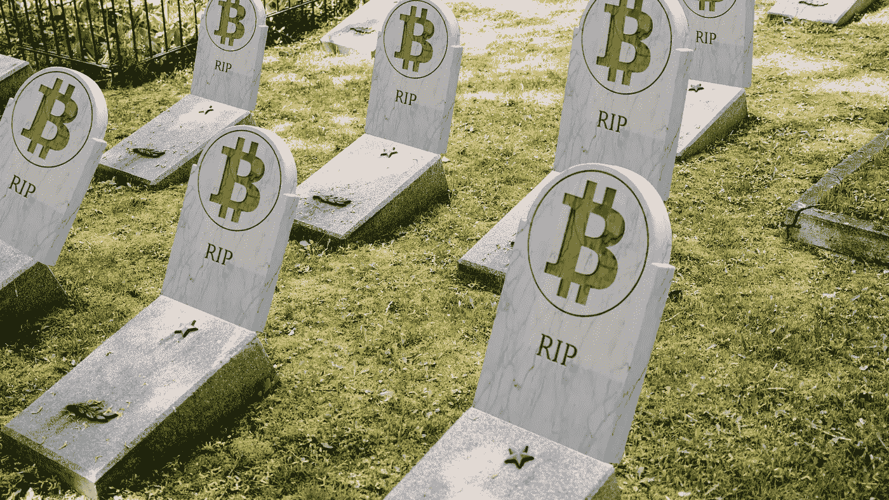

# 你死了你的加密货币去哪了？

> 原文：<https://medium.com/coinmonks/where-does-your-cryptocurrency-go-when-you-die-15b2f786017e?source=collection_archive---------48----------------------->

# 你的加密货币资源将会毫无阻碍地给你的接收者

传递不是我们喜欢反复思考或讨论的事情，但是为所有可能性做出安排是至关重要的，尤其是假设您已经将资源放入 crypto 中。

根据区块链调查机构 Glassnode 的信息显示，直到时间结束，超过 10%的比特币流通供应将会丢失。为什么它会消失，没有人真正知道。在任何情况下，一个假设将是它的丢失，因为个人没有给亚利桑那州遗嘱检验足够的想法或有令人满意的措施后，他们已经死了。

如果你没有考虑过未来，也不想让你的朋友和家人接受你的密码，而且这对你抛弃的人来说很有价值，下面是你想做的事情。

## 挑选合适的人把你的加密资产交给他

在您开始苦恼如何最好地安全获得您的加密资源之前，第一步是选择告诉谁。这并不像你想的那样简单，因为这不仅仅是你信任谁的问题。你另外告诉的那个人应该接受教育，因为他们必须理解如何获得你的基于密码的富足。

如果个人不知道如何使用装备钱包或交易，他们将需要找到或利用其他人来帮助他们或试图找出如何利用自己的密码阶段和小工具。

这可能是一个安全风险，因为将加密发送到一些不可接受的位置是非常简单的，就像利用一些不可接受的符号原则来阻止小工具或提取资源一样。

另一件要考虑的事情是，你发现多少数据是明智的？您必须透露足够的数据，以便有人可以选择访问您的加密属性。尽管如此，对你来说，相信一个人的数据或者在你认识的几个相信的人之间分配指南是明智的吗？只是你知道答案，但这是你必须考虑的事情。

## 您应该采取的步骤

无论何时，当你决定了谁将成为你的加密储备的接收者，接下来的阶段就是设计发现和断言他们的技术。

## 你的资金领域

你的指导方针应该包括你拥有的任何设备钱包的实际面积，以及你的密码放在哪个热门钱包里。

假设你把你的资源放在几个地方，例如，DeFi pools，集中交易，或不可替代的象征性商业中心，现在可能是一个很好的机会把它们组合成密码钱包，帮助不同种类的资源。

## 密码、私钥和备份代码

为你的加密钱包、电子邮件记录和交易账户列出大量的密码、私钥和种子短语，接收者应该得到你的资产。

万一双因素验证被打开，您同样必须给出存放应用程序的小工具的区域和密钥。

假设你的记录被设置为接收 SMS 安全信息，你同样需要为你正在使用的手机加入区域和密钥的微妙之处。

## 专业建议

你可能会觉得记住风险投资对于任何接受者应该如何处理或出售你的资源是很重要的。例如，你可以确定哪种交易是最理想的，或者制定一个简短的演练指南，告诉他们如何建立自己的钱包和转移资产。

需要思考的是，一段时间后，阶段会以何种方式传播。此外，安全漏洞可能会驱使您将资产转移到新的钱包中。这意味着你想跟上最新的。

## 复制你的敏感加密信息

在便利贴上写下种子短语，然后把它们粘在冷却器上或通过电子邮件发送数据并不是最明智的做法。

在一个完美的世界里，你应该把数据复制到纸上，并且复制几份。每个副本应该放在不同的地方，以消除任何薄弱环节。例如，假设你在床头柜上放了一份纸质副本，然后你的家突然着火了。您的收件人可能总是无法获得资产。

为了增强您的微妙的加密数据的安全性，有一些组织提供了在金属板上植入表达式和密码的能力。这提供了额外的保证，防止水损害，房屋火灾，以及大多数实际上可能损害纸质复制品的不同事情。

最后一点是，你应该排除你的密码数据在你的遗嘱。这是因为无论你何时离开，遗嘱中的任何数据，包括加密密码，都会向公众公开。

## 最后的想法

或许加密钱包最大的好处就是当你还活着的时候，没人能进入它。无论如何，一旦你死了，这就不太理想了。

现在你意识到该采取什么步骤来保证你的数字货币进入完美的个人手中，你可以在晚上休息，意识到你的朋友和家人会被处理。

文章中公布的数据可以说是出于教育目的。通过利用这一点，你同意数据没有建立风险或金钱顾问。在决定任何投机选择之前，一定要引导你自己的检查并与货币指导者联系。

> 加入 Coinmonks [电报频道](https://t.me/coincodecap)和 [Youtube 频道](https://www.youtube.com/c/coinmonks/videos)了解加密交易和投资

# 另外，阅读

*   [3 商业评论](/coinmonks/3commas-review-an-excellent-crypto-trading-bot-2020-1313a58bec92) | [Pionex 评论](https://coincodecap.com/pionex-review-exchange-with-crypto-trading-bot) | [Coinrule 评论](/coinmonks/coinrule-review-2021-a-beginner-friendly-crypto-trading-bot-daf0504848ba)
*   [莱杰 vs n rave](/coinmonks/ledger-vs-ngrave-zero-7e40f0c1d694)|[莱杰 nano s vs x](/coinmonks/ledger-nano-s-vs-x-battery-hardware-price-storage-59a6663fe3b0) | [币安评论](/coinmonks/binance-review-ee10d3bf3b6e)
*   [Bybit Exchange 审查](/coinmonks/bybit-exchange-review-dbd570019b71) | [Bityard 审查](https://coincodecap.com/bityard-reivew) | [Jet-Bot 审查](https://coincodecap.com/jet-bot-review)
*   [3 commas vs crypto hopper](/coinmonks/3commas-vs-pionex-vs-cryptohopper-best-crypto-bot-6a98d2baa203)|[赚取加密利息](/coinmonks/earn-crypto-interest-b10b810fdda3)
*   最好的比特币[硬件钱包](/coinmonks/hardware-wallets-dfa1211730c6) | [BitBox02 回顾](/coinmonks/bitbox02-review-your-swiss-bitcoin-hardware-wallet-c36c88fff29)