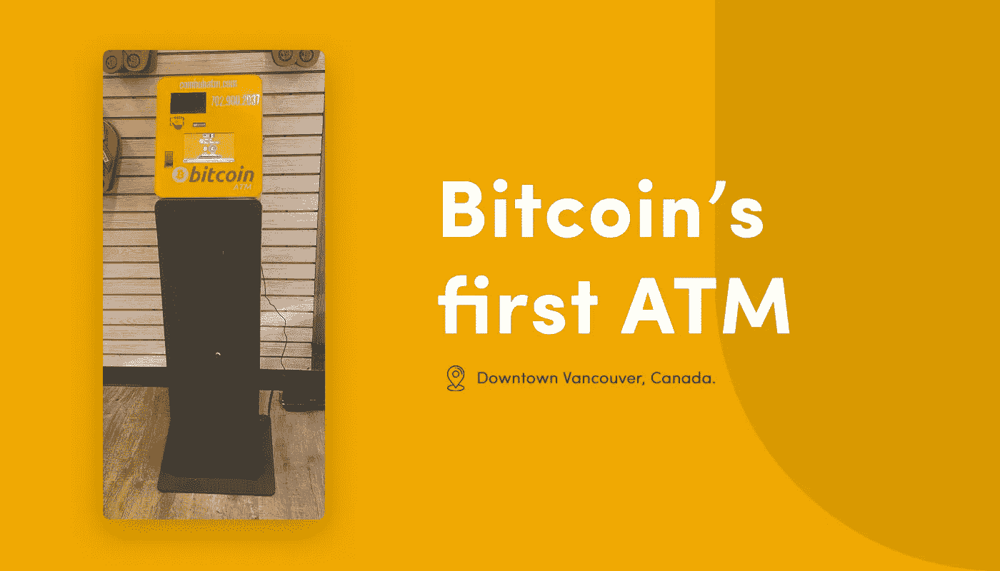

# 第一台比特币 ATM 机在哪里？

> 原文：<https://medium.com/coinmonks/where-is-first-bitcoin-atm-situated-4399c1324e44?source=collection_archive---------56----------------------->

比特币通常被称为加密货币之王，是一种纯粹的虚拟货币形式。它类似于一种在线形式的现金。比特币可以被别人发到你的数字钱包里，你也可以把比特币发给别人。将比特币兑换为当地货币、商品或服务或其他加密货币的过程称为比特币兑换。

# **你有没有想过第一个比特币是什么时候出现的-**

第一台自动取款机位于加拿大温哥华。Robocoin 机器在市中心开了 Waves 咖啡店。对于一些人来说，它可以方便地存储和交换价值。

*   此外，2014 年，加拿大是第一个批准监管加密货币的国家。
*   根据 coin ATM Radar 的数据，截至 9 月份，美国共有超过 24700 台比特币 ATM。
*   Robocoin 是世界上第一台比特币 ATM 机。
*   其他的自动取款机不像机器警察。不接受借记卡或信用卡。这是一台只接受现金的机器。你把钱放进去，它给你号码——对应于比特币的地址，比特币是世界上使用最广泛的数字货币。
*   比特币是一个基于互联网的系统，由机器网络管理。当你购买一枚比特币时，你实际上是在购买加密保护的数字，然后你可以利用一个全球性的点对点计算机网络来移动这些数字。它是钱，但它像电子邮件一样容易移动。

然而，重要的是要记住比特币是一个去中心化的组织。

如果我们可以使用这个术语，它是由所有用户的总和“拥有”的。

那么，比特币是什么以及它如何演变是一个开放的话题，其答案将由各种声音决定，从矿工和节点到交易所、钱包提供商，以及最重要的，拥有和使用比特币的人。

因此，记住了解比特币价格变动的几个步骤。

1.  选择一种比特币交易风格和策略。
2.  选择你想要接触比特币的方式。
3.  决定是做多还是做空。
4.  设置你的止损和限制。
5.  监控你的交易。
6.  平仓以获利或止损。

[BuyUcoin 的](http://www.buyucoin.com)加密指标可以帮助你决定何时买卖比特币和其他加密货币。算法实际上相当简单。全靠供求关系。对比特币的需求越大，比特币的价格就越高。通过 BuyUCoin 的实时加密交易市场，你将不必等待几分钟或几小时就能获得比特币。它快速、可靠、安全。

> *加入 Coinmonks* [*电报频道*](https://t.me/coincodecap) *和* [*Youtube 频道*](https://www.youtube.com/c/coinmonks/videos) *了解加密交易和投资*

# 另外，阅读

*   [3 商业评论](/coinmonks/3commas-review-an-excellent-crypto-trading-bot-2020-1313a58bec92) | [Pionex 评论](https://coincodecap.com/pionex-review-exchange-with-crypto-trading-bot) | [Coinrule 评论](/coinmonks/coinrule-review-2021-a-beginner-friendly-crypto-trading-bot-daf0504848ba)
*   [莱杰 vs n 格拉夫](/coinmonks/ledger-vs-ngrave-zero-7e40f0c1d694) | [莱杰纳诺 s vs x](/coinmonks/ledger-nano-s-vs-x-battery-hardware-price-storage-59a6663fe3b0) | [币安评论](/coinmonks/binance-review-ee10d3bf3b6e)
*   [Bybit Exchange 审查](/coinmonks/bybit-exchange-review-dbd570019b71) | [Bityard 审查](https://coincodecap.com/bityard-reivew) | [Jet-Bot 审查](https://coincodecap.com/jet-bot-review)
*   [3 commas vs crypto hopper](/coinmonks/3commas-vs-pionex-vs-cryptohopper-best-crypto-bot-6a98d2baa203)|[赚取加密利息](/coinmonks/earn-crypto-interest-b10b810fdda3)
*   最好的比特币[硬件钱包](/coinmonks/hardware-wallets-dfa1211730c6) | [BitBox02 回顾](/coinmonks/bitbox02-review-your-swiss-bitcoin-hardware-wallet-c36c88fff29)
*   [BlockFi vs Celsius](/coinmonks/blockfi-vs-celsius-vs-hodlnaut-8a1cc8c26630)|[Hodlnaut 点评](/coinmonks/hodlnaut-review-best-way-to-hodl-is-to-earn-interest-on-your-bitcoin-6658a8c19edf) | [KuCoin 点评](https://coincodecap.com/kucoin-review)
*   [Bitsgap 审查](/coinmonks/bitsgap-review-a-crypto-trading-bot-that-makes-easy-money-a5d88a336df2) | [Quadency 审查](/coinmonks/quadency-review-a-crypto-trading-automation-platform-3068eaa374e1) | [Bitbns 审查](/coinmonks/bitbns-review-38256a07e161)
*   [密码本交易平台](/coinmonks/top-10-crypto-copy-trading-platforms-for-beginners-d0c37c7d698c) | [Coinmama 审核](/coinmonks/coinmama-review-ace5641bde6e)