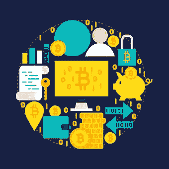

# 在尼日利亚哪里可以买到比特币和其他加密货币

> 原文：<https://medium.com/coinmonks/where-to-buy-bitcoin-and-other-cryptocurrencies-in-nigeria-f11ffcf53510?source=collection_archive---------44----------------------->

在继续购买 crypto 之前，我们必须了解什么是加密货币。什么是加密货币？加密货币是数字或虚拟令牌，使用加密技术来保护其交易并控制新单位的创建。加密货币是分散的，这意味着它们不受政府或金融机构的控制。比特币是第一种也是最知名的加密货币，诞生于 2009 年。现在有超过 1000 种不同的加密货币在流通，并且每天都在创造更多。加密货币通常在分散的交易所交易，也可以用来购买商品和服务。

在本文中，我们将讨论如何在尼日利亚购买加密货币，以及我们在尼日利亚拥有的最好的加密交易所。加密货币的分散性对其在包括尼日利亚在内的许多国家被广泛接受做出了积极贡献。然而，该国年轻的技术专家已经诞生了金融科技公司，这些公司帮助该国无缝采用加密货币。

接下来，我们将考虑在尼日利亚购买加密货币的可用平台。无论你是比特币新手还是高级加密货币交易者，你都必须了解什么是加密交换平台以及它们如何工作，以便选择适合你需求的平台。其中一些平台包括:币安、Quidax、Prestmit、Breet app、 [Dart Africa](https://play.google.com/store/apps/details?id=com.dartafrica&hl=en_US&gl=US) 等。随着加密货币的增长和广泛采用，越来越多的人会问自己应该使用什么平台来开始他们的加密之旅。这可能具有挑战性，因为不同的人对加密货币的了解程度不同。在加入这个领域之前，有几十个特征需要跨交易所检查。

不管你在加密领域的知识水平如何，这里有五件重要的事情需要注意。

●安全性:你要时刻关注任何一个交易平台的安全级别，这样你才确定平台的合法性。做你的研究，并确保平台有一个强大的安全交换协议。

●可用的购买方法:购买 crypto 的方法因平台而异。一些平台要求通过银行转账存款，一些接受 PayPal 转账，一些接受信用卡和借记卡，一些只使用加密货币进行购买。你必须注意所有这些选项，看看哪个适合你。如果你在加入交易平台之前没有任何密码，选择一个接受 fiat 的平台是很重要的，这样你才能进入市场。注意完成购买需要多长时间也很重要。这也因平台而异。

●可用交换选项:各种平台有各种交换选项，包括:经典交易流程、点对点加密交易、经纪人和差价合约交易、衍生品交易。注意了解这些选项中哪一个适合你。

●交易费用:交易费用因交易平台的政策不同而不同。在决定使用交换平台之前，必须通读他们的政策。

●用户界面/体验:要考虑的最重要的事情之一是任何平台的用户界面和功能。无论你是老交易员还是第一次购买比特币，良好的界面和良好的用户体验有助于用户更加知情和高效。用户体验是主观的，因为不同的人会根据他们的品味和选择喜欢不同的界面。

在权衡了所有因素和选项后，您现在可以选择使用什么平台了。尼日利亚的一些可信的加密交易所包括币安、Kucoin、Yellowcard.io、FTX、Dart Africa 和 Luno。然而，当涉及到用加密货币兑换现金时，Dart Africa 在尼日利亚和加纳都处于领先地位。这个平台建立在信任、快速支付系统、强大的客户支持和用户友好的界面之上。通过 Dart Africa，任何人都可以以市场上最优惠的价格将比特币兑换成现金和其他加密资产。此外，这个平台配备了一个自动利率计算器，让你的奈拉或加纳塞地相当于你的加密资产。

> 加入 Coinmonks [电报频道](https://t.me/coincodecap)和 [Youtube 频道](https://www.youtube.com/c/coinmonks/videos)了解加密交易和投资

# 另外，阅读

*   [用信用卡购买密码的 10 个最佳地点](https://coincodecap.com/buy-crypto-with-credit-card)
*   [加拿大最佳加密交易机器人](https://coincodecap.com/5-best-crypto-trading-bots-in-canada) | [Bybit vs 币安](https://coincodecap.com/bybit-binance-moonxbt)
*   [阿联酋 5 大最佳加密交易所](https://coincodecap.com/best-crypto-exchanges-in-uae) | [SimpleSwap 评论](https://coincodecap.com/simpleswap-review)
*   购买 Dogecoin 的 7 种最佳方式 | [ZebPay 评论](https://coincodecap.com/zebpay-review)
*   [最佳期货交易信号](https://coincodecap.com/futures-trading-signals) | [流动性交易回顾](https://coincodecap.com/liquid-exchange-review)
*   【Huobi 的加密交易信号 | [Swapzone 审查](/coinmonks/swapzone-review-crypto-exchange-data-aggregator-e0ad78e55ed7)