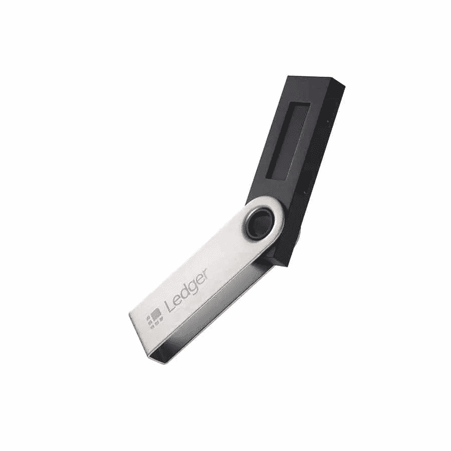

# 在哪里存储私钥？保管好你的私人钥匙！

> 原文：<https://medium.com/coinmonks/where-to-store-private-keys-f3df31c4ca8e?source=collection_archive---------14----------------------->

近年来，加密货币市场增长迅猛。随着加密货币的兴起，金融的力量又回到了我们手中。然而，这也使我们容易受到网络犯罪的攻击。本文将帮助您了解什么是私钥，以及如何有效地保护您的私钥。

# 什么是私钥？

`A **private key** is a **secret string of letters and numbers that allows you to access and manage your cryptocurrency funds.** It is like a password that proves your ownership of your cryptocurrency.`

# 为什么私钥很重要？

您将获得两种密钥:公钥，其功能类似于电子邮件地址(您可以安全地与其他人共享，使您能够发送和接收付款)，以及私钥，通常是一串字母和数字(不得与任何人共享)。把私钥看作是打开存放你的钱的虚拟金库的密码。您的资产是安全的，只要您(并且只有您)能够访问您的私钥，就可以在任何有互联网连接的地方对其进行管理。

# 您应该在哪里存储您的私钥？

就像你的银行密码一样，保管好你的私人钥匙也很重要！将它们离线存储在安全的地方。一些投资者选择将私人密钥保存在没有联网的电脑上，写在纸上，甚至只是记忆。

如果你涉足比特币或其他加密货币，你或许可以将你的私人密钥存储在软件钱包中。然而，如果你认真对待加密，挖掘自己的比特币，或者在加密上投入了大量现金，你应该强烈考虑硬件钱包。

下面描述了我用来保护我的加密资产安全的硬件——莱杰纳米 T2，以及它的优缺点。当你点击我的链接后购买钱包，我会得到一点佣金。但是，无论你使用我个人最喜欢的[莱杰纳米 S](https://www.amazon.ca/Ledger-Nano-Cryptocurrency-Hardware-Ethereum/dp/B07FY5R77T?pd_rd_i=B07FY5R77T&th=1&linkCode=ll1&tag=fusuy-20&linkId=a0d6369251540fe71715c79cdf00d34f&language=en_CA&ref_=as_li_ss_tl) ，还是其他选择，我强烈建议你避免使用总是与互联网相连的软件钱包，这样更容易被黑客攻击。

# 莱杰纳米 S

这是一个类似 u 盘的硬件钱包。Ledger Nano S 支持 30 多种不同的加密货币(包括比特币、以太坊、XRP、比特币现金、EOS、Stellar、Dogecoin 等)和所有 ERC20 令牌，一切都受到 8 位 PIN 码的保护。

## 强项

*   支持 30 多种不同的加密货币。
*   受 8 位密码保护。

## 弱点

*   显示屏很小，不是触摸屏。

[亚马逊上的视图](https://www.amazon.ca/Ledger-Nano-Cryptocurrency-Hardware-Ethereum/dp/B07FY5R77T?pd_rd_i=B07FY5R77T&th=1&linkCode=ll1&tag=fusuy-20&linkId=0cefb3e3ce7907311ea906d5a460b713&language=en_CA&ref_=as_li_ss_tl)

# 最后的想法

网络犯罪分子瞄准加密货币用户已经有一段时间了，他们在这方面变得越来越老练。这是因为随着加密货币数量的增长，它们的价值也在增长，这使它们成为黑客的一个有吸引力的目标。避免这些攻击的最佳方式是使用离线的冷存储钱包，并将加密货币存储在未连接到互联网的硬盘或 u 盘上。这里有一些其他的提示可以帮助你保护你的数字资产:只使用最有信誉的钱包，避免任何未知或不可信的交易。不要把所有的硬币都放在一个地方。最好把它们分在几个不同的钱包里，分散开来。这将使黑客更难获得你所有的加密货币。对存储您的数字资产的任何帐户使用双因素身份验证。如果你有一个像 Ledger Nano S 这样的硬件钱包，总是通过检查它的绿灯来确认设备没有连接到你的 PC。这是因为一些恶意软件可以导致设备进入假的“睡眠模式”，这将允许它窃取数据。

 [## 你准备好迎接加密经济了吗？加密派

### 每次你打开新闻，阅读报纸，或者浏览你的推特，你很可能会看到一些故事…

www.thecryptopie.com](https://www.thecryptopie.com/) 

> *加入 Coinmonks* [*电报频道*](https://t.me/coincodecap) *和* [*Youtube 频道*](https://www.youtube.com/c/coinmonks/videos) *了解加密交易和投资*

# 另外，阅读

*   [有哪些交易信号？](https://coincodecap.com/trading-signal) | [Bitstamp vs 比特币基地](https://coincodecap.com/bitstamp-coinbase) | [买索拉纳](https://coincodecap.com/buy-solana)
*   [ProfitFarmers 回顾](https://coincodecap.com/profitfarmers-review) | [如何使用 Cornix 交易机器人](https://coincodecap.com/cornix-trading-bot)
*   [十大最佳加密货币博客](https://coincodecap.com/best-cryptocurrency-blogs) | [YouHodler 评论](https://coincodecap.com/youhodler-review)
*   [MyConstant Review](https://coincodecap.com/myconstant-review) | [8 款最佳摇摆交易机器人](https://coincodecap.com/best-swing-trading-bots)
*   [MXC 交易所评论](/coinmonks/mxc-exchange-review-3af0ec1cba8c) | [Pionex vs 币安](https://coincodecap.com/pionex-vs-binance) | [Pionex 套利机器人](https://coincodecap.com/pionex-arbitrage-bot)