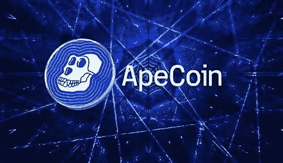

# 5 年后 ApeCoin 会在哪里？

> 原文：<https://medium.com/coinmonks/where-will-apecoin-be-in-5-years-b90bab3b8cf3?source=collection_archive---------12----------------------->

Source photo [apecoin news — Bing images](https://www.bing.com/images/search?view=detailV2&ccid=jeudMYxx&id=6128D38EBB3A0CA5C1B0F6AA1A83B05C7C023FC9&thid=OIF.0WbehQURAMIcu%2fwRVRKA2Q&mediaurl=https%3a%2f%2fnews.t-rex.exchange%2fwp-content%2fuploads%2f2022%2f03%2f3Ape-trex.jpg&cdnurl=https%3a%2f%2fth.bing.com%2fth%2fid%2fR.8deb9d318c712c728da8b3f2065945e7%3frik%3d%26pid%3dImgRaw%26r%3d0&exph=410&expw=707&q=apecoin+news&simid=7091479022839&FORM=IRPRST&ck=D166DE85051100C21CBBFC11551280D9&selectedIndex=9&ajaxhist=0&ajaxserp=0)

尽管最近的价格历史，硬币仍然是有史以来表现最好的货币之一。

自 2022 年 3 月 17 日推出以来，APE 的投资回报率已超过 3800%。

虽然 APE 在 2022 年 4 月继续面临价格修正和阻力，使对 39.40 美元的历史最高价格的重新测试具有挑战性，但 APE 在…