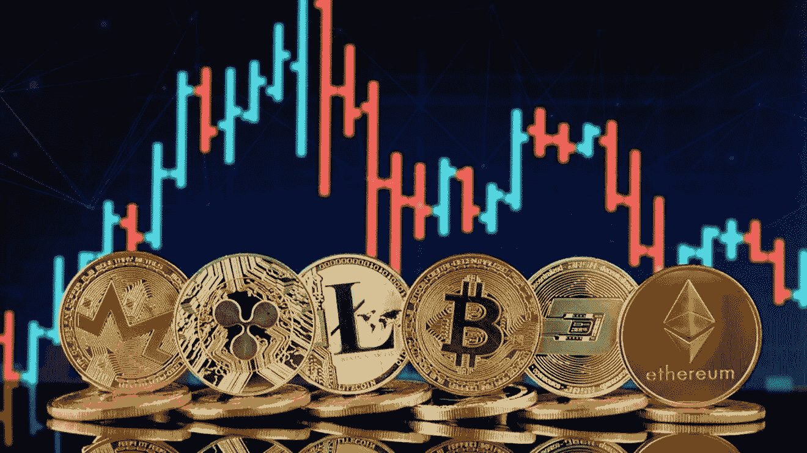
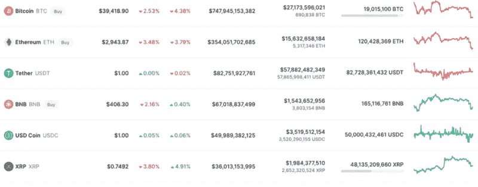
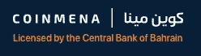

# 你可以在中东购买加密货币

> 原文：<https://medium.com/coinmonks/where-you-can-purchase-cryptocurrency-in-the-middle-east-d3d646aa0dac?source=collection_archive---------39----------------------->

投资加密货币已经席卷了整个世界。虽然这些货币已经存在了很长时间，但直到最近，科技行业以外的人才开始对此感兴趣。是时候投资了！

# ***什么是加密货币***

加密货币是一种数字或虚拟资产，使用加密技术来确保安全。加密货币是分散的，这意味着它们不受政府或金融机构的控制。比特币是第一种也是最知名的加密货币，诞生于 2009 年。加密货币通常在分散的交易所交易，也可以用来购买商品和服务。

近年来，中东一直是加密货币活动的温床。以色列和阿拉伯联合酋长国一直走在加密技术应用的前列，两国都在实施监管并推出自己的数字货币。巴林也在探索创造自己的中央银行发行的数字货币的可能性。

随着更多国家走向监管并推出自己的数字货币，加密货币在中东的采用可能会在未来几年继续增长。

# 为什么要投资加密货币？

如果你想投资加密货币，有几件事你应该知道。首先，加密货币是一种数字或虚拟资产，使用加密技术来保证安全。加密货币是分散的，这意味着它不受政府或金融机构的控制。比特币是第一种也是最知名的加密货币，诞生于 2009 年。

有几个原因可能会让你想投资加密货币。加密货币有可能比传统的支付和交易方式更安全、更高效。例如，比特币不像传统货币那样容易受到通货膨胀的影响。此外，加密货币可以用于匿名购物，如果你担心隐私，这可能是有益的。

中东是加密货币投资的新兴市场。尽管该地区采用加密货币的速度相对较慢，但人们的兴趣正在增长。在阿拉伯联合酋长国和沙特阿拉伯等国家已经建立了许多交易所。如果你正在考虑投资加密货币，中东是一个值得关注的重要市场。

# 加密货币的类型

加密货币是一种数字资产，它使用加密技术来保护其交易并控制新单位的创建。加密货币是分散的，这意味着它们不受政府或金融机构的控制。最知名的加密货币是比特币，但还有许多其他货币，包括以太坊、莱特币和 Ripple。

加密货币通常在交易所买卖，交易所是一个在线平台，允许用户使用法定货币(如美元)或其他加密货币买卖加密货币。一些受欢迎的交易所包括比特币基地、币安和北海巨妖。

加密货币也可以直接从 LocalBitcoins 或 Paxful 等网站上的卖家那里购买。然而，以这种方式购买加密货币时要谨慎，因为不能保证卖家会按照承诺交付硬币。

此外，允许你用现金购买比特币的自动取款机已经开始在世界各地出现。然而，这些往往比购买加密货币的其他方法更昂贵。

# ***中东哪里买比特币和 altcoin***

加密货币仍然是一个相对较新的现象，因此，很难知道在哪里购买它。在中东，对于那些想购买比特币和替代币的人来说，有几种不同的选择。

主要选择是使用加密货币经纪人。这些平台通常会提供比低费用的点对点交流更广泛的硬币。中东一些受欢迎的经纪商包括 RainFinancial、CoinMENA 和 BitOASIS。

*   [*Rain financial*](https://rain.bh/?ref=JFWNGPE):
    Rain 获得了巴林中央银行的许可，并遵守严格的网络安全和银行标准，他们拥有全天候的本地化支持，并保证您将始终与人交谈，无论是在实时聊天还是电子邮件中，他们的平台上列出了 60 多个硬币。
    使用此推荐[链接](https://www.rain.bh/?ref=JFWNGPE)注册即可获得 110 AED。

*   [*coin MENA*](https://app.coinmena.com/signup?token=add5aea1-2671-437b-b529-7bbd5538636c):
    coin MENA 总部位于巴林王国，是一家符合伊斯兰教法的数字资产交易所，由巴林(CBB)中央银行授权并监管。通过 CoinMENA，您可以安全地购买、出售、存储和接收数字资产，以及以您的本地货币存款和取款。
    使用下面的[这个](https://app.coinmena.com/signup?token=add5aea1-2671-437b-b529-7bbd5538636c)推荐链接，在注册时获得 25 美元的奖金。

*   [*bit oasis*](http://I just bought my first crypto...   I’m thinking you’d also like to invest to get incredible returns on BitOasis! That AED 500 reward is pretty sweet. Use my referral link to sign up!  https://r.bitoasis.net/jG9Y):
    bit oasis 总部位于阿联酋，是中东北非地区最大、最值得信赖的加密货币平台。BitOasis 成立于 2015 年，是该地区加密货币生态系统的先驱，是首次购买加密货币和专业交易者的首选平台。BitOasis 旨在为该地区的零售和机构客户提供加密货币交易方面最安全、最受监管的基础设施。
    使用[下面的](http://I just bought my first crypto...   I’m thinking you’d also like to invest to get incredible returns on BitOasis! That AED 500 reward is pretty sweet. Use my referral link to sign up!  https://r.bitoasis.net/jG9Y)推荐链接，在注册时获得 25 AED 的奖励。

# 结论

如果你想在中东购买加密货币，你有几个选择。你可以使用总部位于阿拉伯联合酋长国的 BitOasis 等交易所，也可以通过点对点交易所购买加密货币。LocalBitcoins 是那些希望在中东购买比特币的人的一个热门选择。你还可以在该地区的一些国家找到比特币自动取款机。

购买加密货币时，一定要做好自己的研究，负责任地投资。加密货币是一个不稳定的市场，价格可能会快速波动。只投资你能承受损失的，时刻牢记你的个人和投资目标。

> *加入 Coinmonks* [*电报频道*](https://t.me/coincodecap) *和* [*Youtube 频道*](https://www.youtube.com/c/coinmonks/videos) *了解加密交易和投资*

# 另外，阅读

*   [3 商业评论](/coinmonks/3commas-review-an-excellent-crypto-trading-bot-2020-1313a58bec92) | [Pionex 评论](https://coincodecap.com/pionex-review-exchange-with-crypto-trading-bot) | [Coinrule 评论](/coinmonks/coinrule-review-2021-a-beginner-friendly-crypto-trading-bot-daf0504848ba)
*   [莱杰 vs Ngrave](/coinmonks/ledger-vs-ngrave-zero-7e40f0c1d694) | [莱杰 nano s vs x](/coinmonks/ledger-nano-s-vs-x-battery-hardware-price-storage-59a6663fe3b0) | [币安评论](/coinmonks/binance-review-ee10d3bf3b6e)
*   [Bybit Exchange 评论](/coinmonks/bybit-exchange-review-dbd570019b71) | [Bityard 评论](https://coincodecap.com/bityard-reivew) | [Jet-Bot 评论](https://coincodecap.com/jet-bot-review)
*   [3 commas vs crypto hopper](/coinmonks/3commas-vs-pionex-vs-cryptohopper-best-crypto-bot-6a98d2baa203)|[赚取加密利息](/coinmonks/earn-crypto-interest-b10b810fdda3)
*   最好的比特币[硬件钱包](/coinmonks/hardware-wallets-dfa1211730c6) | [BitBox02 回顾](/coinmonks/bitbox02-review-your-swiss-bitcoin-hardware-wallet-c36c88fff29)
*   [BlockFi vs 摄氏](/coinmonks/blockfi-vs-celsius-vs-hodlnaut-8a1cc8c26630) | [Hodlnaut 点评](/coinmonks/hodlnaut-review-best-way-to-hodl-is-to-earn-interest-on-your-bitcoin-6658a8c19edf) | [KuCoin 点评](https://coincodecap.com/kucoin-review)