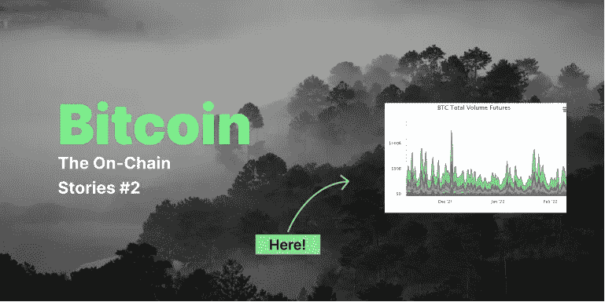
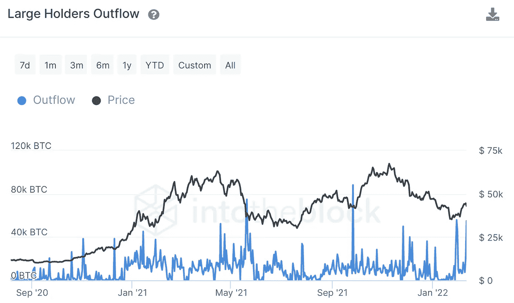
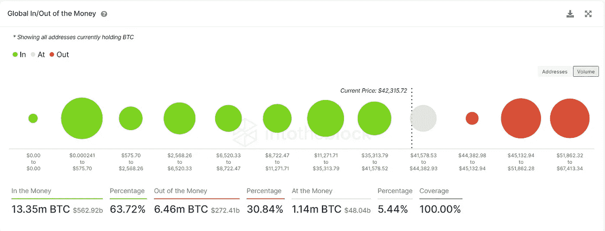
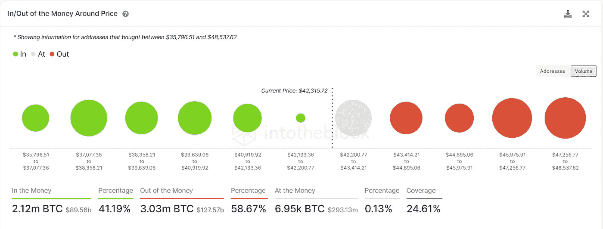
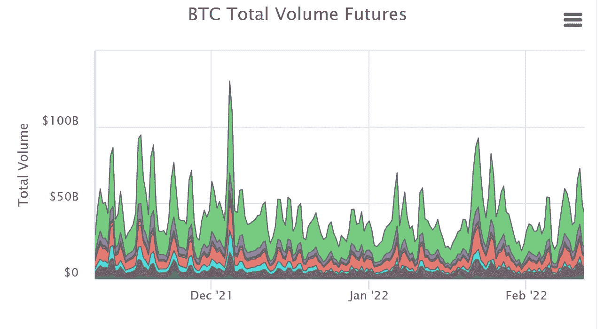
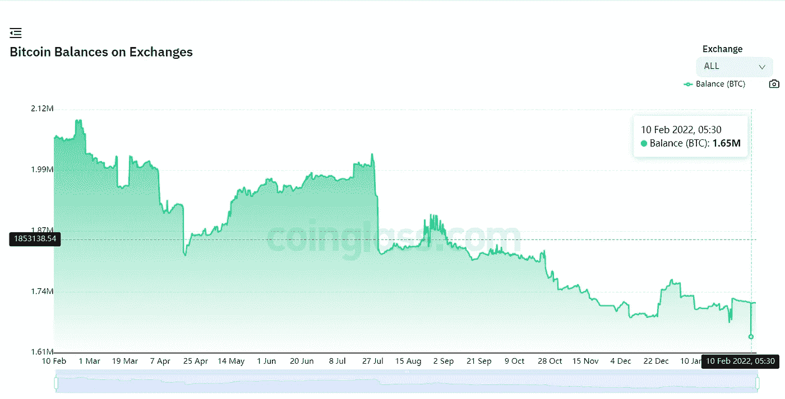

# 经过昨天的抛售，比特币何去何从？连锁故事#2

> 原文：<https://medium.com/coinmonks/wheres-bitcoin-going-after-yesterday-s-dump-the-on-chain-stories-2-e1de85f08a49?source=collection_archive---------17----------------------->

## 在这一系列不为人知的故事中，我们将谈论比特币以及比特币链上正在发生的事情。请继续关注今年更多的故事。

在最后一个[故事](/coinmonks/wheres-bitcoin-going-after-yesterday-s-pump-the-on-chain-stories-1-4f4585dcffd7?source=user_profile---------0-------------------------------)中，我主要说的是回调只是一个由成交量推动的动作，因为市场连续三周以红色收盘。然而，事情可能会有点不同；随着比特币继续保持 42K 大关，对多头来说情况越来越好。

如果我今天错过了这个，我可能就是个笨蛋。让我们从大量的霍德勒外流开始，因为在牛市开始时见过的人都是他们。

> 在[推特](https://twitter.com/0xtanjero)上关注我！

# 大霍德尔外流

你看到 2 月 11 日那个可爱的尖尖的尖峰了吗？这可能是解释为什么比特币仍然保持 42K 水平的原因之一。大股东的流出量与 1 月 30 日和 11 月 26 日的水平大致相同。这两次市场都上涨了。而且 9 月 26 日，比特币也在同样的价格水平附近，流出量明显增加，随后创下历史新高。

# 全球资金流入/流出

有两张图表可以用来观察目前的价格水平。虽然比特币得到了很好的支持，35K 至 41K 的水平可能会长期保持，但在较短的时间内，事情看起来很黯淡。

因为我们确实打破了 43k 的水平，所以对我们来说，要求 45k 的水平并不困难。然而，我们很难维持它，因为前方有强大的阻力。唯一的办法就是使用一个非常大容量的泵。

放大来看，42k 的支撑非常弱，因为音量太低，停留在当前的价格水平有点不稳定。因此，我认为我们可以看到比特币在 41K 至 45K 之间横盘整理(不考虑鲸鱼何时介入并将 sh*t 抽离市场)。

# 期货总交易量

一旦没有人开始觉得我们要去月球，资金就开始流入期货市场。这给了鲸鱼一个抛售的机会，并导致一连串的清算。11 日期货总交易量的飙升显示了下跌的原因，这可能是由于多头被清算而发生的。然而，事情似乎正在恢复正常，因为今天早些时候交易量开始回升。

# 交易所的比特币余额

2 月 10 日，交易所的比特币余额创下了近三年来的新低，交易所只有 165 万比特币。上一次出现这种情况是在 2018 年 12 月。不知道为什么会分享这个(咄，2018 年 12 月还发生了什么，去看图表)。

我想这部分就到此为止了；下周我会带着更多的惊喜回来。在那之前，喝杯啤酒享受周末吧。

> *再来，关注我的* [*推特*](https://twitter.com/0xtanjero) *！*

PS:自己做研究；我看到什么就写什么。所以这不是一条财务建议*(如果你用这些信息买/卖，不要起诉我。你能吗？).此外，永远不要接受白痴的财务建议*

> 加入 Coinmonks [电报频道](https://t.me/coincodecap)和 [Youtube 频道](https://www.youtube.com/c/coinmonks/videos)了解加密交易和投资

## 另外，阅读

*   [BigONE 交易所评论](/coinmonks/bigone-exchange-review-64705d85a1d4) | [CEX。IO 审查](https://coincodecap.com/cex-io-review) | [交换区审查](/coinmonks/swapzone-review-crypto-exchange-data-aggregator-e0ad78e55ed7)
*   [最佳比特币保证金交易](/coinmonks/bitcoin-margin-trading-exchange-bcbfcbf7b8e3) | [比特币保证金交易](https://coincodecap.com/bityard-margin-trading)
*   [加密保证金交易交易所](/coinmonks/crypto-margin-trading-exchanges-428b1f7ad108) | [赚取比特币](/coinmonks/earn-bitcoin-6e8bd3c592d9)
*   [WazirX vs CoinDCX vs bit bns](/coinmonks/wazirx-vs-coindcx-vs-bitbns-149f4f19a2f1)|[block fi vs coin loan vs Nexo](/coinmonks/blockfi-vs-coinloan-vs-nexo-cb624635230d)
*   [BlockFi 信用卡](https://coincodecap.com/blockfi-credit-card) | [如何在币安购买比特币](https://coincodecap.com/buy-bitcoin-binance)
*   [火币交易机器人](https://coincodecap.com/huobi-trading-bot) | [如何购买 ADA](https://coincodecap.com/buy-ada-cardano) | [Geco。一次审查](https://coincodecap.com/geco-one-review)
*   [加密复制交易平台](/coinmonks/top-10-crypto-copy-trading-platforms-for-beginners-d0c37c7d698c) | [五大 BlockFi 替代品](https://coincodecap.com/blockfi-alternatives)
*   [CoinLoan 点评](https://coincodecap.com/coinloan-review)|【Crypto.com】点评 | [火币保证金交易](/coinmonks/huobi-margin-trading-b3b06cdc1519)