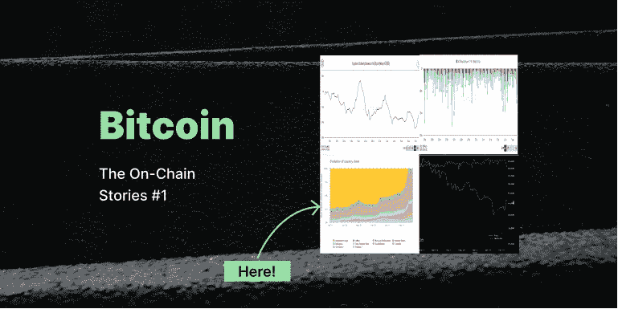
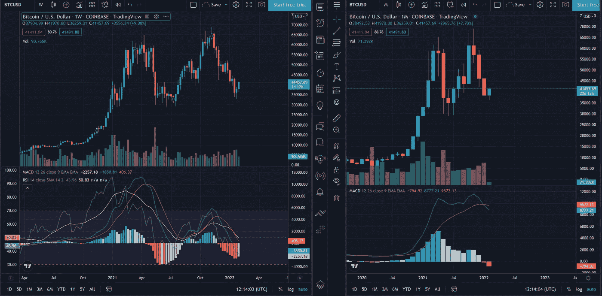
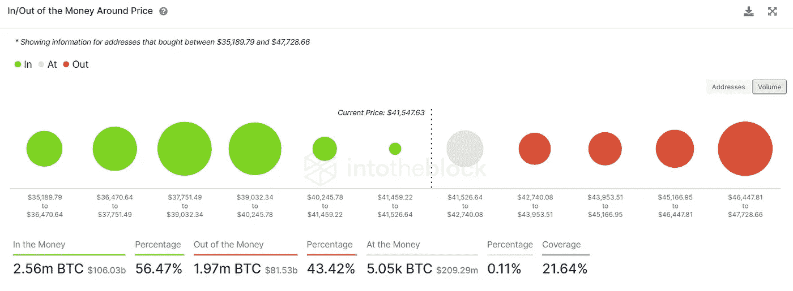
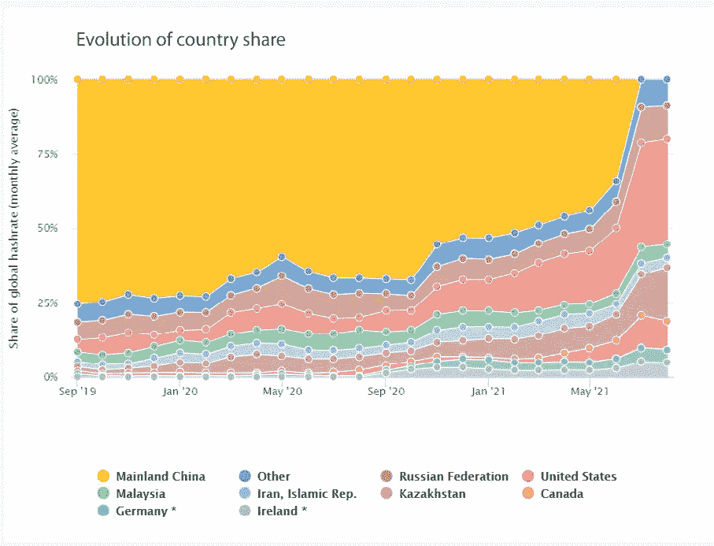
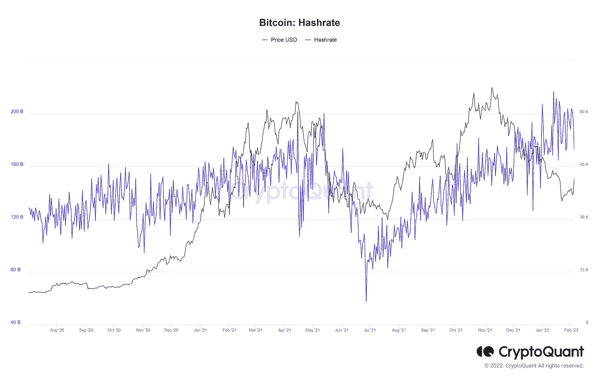
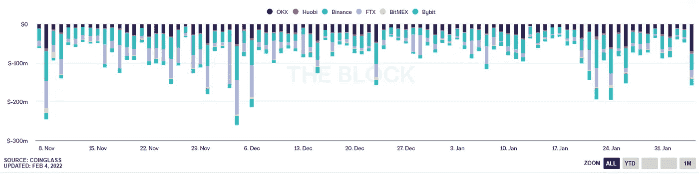
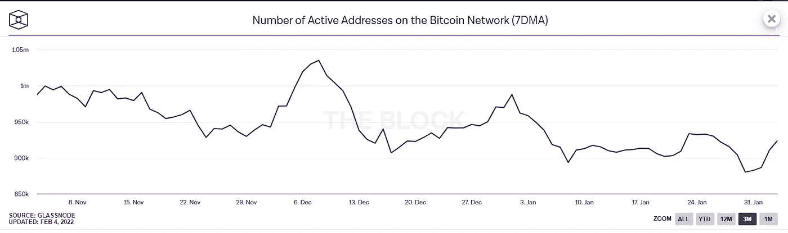

# 比特币经过昨天的泵之后，将何去何从？连锁故事#1

> 原文：<https://medium.com/coinmonks/wheres-bitcoin-going-after-yesterday-s-pump-the-on-chain-stories-1-4f4585dcffd7?source=collection_archive---------3----------------------->

血腥的一月(我们现在这样称呼它吗？)在短短一个月内将我们的比特币投资组合减少了 45%以上。然而，昨天市场出现反弹，比特币单日涨幅超过 12%。这是我们在新的一年里看到的比特币最显著的涨幅，或者可能是自上一个历史高点*(不要告诉我那是它！等等，是吗？).*

其实这篇文章的重点是别的。比特币会走高吗，或者这只是我们整个月看到的崩盘的反弹？让我们试着找出答案:

> 查看我的 [**推特**](https://twitter.com/0xtanjero) 频繁更新！

# 技术指标

比特币在以红色收盘三个月后确实反弹了(该死的，缩小，伙计们)。但这里最有趣的部分是，人们并不倾向于缩小来看显而易见的东西；每个人都在证明这样或那样的事情，甚至没有人试图注意月图上已经形成了几个月的双顶。不管怎样，那确实导致了一场车祸，但我认为这可能不仅仅是它。

左半部分是周线，右半部分是月线图，下面是 MACD 指标 ***(我知道一个经典)。*** 现在，周 MACD 正在形成底部，但另一方面，月时间框架上的 MACD 指标才刚刚开始**(熊市？).**

From TradingView

# 有钱/没钱

随着比特币上涨并触及 41，900 美元大关，在这个价格区间内购买的地址数量有所增加。关键是要看市场能否维持这些价格水平，因为当前市场价格附近的支撑很脆弱；然而，比特币在这里停留的时间越长，它对未来回调的支撑就越重要。比特币需要在 46500 美元区间附近徘徊，并保持强有力的支撑，以维持其前进的旅程。

In/Out of Money by IntoTheBlock

# 比特币是透明的

回到 2021 年 5 月，当中国开始开采 FUD 并禁止所有地下开采活动时，Mainland China 占了全部开采活动的 50%以上*(不要相信我，嗯？看看下面剑桥大学的图表。所以这种从其他国家转移矿业力量的做法在当时看来是最好的事情。*

*(Not Most Accurate) Data from the University of Cambridge*

无论如何，这里重要的一部分是，比特币挖矿的 hashrate 又回到了历史新高，这意味着矿工们正在引入更多的机器能力，使比特币网络变得更加强大。然而，许多分析师认为散列率和比特币的价格之间没有关联；在更短的时间内，情况看起来略有不同。

如果我们放大图表，我们可以观察到价格和杂凑率可以相互关联，因为在较短的时间内，如果杂凑率下降，价格也会下降。虽然这并不总是正确的，但我们可以通过最近的价格上涨来验证这一点，比特币采矿散列率大幅下降。或者这是否意味着我们很快会进一步下跌，而这只是美好的血腥月份的回调？)

The Bitcoin Hashrate by CryptoQuant

# 空头被清算

被清算的空头数量也在上升。当然，做空比特币的人是弱智，永远不想看到全貌(或者如果你是其中之一)。不管怎么说，最大数量的空头平仓通常发生在大崩盘之后；更常见的是，当市场开始反弹时。就个人而言，这些水平可能是做空的最糟糕的地方，因为比特币有更强劲的支撑，其上涨阻力较弱。另外，除此之外，我们还没有看到一个月在 ATH 或双顶之后收绿。

Shorts Getting Liquidated by The Block

# 活动地址的数量

比特币网络上活跃地址的数量让我们了解了购买、出售或只是转移比特币的投资者数量(谁知道为什么？).如果我们放大图表，事情看起来有点有趣。

2021 年 12 月 12 日，活跃地址数量(NAA)达到当地最高水平。不仅仅是这样，同样的事情发生在今年 1 月 1 日，24 日左右又发生了一次。令人兴奋的是所有这些小碰撞都是在撞车后发生的。这种情况很可能发生在霍德勒在崩盘期间买入股票，并开始将他们的 sat 转移到私人钱包的时候。

然而，现在的 NAA 又开始上升了，这一次，事情可能会有所不同。随着比特币的爆发，投资者可能已经开始增加他们的头寸并做多，希望他们能赶上新的反弹。

Number of Active Addresses by The Block

# 我认为现在正在发生什么？

嗯，我不认为这有什么关系，但不管怎样。在连续下跌三个月后，市场可能会出现反弹。因此，我们很有可能在本月底之前保持在这些水平，甚至更高至 45，000 美元左右的水平。此外，这么快回到 60K 美元的水平似乎不太可能，尤其是在形成双顶之后。因此，谨慎交易，因为这可能是我们通常遇到的比特币泡沫之一。

> 还是那句话，关注我 [**推特**](https://twitter.com/0xtanjero) ！

PS:自己做研究；我看到什么就写什么。所以这不是一条财务建议*(如果你用这些信息买/卖，不要起诉我。你能吗？).此外，永远不要接受白痴的财务建议*

> 加入 Coinmonks [电报频道](https://t.me/coincodecap)和 [Youtube 频道](https://www.youtube.com/c/coinmonks/videos)了解加密交易和投资

## 也阅读

 [## 杠杆代币[多头代币]终极指南

### 杠杆化令牌是具有杠杆化风险敞口的 ERC20 令牌，不考虑保证金、要求、管理…

medium.com](/coinmonks/leveraged-token-3f5257808b22)  [## 最佳加密交易所| 2022 年十大加密货币交易所| CoinCodeCap

### 哪一个是最好的加密交换？在本文中，我们将根据多种加密货币列出 10 大加密货币交易所

coincodecap.com](https://coincodecap.com/crypto-exchange)  [## 2022 年最佳加密交换平台| CoinCodeCap

### 随着时间的推移，我们大多数人将转向 dex 以获得更好的安全性和隐私。因此。在这里，我们将讨论…

coincodecap.com](https://coincodecap.com/best-swap-platforms)  [## 10 大最佳在线赌场|赢得并赢取免费 BTC 2022 | CoinCodeCap

### 接收、支付和赚取加密货币| |有各种各样的最佳在线赌场可供选择，有可能…

coincodecap.com](https://coincodecap.com/best-online-casinos)  [## 2021 年最佳加密借贷平台| 6 大比特币借贷平台

### 获得比特币和其他加密货币的最佳贷款利率

medium.com](/coinmonks/top-5-crypto-lending-platforms-in-2020-that-you-need-to-know-a1b675cec3fa)  [## 2021 年 6 大最佳硬件钱包|顶级加密硬件钱包[更新]

### 最好的加密货币硬件钱包是绝对必要的。我们将在 NGRAVE、Ledger Nano X 和…

medium.com](/coinmonks/the-best-cryptocurrency-hardware-wallets-of-2020-e28b1c124069)  [## 加密交易机器人——19 款最佳免费加密交易机器人

### 2022 年币安、比特币基地、库币和其他密码交易所的最佳密码交易机器人。四进制，位间隙…

medium.com](/coinmonks/crypto-trading-bot-c2ffce8acb2a)