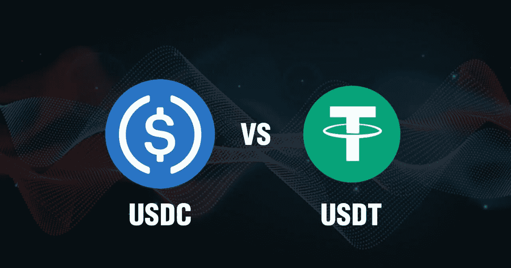

# USDC 和 USDT 是什么？

> 原文：<https://medium.com/coinmonks/which-are-usdc-and-usdt-a98ac5bb1522?source=collection_archive---------6----------------------->

Source photo [usdc and usdt — Bing images](https://www.bing.com/images/search?view=detailV2&ccid=1yU4OJyO&id=AE540FFEB33E85C6878D6D04788D599EB88E6603&thid=OIP.1yU4OJyOXW4MdZkdSloO-gHaD5&mediaurl=https%3a%2f%2ftimestampmag.com%2fwp-content%2fuploads%2f2020%2f09%2fImage-from-iOS-2.jpg&cdnurl=https%3a%2f%2fth.bing.com%2fth%2fid%2fR.d72538389c8e5d6e0c75991d4a5a0efa%3frik%3dA2aOuJ5ZjXgEbQ%26pid%3dImgRaw%26r%3d0&exph=673&expw=1280&q=usdc+and+usdt&simid=608001042521548852&FORM=IRPRST&ck=ABDB8C458091B7AA86309B185A046DAF&selectedIndex=3&ajaxhist=0&ajaxserp=0)

# 什么是 USDC？

与美元挂钩的硬币被称为美元硬币(USDC)。被称为 USDC 的中心财团自 2018 年成立以来，一直是美元硬币的主要支持者。(由比特币基地和 Circle 领导)。该联盟声明的目标是生产一种稳定的数字货币，并开发一种环境，使金融合作伙伴、钱包、交易所和加密公司可以在当前的全球金融…