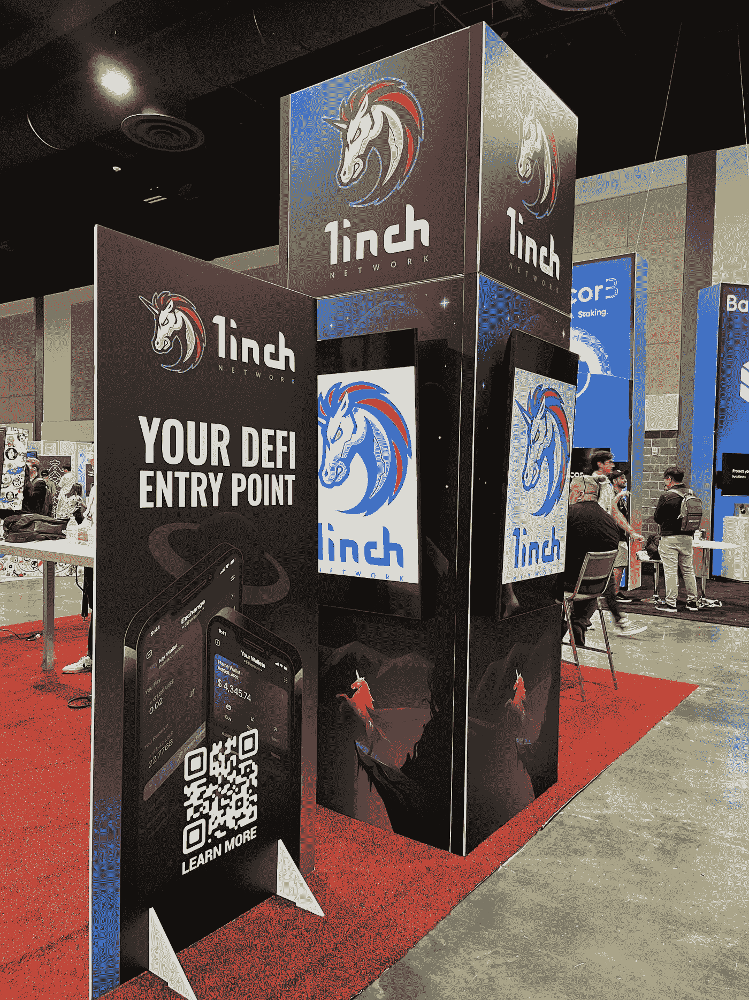

# 哪些城市将成为“秘密”首都？

> 原文：<https://medium.com/coinmonks/which-cities-will-emerge-as-crypto-capitals-ac0d3a0affbe?source=collection_archive---------34----------------------->

作者:[克里斯托弗·h·卢，医学博士](http://www.drchrisloomdphd.com)

# “接近就是力量”——托尼·罗宾斯

[Permissionless 2022](https://bit.ly/36OsCsH) (West Palm Beach)

自 2017 年以来，crypto 以一种非常积极的方式进入了公众的意识。

然而，为了让 crypto 和 onboard 在世界其他地方有一个强大的用例，还有许多工作要做。