# 2023 年哪种加密币能爆炸？

> 原文：<https://medium.com/coinmonks/which-crypto-coin-can-explode-in-2023-4be4a0d4735d?source=collection_archive---------7----------------------->

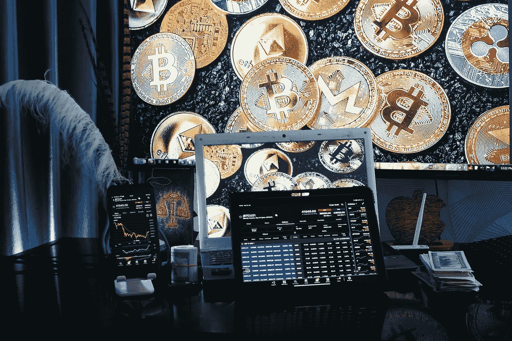

Which Crypto Coin Can Explode In 2023? pic by [sergeitokmakov](https://pixabay.com/users/sergeitokmakov-3426571/)

加密货币一直在飞速发展，关于下一种重要的加密货币有很多猜测。

尽管如此，我们认为还没有人在市值或价值上接近比特币。

不过，似乎很快就会有另一种货币取而代之。

> **目前的加密货币市场价值 1.84 万亿美元，预计到 2023 年将增长到 3 万亿美元。**
> 
> **超过 2000 种不同的加密货币存在，但比特币仍然是最受欢迎的，市值超过 7790 亿美元。**

> 学习[如何用 USDT 赚钱](https://occupycooperative.com/how-to-make-money-with-usdt/)

# 2023 年哪种加密币能爆炸？

**以下是 cryptos 在未来一年有机会获得重大收益的一些公司:**

# 1.比特币(BTC)

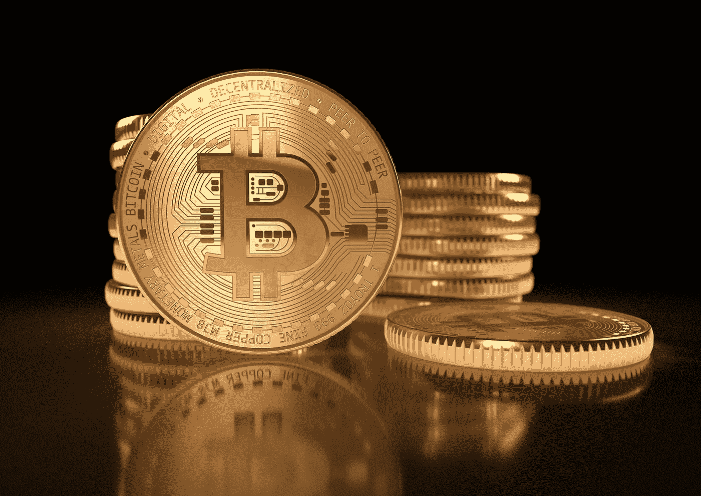

Image by [Ricardo Goncalves](https://pixabay.com/users/15958319-15958319/?utm_source=link-attribution&utm_medium=referral&utm_campaign=image&utm_content=5019625) from [Pixabay](https://pixabay.com/?utm_source=link-attribution&utm_medium=referral&utm_campaign=image&utm_content=5019625)

作为加密技术的鼻祖，比特币仍然是全球最知名、使用最广泛的加密货币。

虽然近年来出现了一些波动，但它仍是最稳定、最安全的选择。

随着越来越多的企业和个人开始接受比特币作为支付手段，比特币的使用在未来几年只会越来越多。

**此外，当谈到哪种硬币可能会出现价值爆炸时，比特币永远是最大的竞争者。**

虽然在过去几年中经历了一些起伏，但总体而言，它一直呈上升趋势，许多专家认为它的长期潜力仍然非常强劲。

# 2.以太坊

Image by [WorldSpectrum](https://pixabay.com/users/worldspectrum-7691421/?utm_source=link-attribution&utm_medium=referral&utm_campaign=image&utm_content=3424785) from [Pixabay](https://pixabay.com/?utm_source=link-attribution&utm_medium=referral&utm_campaign=image&utm_content=3424785)

**以太坊通常被认为是比特币的主要竞争对手，它是一个去中心化的平台，支持智能合约和去中心化应用(DApps)。**

此外，它的受欢迎程度近年来呈指数增长，现在是世界上使用最广泛的加密货币平台之一。

因此，以太坊是另一个受欢迎的选择，有可能在 2023 年出现爆炸式增长。

近年来，人民币汇率已经大幅上涨，有人猜测，明年人民币汇率可能会继续以更快的速度上涨。

# 3.瑞波(XRP)

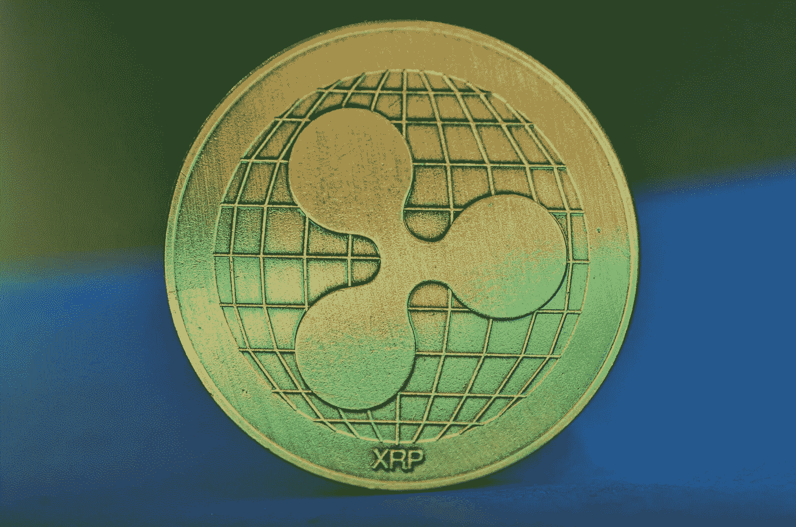

Image by [Miloslav Hamřík](https://pixabay.com/users/vjkombajn-764634/?utm_source=link-attribution&utm_medium=referral&utm_campaign=image&utm_content=3789233) from [Pixabay](https://pixabay.com/?utm_source=link-attribution&utm_medium=referral&utm_campaign=image&utm_content=3789233)

**Ripple 是金融机构为加快和简化跨境支付而设计的加密技术。**

一些中央银行和金融机构已经采用了它，而且在未来几年里它的使用只会增加。

# 4.莱特币

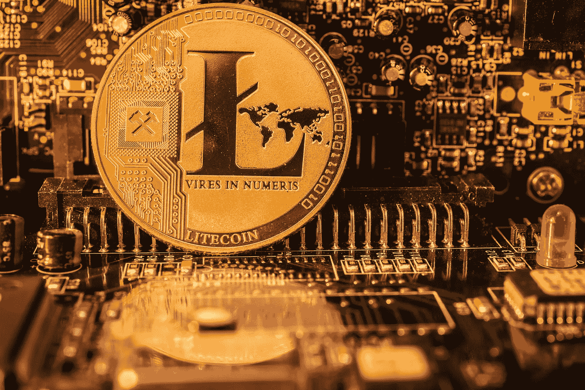

Image by [Christopher Muschitz](https://pixabay.com/users/christopher_muschitz-16781591/?utm_source=link-attribution&utm_medium=referral&utm_campaign=image&utm_content=6228177) from [Pixabay](https://pixabay.com/?utm_source=link-attribution&utm_medium=referral&utm_campaign=image&utm_content=6228177)

莱特币通常被称为“比特币的黄金之银”，事实上，莱特币是一种比比特币交易时间更快、费用更低的加密技术。

它是一种广泛使用的密码，预计其价格在未来一年将会上涨。这些只是 2023 年有潜力爆发价值的几个密码。

在正确的因素组合下，这些硬币中的任何一种都可能在下一年获得巨大收益。

除此之外，随着比特币和其他加密货币的兴起，越来越多的投资者开始将目光转向几个 altcoins 资产类别。

# 5.兽医

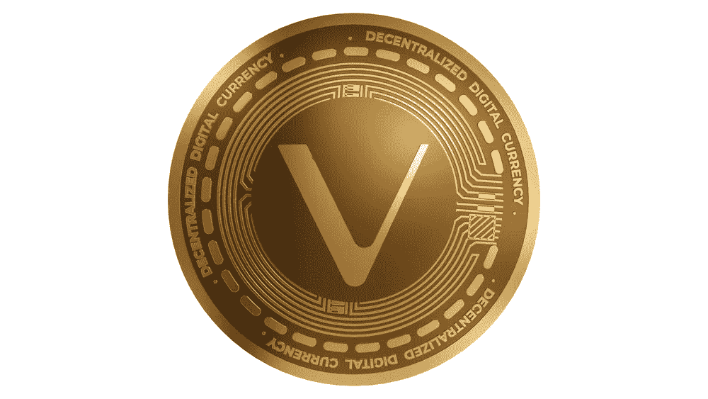

是一个为商业和企业用户设计的区块链平台。Vechain 已经与 PwC、BMW 和 DNV GL 等大公司建立了合作伙伴关系，其网络还在不断扩大。

> Vechain 的本地令牌 VET 目前的交易价格约为 0.05 美元，但一些人认为未来几年可能会达到 3 美元或更高。

# 6.卡尔达诺

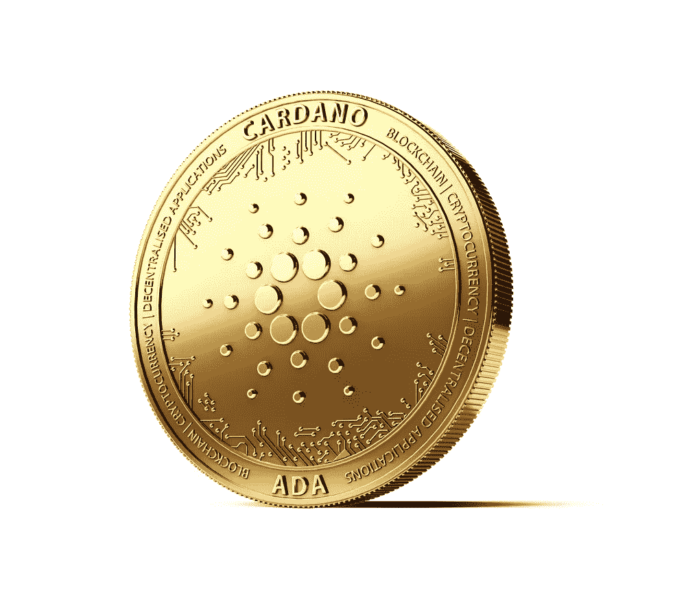

是一个区块链平台，致力于提高区块链应用程序的可伸缩性和安全性。

Cardano 仍在开发中，但围绕这枚硬币有很多炒作。一些人认为，Cardano 最终可能成为世界上顶级的加密货币。

> 卡尔达诺代币 ADA 目前的交易价格约为 0.8 美元，但未来可能会轻松达到 7 美元或更高。

# 7.海德拉(HBAR)

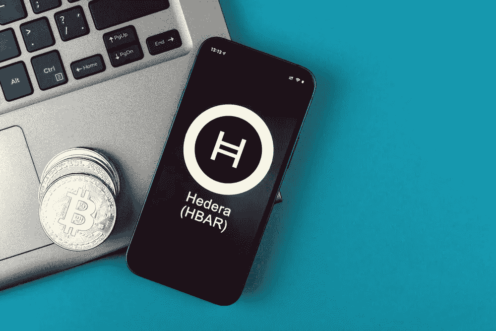

是一种基于 Hashgraph 算法的新型加密货币。

**Hedera 已经与 IBM、惠普等大公司合作，其网络正在滚雪球。**

> Hedera token HBAR 目前的交易价格约为 0.2 美元，但一些人认为 2023 年可能会达到 5.3 美元或更高。

# 8.分散土地(法力)

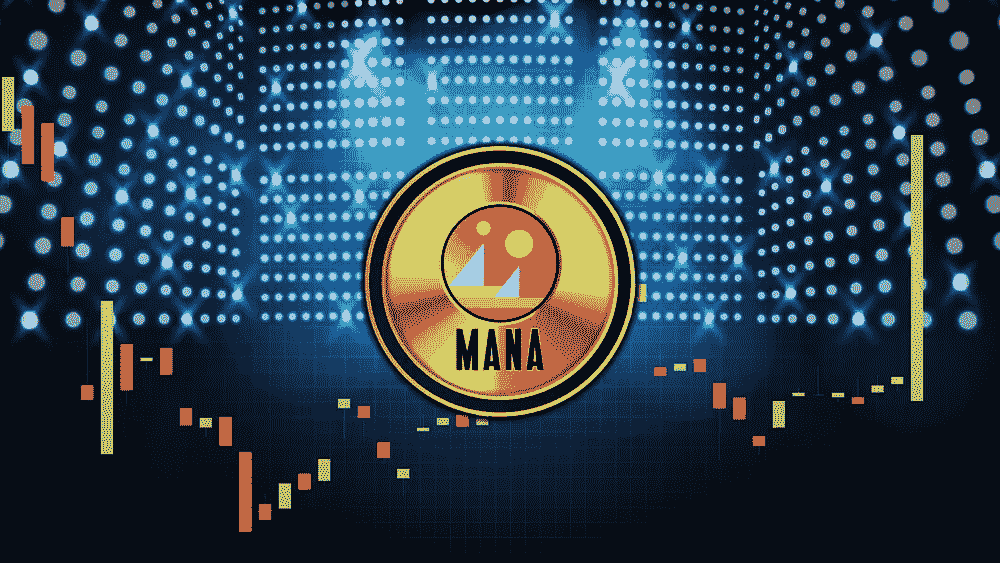

**是一个由以太坊区块链驱动的沉浸式互动虚拟世界。**

在去中心化的土地上，用户可以创造、体验和分享所有物和财产。法力是分散土地上使用的加密货币。

它被用来购买土地，创造体验，并与分散世界中的其他用户互动。

# 9.币安硬币(BNB)

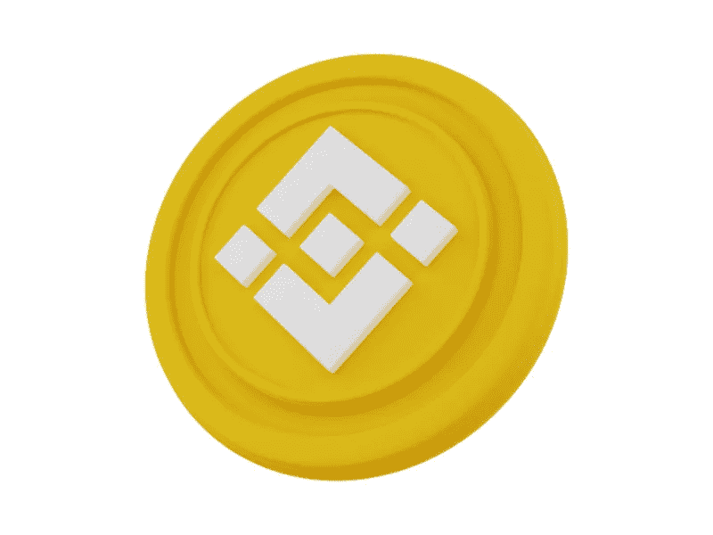

**BNB 是币安交易所的本土代币。币安币使币安平台上的交易变得快捷方便。**

币安硬币有几个用例，包括支付费用和参与其他项目主办的代币销售。

币安自推出以来一直呈指数级增长，背后有一个强大的社区。

币安硬币也有一个非常活跃的开发团队，不断致力于新的功能和改进。

# 10.茄属植物

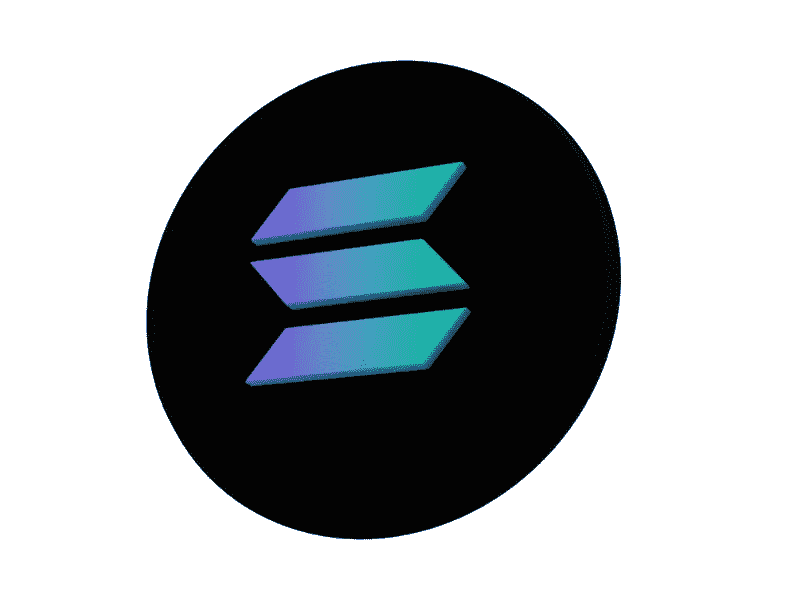

Solana 是一款高性能区块链，每秒可以处理数千笔交易。Solana 是一个区块链平台，旨在处理大量交易。这种高交易能力可能会使索拉纳成为世界上最受欢迎的加密货币之一。随着对溶胶需求增加，溶胶的价值也会增加。此外，Solana 的历史证明共识算法确保节点始终拥有最新的信息，以快速高效地处理事务。

# 11.雪崩

是一种独特的加密货币，使用全新的雪崩效应算法。

这种算法允许更安全和更快速的交易，使 Avalanche 成为 2023 年最有价值的加密硬币的顶级竞争者。

Avalanche 可能走向大事业的另一个原因是它强大的社区支持。

Avalanche 团队非常积极地参与社区活动，并与其他企业和组织发展合作伙伴关系。

> 这种程度的参与和支持对于任何想要长期成功的加密货币来说都是至关重要的。

# 12.恒星(XLM)

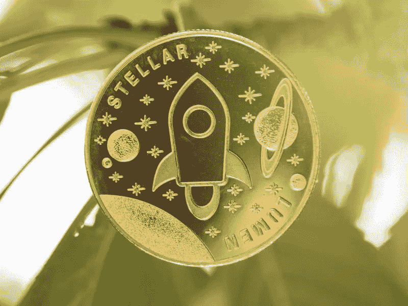

许多专家认为 Stellar 的价值被低估了，可能会在 2023 年暴涨。

因此，STELLAR (XLM)是一种能够在世界上任何货币之间进行货币交叉转移的协议。

它交易时间快，费用低。该项目与业内一些最大的公司有合作关系，包括 IBM。

它正在努力实现新的功能，这可能使它成为最受欢迎的加密货币之一。

> 如果 Stellar 继续获得牵引力，它的价值可能会在未来几年内迅速爆炸。

# 13.什巴·INU(SHIB)

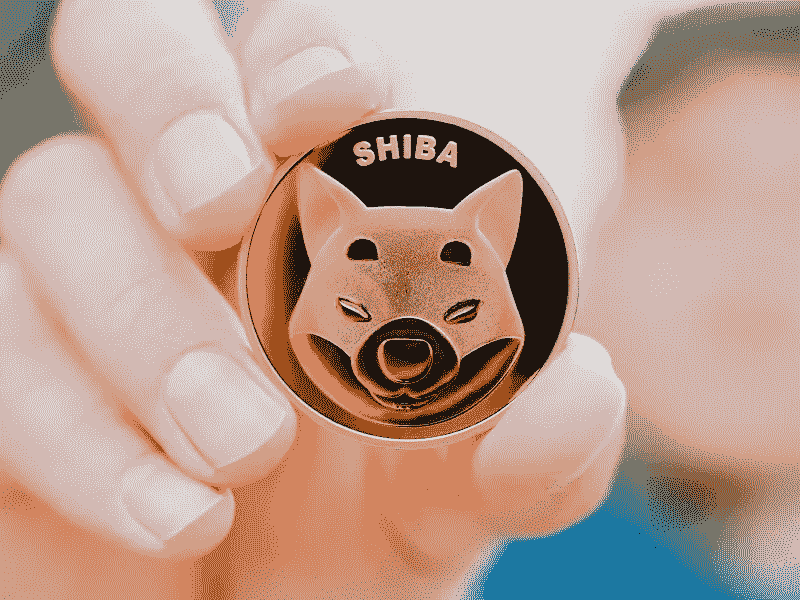

是一种加密货币，在去年大受欢迎。柴犬币以日本流行的柴犬品种命名。Dogecoin 标志也启发了柴犬硬币标志。

柴犬币是其他加密货币的有趣和友好的替代品。柴犬币不隶属于 Dogecoin，但这两种加密货币有几个相似之处。

柴犬币基于以太坊区块链，使用 ERC-20 代币标准。柴犬币受到欢迎是由于几个因素，包括其友好的社区，低廉的价格和高增长潜力。

# 14.地球(月球)

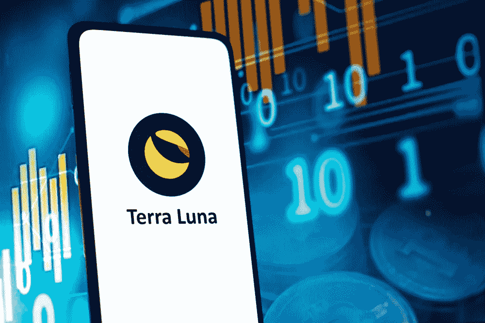

**是一个相对较新的硬币，在 2023 年有很大的增长潜力。**

Terra 建立在坚实的基础上，拥有一支经验丰富的开发团队和一个庞大的支持者社区。

Terra 已经实现了一些令人印象深刻的里程碑，包括在交易所上市和市值超过 3300 万美元。

# 15.向往。金融(YFI)

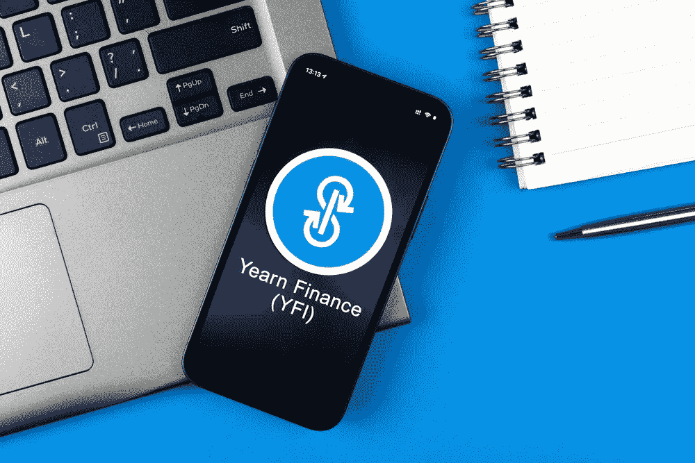

**是最有前途的加密硬币之一。它有一个强大的团队和坚实的社区支持。**

由于其独特的功能和优势，向往金融可能会在 2023 年迅速爆发。此外，Yearn.finance 允许用户从他们闲置的加密资产中赚取利息。

向往金融提供了一套提高收益率的产品，可以帮助用户实现回报最大化。

向往金融有一个用户友好的界面，使任何人都容易使用。

# 16.煎饼交换(蛋糕)

**是最优秀的去中心化交流平台之一。**

它呈指数级增长，大量用户已经在这个平台上交易。PancakeSwap 是交易所有你喜欢的加密货币的完美场所。

PancakeSwap 也是最受欢迎的分散式交易所之一，所以你可以肯定会有充足的流动性。

> 学习[如何用 USDT 赚钱](https://occupycooperative.com/how-to-make-money-with-usdt/)

# 结论

总之，未来投资的最佳加密货币是拥有清晰路线图、强大领导力和活跃社区的加密货币。

如果你试图预测哪种加密硬币将在 2023 年爆炸，这些硬币可能值得研究。

此外，要了解更多关于如何让你的钱更好地使用加密货币的信息，相应地，投资一种你认为在未来几年有升值潜力的加密货币。

尽管如此，还不能说哪种加密货币将在 2023 年前价值爆炸，但一些竞争者有可能看到显著增长。

加密货币是一个相对较新的现象，没有人知道它们中的哪些可能在 2023 年爆发。

然而，一些专家预测，比特币将会升值，因为它保持了作为市场上最受欢迎的加密货币的领先地位。

未来增长的其他可能竞争者包括以太坊和莱特币，但没人能预见未来。

**免责声明:**

**我不是金融顾问或密码专家——投资总是伴随着失去一切的风险！**

请在投资前做好自己的研究。

> 如果你输了，别怪我！
> 
> 但是，如果你赢得了这些硬币，请务必分享这篇文章！

谢谢🙏

> 加入 Coinmonks [电报频道](https://t.me/coincodecap)和 [Youtube 频道](https://www.youtube.com/c/coinmonks/videos)了解加密交易和投资

# 另外，阅读

*   [Bookmap 评论](https://coincodecap.com/bookmap-review-2021-best-trading-software) | [美国 5 大最佳加密交易所](https://coincodecap.com/crypto-exchange-usa)
*   最佳加密[硬件钱包](/coinmonks/hardware-wallets-dfa1211730c6) | [Bitbns 评论](/coinmonks/bitbns-review-38256a07e161)
*   [新加坡十大最佳加密交易所](https://coincodecap.com/crypto-exchange-in-singapore) | [购买 AXS](https://coincodecap.com/buy-axs-token)
*   [红狗赌场评论](https://coincodecap.com/red-dog-casino-review) | [Swyftx 评论](https://coincodecap.com/swyftx-review) | [CoinGate 评论](https://coincodecap.com/coingate-review)
*   [投资印度的最佳密码](https://coincodecap.com/best-crypto-to-invest-in-india-in-2021)|[WazirX P2P](https://coincodecap.com/wazirx-p2p)|[Hi Dollar Review](https://coincodecap.com/hi-dollar-review)