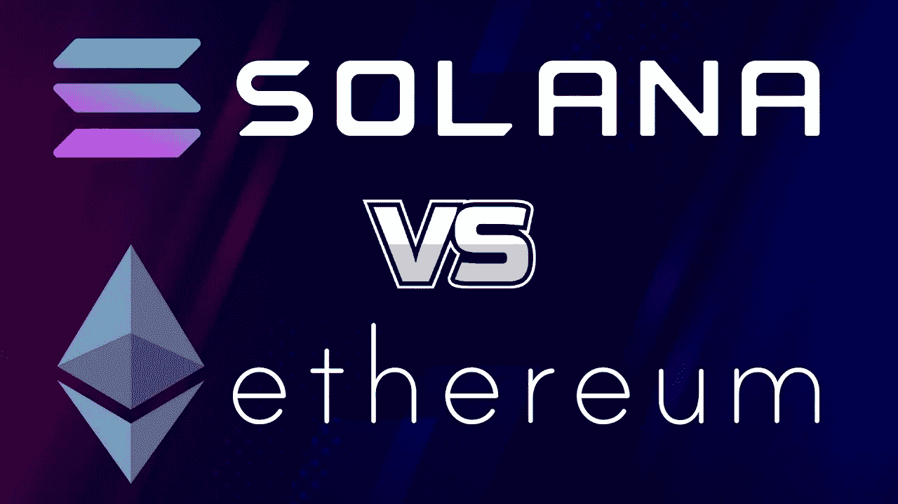

# 你会投资哪种加密令牌？索拉纳还是以太坊？

> 原文：<https://medium.com/coinmonks/which-crypto-token-would-you-invest-solana-or-ethereum-cfb6a01be84c?source=collection_archive---------36----------------------->

这取决于你的目标和投资方式。以太坊是一种安装得当的加密货币，拥有庞大的用户基础和市场上限。Solana 是一种全新的加密货币，尚未推出。它是否会像以太坊一样出名还有待观察。

Photo Source on Google

> 如果你正在寻找长期投资，以太坊可能是比索拉纳更好的选择。然而，如果你正在寻找一个短期投资，索拉纳可能更有利可图。在做任何投资之前，一定要做好自己的研究！

# **索拉纳比以太坊好吗？**

现在我们已经对索拉纳和以太坊有了更多的了解，我们可以更有效地比较这两个区块链。我们知道以太坊是两者中更安全、更分散的选择，而索拉纳是更快、更便宜的网络。

# **索拉纳和以太坊兼容吗？**

是的，索拉纳兼容以太坊。

这两个网络有不同的侧重点，但可以一起使用来实现类似的目标:通过消除等待加油费的时间或确认来自分散应用程序(dApps)的数据负载来加速区块链的交易。

# **索拉纳能否赶超以太坊？**

在网络上，有 5000 多个开发项目正在进行中。然而，他们中的许多人还没有功能。说到 dApps，索拉纳仍然落后于以太坊。它在 2021 年初网络上的 70 个项目的适度增长表明它有机会赶上甚至超过它的竞争对手。

# **什么会取代以太坊？**

Cardano，Solana，Avalanche 三家都比以太坊有技术优势。区块链革命的先发优势赋予了它对抗强劲对手的持久力。最终，以太坊最好的替代品可能是同一系统的改进版本。

> 加入 Coinmonks [电报频道](https://t.me/coincodecap)和 [Youtube 频道](https://www.youtube.com/c/coinmonks/videos)了解加密交易和投资

# 另外，阅读

*   [3 商业评论](/coinmonks/3commas-review-an-excellent-crypto-trading-bot-2020-1313a58bec92) | [Pionex 评论](https://coincodecap.com/pionex-review-exchange-with-crypto-trading-bot) | [Coinrule 评论](/coinmonks/coinrule-review-2021-a-beginner-friendly-crypto-trading-bot-daf0504848ba)
*   [莱杰 vs Ngrave](/coinmonks/ledger-vs-ngrave-zero-7e40f0c1d694) | [莱杰 nano s vs x](/coinmonks/ledger-nano-s-vs-x-battery-hardware-price-storage-59a6663fe3b0) | [币安评论](/coinmonks/binance-review-ee10d3bf3b6e)
*   [Bybit Exchange 评论](/coinmonks/bybit-exchange-review-dbd570019b71) | [Bityard 评论](https://coincodecap.com/bityard-reivew) | [Jet-Bot 评论](https://coincodecap.com/jet-bot-review)
*   [3 commas vs crypto hopper](/coinmonks/3commas-vs-pionex-vs-cryptohopper-best-crypto-bot-6a98d2baa203)|[赚取加密利息](/coinmonks/earn-crypto-interest-b10b810fdda3)
*   最好的比特币[硬件钱包](/coinmonks/hardware-wallets-dfa1211730c6) | [BitBox02 回顾](/coinmonks/bitbox02-review-your-swiss-bitcoin-hardware-wallet-c36c88fff29)
*   [BlockFi vs 摄氏](/coinmonks/blockfi-vs-celsius-vs-hodlnaut-8a1cc8c26630) | [Hodlnaut 点评](/coinmonks/hodlnaut-review-best-way-to-hodl-is-to-earn-interest-on-your-bitcoin-6658a8c19edf) | [KuCoin 点评](https://coincodecap.com/kucoin-review)