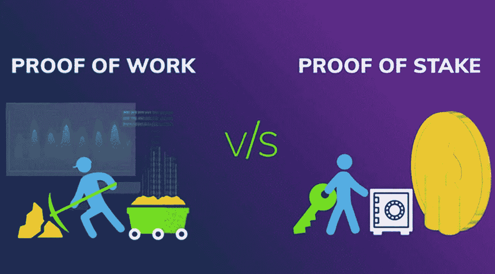

# 工作证明和利益证明的区别是什么？

> 原文：<https://medium.com/coinmonks/which-is-the-diffence-between-proof-of-work-and-proof-of-stake-6a27d387cddb?source=collection_archive---------55----------------------->

Source photo [proof of work vs proof of stake — Bing images](https://www.bing.com/images/search?view=detailV2&ccid=HHgtWNNi&id=51AFA55DDA36857FE284AA3F8C2B4187F3DECDFF&thid=OIP.HHgtWNNiD9hjCrW33wXQjwHaEG&mediaurl=https%3a%2f%2fi.morioh.com%2f200629%2fee7f4084.jpg&cdnurl=https%3a%2f%2fth.bing.com%2fth%2fid%2fR.1c782d58d3620fd8630ab5b7df05d08f%3frik%3d%252f83e84dBK4w%252fqg%26pid%3dImgRaw%26r%3d0&exph=710&expw=1280&q=proof+of+work+vs+proof+of+stake&simid=608023810150969746&FORM=IRPRST&ck=FA26A21CFF4C3D74B6436BE86FE90F53&selectedIndex=11&ajaxhist=0&ajaxserp=0)

网络使用一致的过程来验证区块链交易，确保相同的钱不会被花两次。共识机制用于验证交易，将其添加到区块链，并创建新的硬币。为此，最常见的共识机制是工作证明(PoW)和利益证明(PoS)。