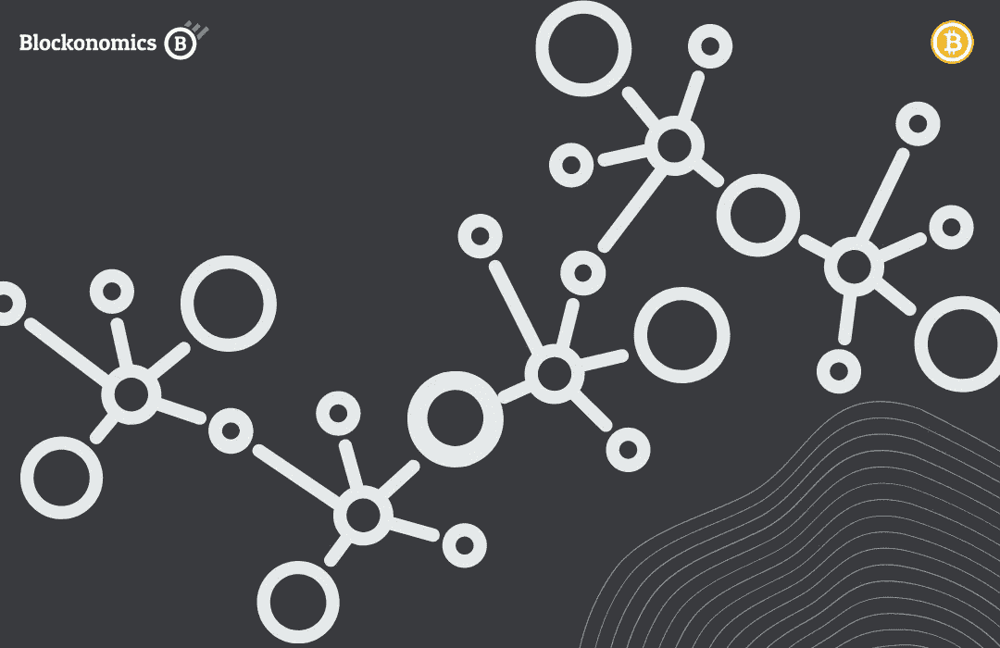

# 最分散的加密货币是哪种？

> 原文：<https://medium.com/coinmonks/which-is-the-most-decentralized-cryptocurrency-c446d6cedc9e?source=collection_archive---------0----------------------->

权力下放的概念并不新鲜，但在金融领域却很少听到。世界上盛行的传统金融机构是出了名的集权。

事实上，正是加密货币的出现迎来了一个去中心化金融的时代。

2008 年 10 月 28 日，中本聪发布了一份白皮书，这个数字至今仍是一个谜。该论文概述了一种对等电子现金系统，它允许各方之间进行交易，而无需金融中介。这个电子现金系统不是别人，正是‘比特币’。

世人都不知道，这篇论文将在几年内彻底改变金融业，创造一个全新的空间。

比特币和它之后的大多数加密货币一样，具有去中心化的特征。

但比特币的去中心化程度如何？有没有比比特币更分散的其他货币？

# 什么是去中心化？

在金融领域，分散化指的是在没有第三方中介监管交易的情况下进行金融交易的能力。

对于要去中心化的加密货币，它需要具有以下特征:

## 没有中央权威

不可能有一个中央权力机构来管理货币或它所运行的区块链。相反，这种货币是由一个分布式计算机网络维持的，这个网络对所有人开放。

T2 的数据也是如此，分散的货币没有中央存储或数据服务器。这些信息是公开的，并存储在一个分布式网络中，因此非常安全和高效。

不仅消除了网络攻击的风险，还增加了用户的信任度，他们可以随时轻松访问信息。

## 决策

关于分散货币的维护和未来升级，决策是基于考虑到网络中每个人的*共识机制*做出的。

参与区块链的利益相关者网络可能包括开发商、采矿者、研究人员、贸易商、投资者、企业家等。

## 发布

分散货币的发行通常是由在它诞生之初起草的定义参数决定的。它的美妙之处在于它不能被操纵或篡改。

这意味着在任何给定的时间，只有固定数量的货币在流通。

与中央集权的法定货币相反，中央集权的法定货币的发行和价值很容易被政府机构操纵，而分散化的货币则遵循其建立时的规则。

## 使用

> 任何人都可以使用分散货币。

使用分散货币不需要批准、身份证检查或地理限制。它对全世界的每个人开放。

而且这种开放存取不仅仅局限于其用于执行交易，就连新硬币的*发行*都是对公众开放的。几乎任何人都可以开始发行分散货币的新硬币，只要他们遵循为该货币设计的特定协议。

# 最分散的货币是什么？

为了回答这个问题，让我们来看看一些历史悠久的顶级加密货币:

# 比特币

比特币(BTC)被广泛认为是最去中心化的区块链，尽管有一些反对的声音。

大多数比特币节点使用**比特币核心**作为其客户端来运行区块链，使其在客户端使用时高度集中。此外，比特币网络的任何**更新/改变都是由一小撮开发者贡献的，使其成为一个集中的生态系统。**

当谈到**比特币节点时，**尽管它们分布在全球各地，但它们高度集中在美国和德国，各占近 12%。

Global Bitcoin Node Distribution [Source: [Bitnode](https://bitnodes.io/)]

比特币使用工作验证(POW)共识机制，这是众所周知的高能耗机制，需要使用专门的硬件。

创造新比特币以及处理交易的过程被称为挖掘。尽管在理论上，这是一个独立的、对所有人开放的过程，这意味着任何人都可以成为矿工(只要他们拥有必要的硬件)，并开始铸造比特币，但现实世界并非如此。

**采矿**是一个竞争极其激烈的过程，小矿商被选中开采一个区块的机会很少，这迫使这些独立矿商将他们的开采权交给大型矿池。

这使得矿业权力集中到少数矿业巨头手中，他们现在对网络拥有巨大的控制权。

类似的事件发生在 2014 年，当时一个矿池设法集中了超过 50%的比特币散列能力，使网络容易受到攻击和操纵。谢天谢地，这类事情没有发生，但它确实在比特币社区拉响了警报。

截至去年，没有一个池能够获得超过 15%的哈希能力。

Bitcoin Mining Pool Distribution [Source: [btc](https://btc.com/stats/pool)]

毫无疑问，随着越来越多的矿工加入这个网络，它就变得越来越分散。但硬进入壁垒确实让人对其分散化的本质产生了疑问。

BTC 在交易所的交易量为 340 亿美元，在 24H 时期的顶级加密货币交易量中排名第二。

而**BTC 地址总数**目前为 [918K](https://bitinfocharts.com/comparison/bitcoin-activeaddresses.html#3y) ，在过去 3 年中曲线相当平坦，表明变化不大。

# 以太坊

按市值计算，以太坊(ETH)是第二大加密货币，迄今已有近 7 年历史，拥有比比特币更活跃的开发者社区。

但是，它的**开发**是按照它的创造者 Vitalik Buterin 的愿景高度集中的，他可以按照自己的喜好来控制这个项目。此外，没有一致同意的机制来批准对协议的任何修改，这使得这个硬币在开发方面高度集中。

此外，以太坊使用一个 **geth 代码库**来运行它的区块链，这意味着这个代码库的任何妥协或漏洞都可能将整个区块链置于危险之中。

**以太坊节点**在全球分布上也相当集中，美国拥有 41%的节点，德国紧随其后，占 15%。

以太坊是一种工作证明(POW)币，其操作方式与比特币类似，通过培育控制重要哈希能力的大型**挖掘**池来实现过程集中化。

ETH Hashrate Distribution [Source: [blockchair](https://blockchair.com/ethereum/charts/hashrate-distribution)]

但是，随着以太坊 2.0 的推出，以太坊将在 2022 年的某个时候过渡到股权证明(POS)算法，使区块链更加分散，因为它不需要人们参与采矿池或投资重型设备。

然而，要成为一个完整的验证节点，必须持有至少 32 个 ETH，以 ETH 的当前市场价格来看，这是一笔相当大的投资。

但除了初始投资，成为完全节点验证器的过程对所有人开放，这使得进入壁垒比以前明显降低，并使网络更加分散。

至于在交易所**交易的 ETH**交易量，查看过去的 24H 数据，交易量为[170 亿美元](https://coinmarketcap.com/currencies/ethereum/)，在 24H 时期交易量排名前三。

而**总 ETH 地址**目前为 [821K](https://bitinfocharts.com/comparison/ethereum-activeaddresses.html#3y) ，自 2017 年以来持续增长。虽然 20%的 ETH 只集中在 10 个 ETH 地址。

# 莫内罗

Monero[XMR]是另一种历史悠久的加密货币，其历史与以太坊一样悠久。它以匿名性和私密性著称。

Monero 是为数不多的每个用户都是匿名的加密货币之一，交易细节不会公开。每笔交易的发送者、接收者和金额都通过使用三种重要的技术来隐藏:秘密地址、环签名和环 CT。

至于它的分散性质，Monero 的**开发者社区**与比特币或以太坊相比相当集中，虽然代码的变化确实涉及社区共识，但代码的开发肯定更加集中。

要运行一个 Monero 节点，你必须连接到一个名为 *deamon* 的**客户端**，它将你的节点连接到区块链。除此之外，实在没有其他选择来运行 Monero 节点。

虽然 **Monero 节点**遍布全球，但与 BTC 和 ETH 相似，拥有最多节点的前两个国家是美国和德国。

Monero 像 BTC 和 ETH 一样是一枚工作证明(POW)硬币，因此它确实需要采矿来验证交易并创造新的交易。

Monero 不需要高度专业化的设备，可以使用普通计算机进行开采，大大降低了准入门槛。

也就是说，采矿业竞争激烈，独立采矿者开采新区块的机会少于大型采矿池，这就是为什么建议独立采矿者加入采矿池，如果他们希望获得稳定的收入。这使得挖掘过程高度集中。

Monero Hashrate Distribution [Source: [minexmr](https://minexmr.com/pools)]

事实上，Monero 大约 74%的散列率仅由 3 个矿池控制，这使得它比比特币甚至以太坊更加集中。

至于在交易所交易的 XMR**交易量**，交易量为[1 . 85 亿美元](https://coinmarketcap.com/currencies/monero/)，在 24H 时期交易量最高的加密货币中排名第 44 位。

# 莱特币

莱特币[LTC]也被称为数字银，是现存最古老的加密货币之一。查理·李莱特币于 2011 年推出，在功能和用途上与比特币相似。

Litecoin 是工作证明(POW)硬币，就像我们前面讨论的其他硬币一样，需要挖掘来验证交易和铸造新硬币。

莱特币的**发展**生态系统是以查理·李为先导的集中化发展。由于他是硬币的创造者，并且仍然积极参与硬币的开发，硬币的走向很容易被他的观点所影响。这与所有其他密码的工作方式形成了鲜明的对比，并使比特币在发展过程中变得集中化。

只有一个**客户端**用于运行大多数 LTC 节点，称为 Litecoin Core，使其客户端分布高度分散。

Litecoin 拥有全球分布的**节点网络**，与其他同行相比，lite coin 相当分散，但其最大的节点块仍位于美国，其次是俄罗斯。

至于**采矿**莱特币，它也遭遇了大多数战俘币的问题，那就是采矿池的集中化。由于独立采矿者开采莱特币不再有利可图，他们不得不加入联营来创收。

Litecoin Hashrate Distribution [Source: [litecoinpool](https://www.litecoinpool.org/pools)]

截至 2022 年，65%的哈希速率由 3 个挖掘池控制，使得挖掘高度集中。

在交易所交易的长期加密货币的**交易量达到[15 亿美元](https://coinmarketcap.com/currencies/litecoin/)，在 24H 时期的顶级加密货币交易量中排名第 20。**

而**总 LTC 地址**目前为[20 万](https://bitinfocharts.com/comparison/litecoin-activeaddresses.html#alltime)，具有公平分布的硬币网络。

# 结论:

虽然所有加密货币都被设计为去中心化，但随着时间的推移和人们的使用，总有一些方面会变得集中。

谈到开发结构，比特币凭借分布式开发者网络和匿名创建者中本聪领先图表。其次是 Monero，Litecoin，最后是以太坊。他们几乎都使用**集中式客户端**来运行他们的区块链。

至于**客户端分布**，比特币、莱特币、以太坊、Monero 都有一个集中的结构，但是一个客户端用来运行大部分节点。

谈到贸易额，BTC 位居榜首，其次是 ETH，LTC，最后是 XMR。

同样，BTC 在活跃地址方面领先于 T21，但其联邦理工学院在过去 3 年里地址稳步增长，这使其比 BTC 更加分散。

但是当我们看到**矿业**结构和进入区块链网络的进入壁垒时，事情就变了。以太坊凭借其 POS 升级和 Eth 2.0 的推出领先图表，使硬币比以前更加分散。在 ETH 之后是 BTC、LTC，最后是 Monero。

纵观全局，**比特币**似乎是最分散的硬币，平衡了发展以及挖掘网络，为用户提供更容易和开放的访问。

> 加入 Coinmonks [电报频道](https://t.me/coincodecap)和 [Youtube 频道](https://www.youtube.com/c/coinmonks/videos)了解加密交易和投资

## 另外，阅读

*   [Bitsgap 审核](/coinmonks/bitsgap-review-a-crypto-trading-bot-that-makes-easy-money-a5d88a336df2) | [Quadency 审核](/coinmonks/quadency-review-a-crypto-trading-automation-platform-3068eaa374e1) | [Bitbns 审核](/coinmonks/bitbns-review-38256a07e161)
*   [加密复制交易平台](/coinmonks/top-10-crypto-copy-trading-platforms-for-beginners-d0c37c7d698c) | [Coinmama 审核](/coinmonks/coinmama-review-ace5641bde6e)
*   [印度的加密交易所](/coinmonks/bitcoin-exchange-in-india-7f1fe79715c9) | [比特币储蓄账户](/coinmonks/bitcoin-savings-account-e65b13f92451)
*   [OKEx vs KuCoin](https://coincodecap.com/okex-kucoin) | [摄氏替代品](https://coincodecap.com/celsius-alternatives) | [如何购买 VeChain](https://coincodecap.com/buy-vechain)
*   [麻雀交换评论](https://coincodecap.com/sparrow-exchange-review) | [纳什交换评论](https://coincodecap.com/nash-exchange-review)
*   [eToro vs robin hood](https://coincodecap.com/etoro-robinhood)|[MoonXBT vs by bit vs Bityard](https://coincodecap.com/bybit-bityard-moonxbt)
*   [有哪些交易信号？](https://coincodecap.com/trading-signal) | [比特斯坦普 vs 比特币基地](https://coincodecap.com/bitstamp-coinbase)
*   [ProfitFarmers 回顾](https://coincodecap.com/profitfarmers-review) | [如何使用 Cornix Trading Bot](https://coincodecap.com/cornix-trading-bot)
*   [如何在势不可挡的域名上购买域名？](https://coincodecap.com/buy-domain-on-unstoppable-domains)
*   [印度的秘密税](https://coincodecap.com/crypto-tax-india) | [altFINS 审查](https://coincodecap.com/altfins-review) | [Prokey 审查](/coinmonks/prokey-review-26611173c13c)