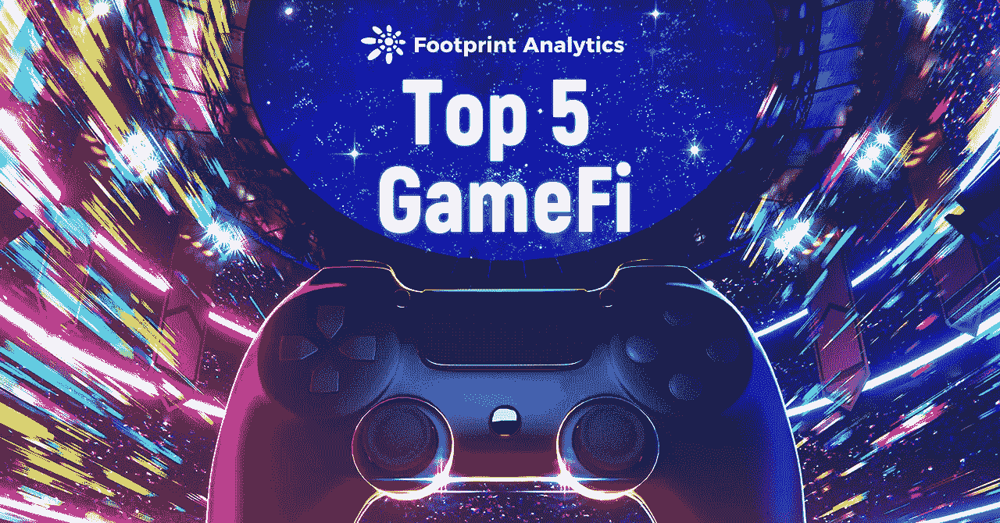
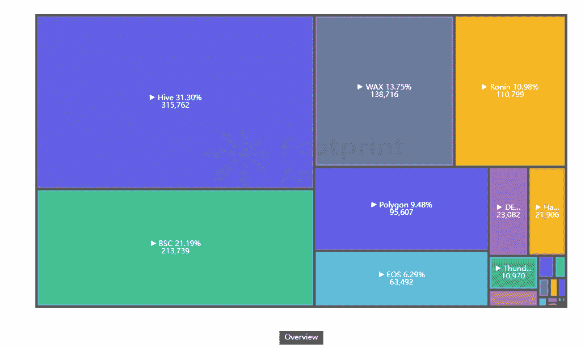
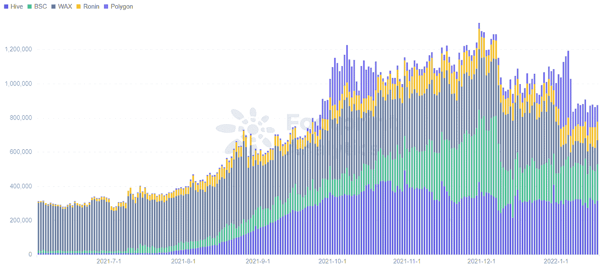
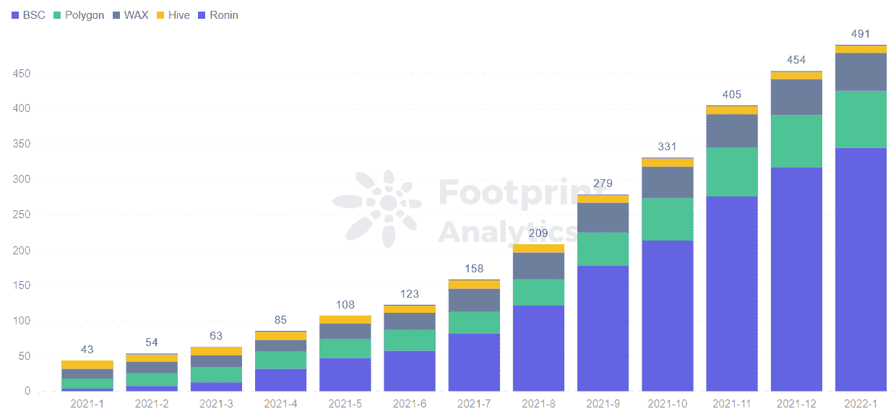
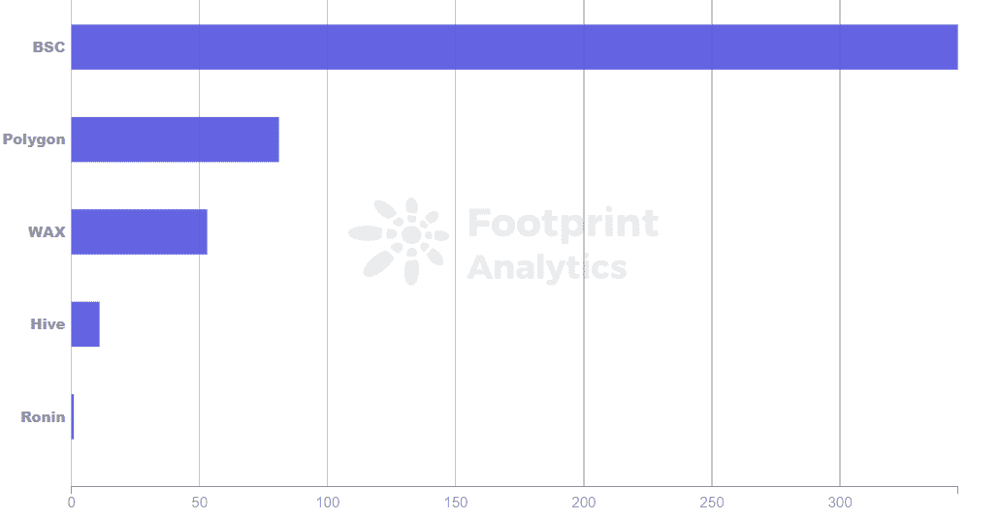
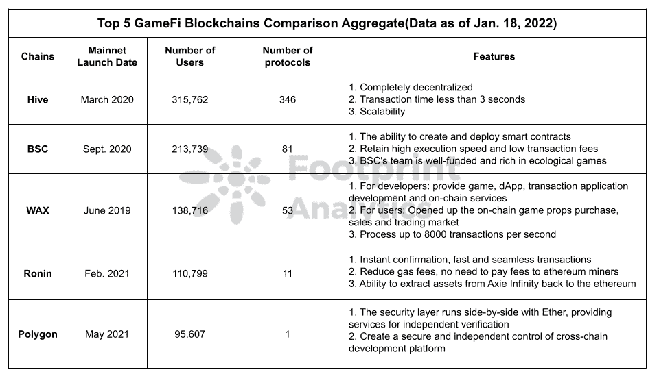

# GameFi 区块链五强中哪一个最有潜力？|足迹分析

> 原文：<https://medium.com/coinmonks/which-of-the-top-5-gamefi-blockchains-has-the-most-potential-footprint-analytics-c25097ef42d9?source=collection_archive---------6----------------------->

交易速度、资金、TPS 和生态系统之战。

2022 年 1 月杨永晴@footprint.network

数据来源:足迹分析— [排名前五的 GameFi 连锁店仪表盘](https://www.footprint.network/guest/dashboard/top-5-game-fi-chains-dashboard-fp-c6b954a0-0bc1-4b99-853c-7061cc318d38?channel=u-QytebM#secret=A0BC0B6F3B5999BFE4ADC3DA77FD5CF4)

根据 Footprint Analytics 的数据，6 月份以来用户量排名前 5 的 GameFi 区块链分别是 Hive、BSC、 [WAX](https://www.footprint.network/guest/dashboard/wax-dashboard-fp-9927b1df-8f8d-4a6c-b097-3f93e712470a?channel=u-QytebM#secret=0F438D9D4A7925B5CEBFF5929609EDF8) 、Ronin 和 [Polygon](https://www.footprint.network/guest/dashboard/polygon-dashboard-fp-9aefaa6b-c76c-4672-a572-cfbf3e92b935?date_filter=2021-04-30~&channel=u-QytebM#secret=261351EB556F88C71A48D363859EFD1B) ，这些游戏以其创新的玩法和新颖的概念深受玩家欢迎。

*Footprint Analytics — Market Share of GameFi Users*

在本文中， [Footprint Analytics](https://www.footprint.network/guest/dashboard/top-5-game-fi-chains-dashboard-fp-c6b954a0-0bc1-4b99-853c-7061cc318d38?channel=u-QytebM#secret=A0BC0B6F3B5999BFE4ADC3DA77FD5CF4) 将对这 5 家连锁店进行比较，以了解它们的独特功能、游戏生态系统和潜力。

# 五大 GameFi 区块链:特色

*Footprint Analytics — Top 5 Number of GameFi Users Cross-chain*

*   **蜂巢**

Hive 是社会区块链街的一个分支。自 2020 年 3 月 20 日发布以来，Hive 消除了过去四年对 Steem 区块链的集中控制，使其真正去中心化。

*   Hive 对大事务量的支持，结合其快速的 3 秒锁定时间和免费事务，使其成为构建高度交互式应用程序的理想平台。
*   Hive 正在为区块链和第 2 层应用程序构建带有模块化插件的多层解决方案。它使应用程序能够在不同的网络层之间进行交互。
*   **BSC**

BSC 最初专注于 DeFi，但现在在 GameFi 领域也很突出。

与 Hive、WAX、Ronin 和 Polygon 区块链相比，BSC 是最受欢迎的游戏项目之一，成为 GameFi DApps 的游乐场。

*Footprint Analytics — Monthly Number of Games*

*   BSC 可以创建和部署智能合同。是一个完全独立的智能合同区块链与 EVM。
*   BSC 速度很快，交易费用也很低。
*   BSC 的团队资金雄厚，生态系统更丰富。
*   **蜡**

WAX 致力于为开发者和普通用户提供在线 NFT 虚拟资产交易服务。

基于 EOS 改编，它遵循 DPoS 共识机制，以支持游戏所需的高吞吐量。

*   对于开发者来说，它提供游戏、DApp、交易应用开发和链上服务。
*   对于用户来说，有一个用于购买、销售和交易游戏道具的网上市场被打开。
*   与 BSC 相比，WAX 支持更高频率和更高价值的事务，每秒处理多达 8，000 个事务，而 BSC 大约处理 100 个事务。
*   **浪人**

Ronin 的生态系统相对于 Hive、BSC、WAX、Polygon 来说比较单一，只作为 Axie Infinity 的专属链。

Ronin 更侧重于应用的体验，解决了低效率、高消耗等最重要的问题。

*   即时确认和快速、无缝的交易。
*   随着燃气费的降低，用户不需要向以太坊矿工支付费用，燃气费可以由社区保留，用于锦标赛和奖金等活动。
*   能够从 Axie Infinity 提取资产回到以太坊主网。
*   **多边形**

Polygon 是建立在以太坊基础上的第 2 层扩展解决方案，其目标是解决采用 DApp 的一些障碍(速度、可伸缩性和可用性)。多边形已经扩展到 GameFi 和 NFTs。

*   与以太坊并行运行的安全层，为独立身份验证提供服务。
*   为跨链的安全和独立控制创建开发平台。
*   确立自己在分散式游戏领域的领导地位。

*Footprint Analytics — Top 5 Chains — Current Game Totals*

# 摘要

为了找到质量更好的 GameFi 区块链和游戏项目，以下是一些需要考虑的主要评估因素。

*   完善的基础设施，包括交易速度、高 TPS 和高安全性。
*   注重用户体验，解决用户考虑的问题，如燃气费用高、网络拥堵等。
*   相对强大的金融和资源丰富的生态系统。
*   项目发展趋势良好，底层技术不断迭代。

以下是 5 大 GameFi 链各自的特点。

*Footprint Analytics — Top 5 GameFi Chains Summary Comparison*

**什么是足迹分析**

足迹分析是一个一体化的分析平台，用于可视化区块链数据和发现见解。它清理和整合链上数据，因此任何经验水平的用户都可以快速开始研究令牌，项目和协议。凭借一千多个仪表板模板和一个拖放界面，任何人都可以在几分钟内构建自己的定制图表。发掘区块链数据，利用足迹进行更明智的投资。

*足迹网址:*[*https://www . Footprint . network*](https://www.footprint.network/)

*不和:*[*https://discord.gg/3HYaR6USM7*](https://discord.gg/3HYaR6USM7)

*碎碎念:*[*【https://twitter.com/Footprint_DeFi】*](https://twitter.com/Footprint_DeFi)

*电报:*

**Youtube:*[*https://www.youtube.com/channel/UCKwZbKyuhWveetGhZcNtSTg*](https://www.youtube.com/channel/UCKwZbKyuhWveetGhZcNtSTg)*

> *加入 Coinmonks [电报频道](https://t.me/coincodecap)和 [Youtube 频道](https://www.youtube.com/c/coinmonks/videos)了解加密交易和投资*

## *也阅读*

* [## 杠杆代币[多头代币]终极指南

### 杠杆化令牌是具有杠杆化风险敞口的 ERC20 令牌，不考虑保证金、要求、管理…

medium.com](/coinmonks/leveraged-token-3f5257808b22)  [## 最佳加密交易所| 2022 年十大加密货币交易所| CoinCodeCap

### 哪一个是最好的加密交换？在本文中，我们将根据多种加密货币列出 10 大加密货币交易所

coincodecap.com](https://coincodecap.com/crypto-exchange)  [## 2022 年 2 月值得关注的三大游戏代币| CoinCodeCap

### 排名前 3 位的游戏也占交易总量的 85%以上。Defi 王国、Axie Infinity 和 Pegaxy…

coincodecap.com](https://coincodecap.com/top-3-gaming-tokens-to-look-out-for-in-february-2022)  [## 2022 年最佳加密交换平台| CoinCodeCap

### 随着时间的推移，我们大多数人将转向 dex 以获得更好的安全性和隐私。因此。在这里，我们将讨论…

coincodecap.com](https://coincodecap.com/best-swap-platforms)  [## 10 大最佳在线赌场|赢得并赢取免费 BTC 2022 | CoinCodeCap

### 接收、支付和赚取加密货币| |有各种各样的最佳在线赌场可供选择，有可能…

coincodecap.com](https://coincodecap.com/best-online-casinos)  [## 2021 年最佳加密借贷平台| 6 大比特币借贷平台

### 获得比特币和其他加密货币的最佳贷款利率

medium.com](/coinmonks/top-5-crypto-lending-platforms-in-2020-that-you-need-to-know-a1b675cec3fa)  [## 2021 年 6 大最佳硬件钱包|顶级加密硬件钱包[更新]

### 最好的加密货币硬件钱包是绝对必要的。我们将在 NGRAVE、Ledger Nano X 和…

medium.com](/coinmonks/the-best-cryptocurrency-hardware-wallets-of-2020-e28b1c124069)  [## 加密交易机器人——19 款最佳免费加密交易机器人

### 2022 年币安、比特币基地、库币和其他密码交易所的最佳密码交易机器人。四进制，位间隙…

medium.com](/coinmonks/crypto-trading-bot-c2ffce8acb2a)  [## 最佳 4 个加密交易信号电报通道

### 这是乏味的找到正确的加密交易信号提供商。因此，在本文中，我们将讨论最好的…

medium.com](/coinmonks/best-crypto-signals-telegram-5785cdbc4b2b)*