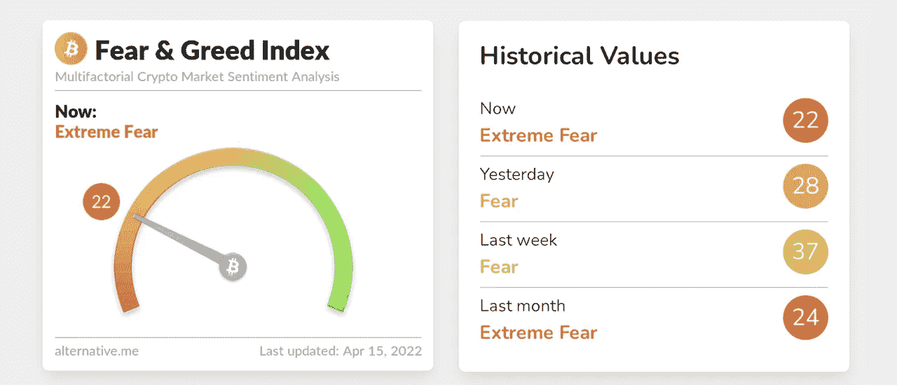

# 当市场整合时，隐藏的恐惧和贪婪指数指向“极度恐惧”

> 原文：<https://medium.com/coinmonks/while-markets-consolidate-crypto-fear-and-greed-index-points-to-extreme-fear-9194a684d86?source=collection_archive---------34----------------------->

Source photo [Crypto Fear & Greed Index — Bitcoin Sentiment — Alternative.me](https://alternative.me/crypto/fear-and-greed-index/)

3 月 28 日，加密的恐惧和贪婪指数四个月来首次显示“贪婪”得分为 60。自那以来，比特币的美元价值已下跌逾 7500 美元，并于 4 月 11 日触及每单位 39200 美元的低点。在最近的暴跌之后，加密的恐惧和贪婪指数回到了“严重恐惧”的位置，得分为 22。