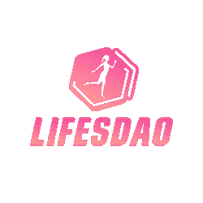
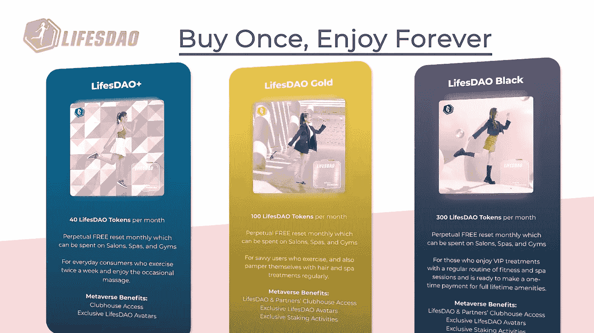
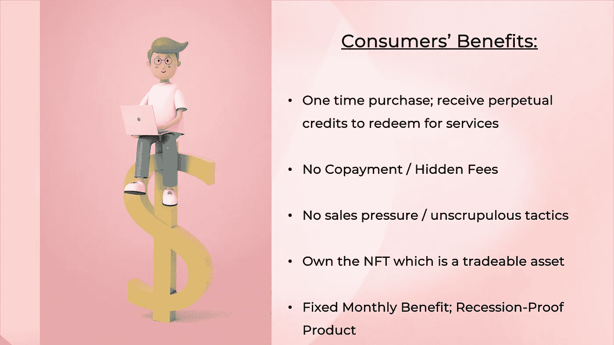
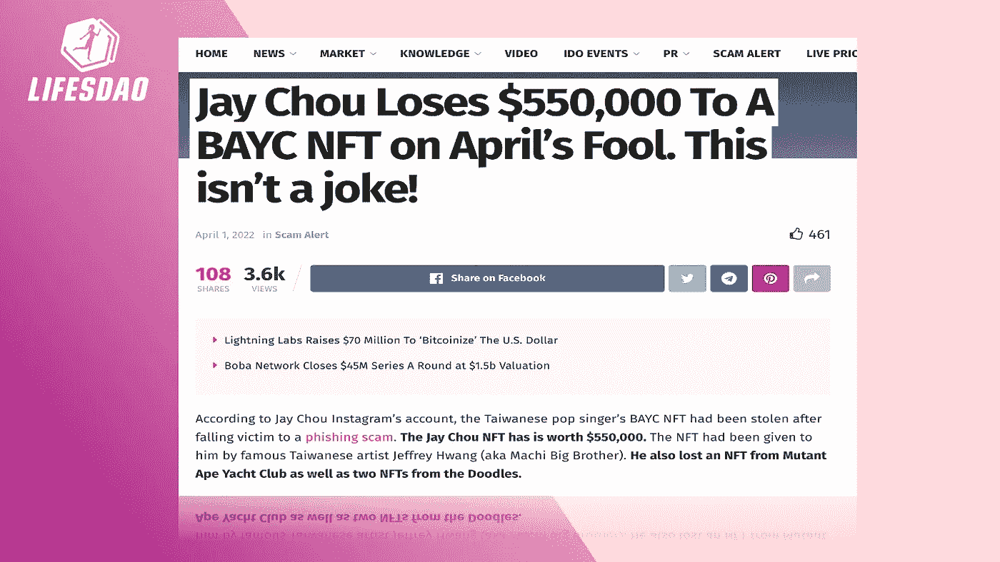
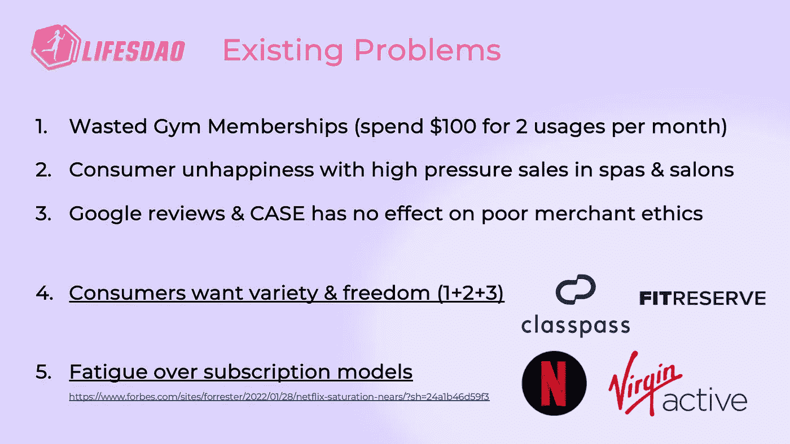
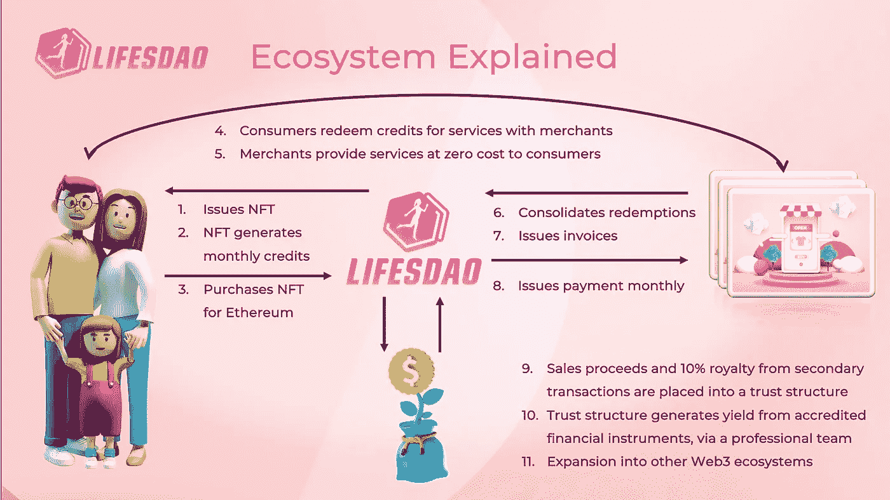
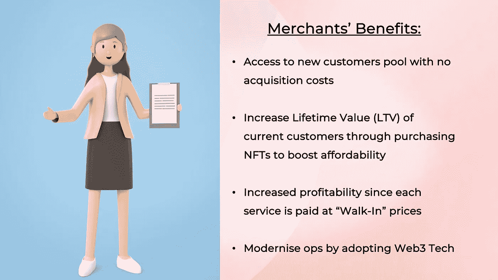

# LifesDAO 白皮书

> 原文：<https://medium.com/coinmonks/white-paper-1b123671b285?source=collection_archive---------8----------------------->

由脉冲谭，技术家伙@生命岛
最后修改:2022 年 5 月 2 日

**摘要**

不可替代令牌(NFT)是区块链令牌，不能复制或更改，用于验证配对资产的所有权。在当前的 NFT 形势下，每天都有许多 NFT 发射。项目范围从耦合 NFT 与资产，如数字艺术品，元宇宙游戏人物，和/或品牌收藏品。如今，NFT 项目的市值相当可观，在撰写本文时，Cryptopunks 和 Bored Ape Yacht Club 等排名项目的交易额分别为 27 亿美元和 16 亿美元。古驰、梅赛德斯和耐克等知名品牌也带着自己的数码收藏品进入了 NFT 空间。然而，这些 NFT 的价值是高度投机性的，大众需求推动了交易价格和交易量，在现实世界的便利性和持有者的直接利益方面几乎没有效用。当前项目 LifesDAO(一个关于生活方式的文字游戏)的目的是探索一个具有即时和现实世界效用的 NFT 项目的部署。LifesDAO 旨在成为区块链多边形(以太坊)上的一个 NFT，使其持有人可以终身享受新加坡合作生活方式商店提供的生活方式服务。通过这个项目的部署，我们希望创造一个 NFT 项目，其价值是由现实世界的公用事业和设施，可以切实和个人的经验。这些 NFT 的持有者将能够根据其真实价值交易 NFT 及其相关的公用事业。LifesDAO 还采用了一项独特的区块链技术，“**版本控制**”，为其持有者提供全面的财务保护，使其免受盗窃、黑客攻击和其他与社会工程相关的诈骗，同时使 LifesDAO NFTs 能够持续更新到最新的区块链标准。

**1。简介**

LifesDAO 的概念是一种公用事业 NFT 代币，向其持有者提供生活服务设施，如健身房入场券、理发、水疗按摩和其他生活方式相关服务。该项目的愿景是利用 NFT 和智能合同技术来支付生活费用，使 NFT 持有者能够“购买一次 NFT，永远享受其便利设施”。

life Dao NFT 持卡人可以使用积分在生活方式商户购买服务，只要他们拥有 life Dao NFT，他们就可以每月获得积分。他们获得的信用额度将由他们拥有的 NFT 决定。在写作的时候，NFTs 有三个建议等级:**生命道+ (40 学分)，生命道金(100 学分)，生命道黑(300 学分)**。在撰写本文时，建议 1 个信用点大约相当于 1 个新加坡元(LifesDAO 部署的主要法定货币)。

Classes of LifesDAO NFT with their accompanying benefits

*作者注:有关 NFT 等级&信用如何获得的更多信息，请访问第 9 节“生态系统可持续性”。*

NFT 持有者将通过智能合约系统获得这些积分，并使用该智能合约系统在 LifesDAO 商户网点购买服务。例如，具有 100 信用配额的 NFT 持有者可以决定购买 5 张 8 信用的健身房入场券，以及 60 信用的全身按摩。因此，NFT 持有者可以在他们的信用额度内自由混合搭配他们可以购买的任何生活服务。积分将在每个日历月的第一天(SGT (UTC+8) 00:00)重置。建议不要将未使用的信用额展期，以鼓励拥有 LifesDAO NFTs 的最大消费(从而最大化收益)。

在撰写本文时，LifesDAO 在新加坡拥有一个由 60 多家商户组成的生态系统。这些商家包括健身房、水疗中心、沙龙、中医和理疗师。因此，NFT 持有者不局限于任何特定的品牌或服务，而是可以选择访问全岛任何可以提供生活便利设施的便利设施。在运营方面，我们预计每个网点每月最多可接待 130 名 NFT 持有者，因此 NFT 的初始池为 180 人(其中 50 人作为创始团队和我们的战争基金的奖励)。随着生态系统的成熟和商家数量的增长，可以创造更多的 LifesDAO NFTs 来确保稳定的需求和服务供应。

为了与我们的 NFT 持卡人只消费一次的项目愿景保持一致，通过 LifesDAO NFT 积分兑换的所有服务都将全额支付。实际上，这意味着无需支付服务费用，没有隐性成本或订阅费。生命岛 NFT 将能够享受由他们的 NFTs 提供的便利设施，而不需要任何花费。这让我们的 NFT 持卡人在兑换服务时可以安心。

Consumers’ Benefits from LifesDAO

生命岛 NFT 还具有**区块链技术，即使在铸造**之后，以及在 NFT 被第三方转移/购买**之后，即使元数据存储在区块链上并在星际文件系统(IPFS)** 上被引用，该技术也能启用*版本控制*。在撰写本文时，生命道 NFT 公司是 NFT 唯一也是第一家拥有 MM 区块链理工学院的公司，这有两个实际意义:

(1) **LifesDAO 为其 NFT 持有者提供全面的财务保障**。这意味着，如果 NFT 通过网络钓鱼、黑客或其他一些与社会工程相关的骗局被盗，LifesDAO 可以通过删除其产生信用的元数据，甚至用“骗子持有的令牌”艺术品替换 NFT 艺术品，以(公开)羞辱持有 NFT 的 NFT 骗子，从而使被盗的 NFT 贬值。在 OpenSea 这样的市场上，整个系列都是公开可见的，这种“令人羞愧的艺术品”特别有效，既能阻止诈骗，又能让骗子的钱包变得鼓鼓的。鉴于最近 NFT 盗窃事件令人震惊的频繁性和严重性(例如，周杰伦价值超过 50 万美元的 Bored Ape &涂鸦 NFT 的损失，以及 iCloud 黑客攻击导致的 Metamask 钱包受损)，追踪被盗 NFT 并使其贬值以向 NFT 持有者提供全面财务保护的能力是无价的。LifesDAO 可以简单地为上述黑客/骗局的受害者铸造一个替换 NFT，只需象征性的替换费用，只要提供骗局的确凿证据。因此 **NFT 持有者将永远不需要担心 LifesDAO NFTs 被盗，因为被盗的 NFT 可以贬值和替换。**

(2) **生命岛 NFT 可以从较低的稀有度“升级”到较高的稀有度，**这增加了持有者的信用生成(除了潜在的其他额外好处)。持有人可以购买和使用 NFTs 升级，并将它们与基本 life Dao NFT 配对。在这种情况下，智能合同将接收基础 NFT 和升级的转移，然后将其发送到项目创始人拥有的私人处置钱包(一次性钱包)，并创建(铸造)具有更高稀有性的新 NFT。这种升级机制旨在保留两个组件的现有艺术作品和元数据，同时为新打造的 NFT 添加新属性。然后，这个新的 NFT 将被发送回用户。**可升级性还允许 LifesDAO NFTs 整合新的项目功能&生态系统协作，并随着区块链技术的改进而不断更新**，在撰写本文时，大多数 NFT 项目都无法为其 NFT 持有者做到这一点。

Hacks and social engineering phishing scams are very common in the Web3 space. And often go unpunished. Until now.

最后，LifesDAO 建议包含一个分散自治组织(DAO)，这是一个算法机制，允许项目通过智能合同进行自治。在这个项目中使用 DAO 允许经销店在区块链上自主消费和更新 NFT 持有者有权享受的生活服务的“每月配额”。NFT 持有者还可以对项目和生态系统相关的决策进行动议和投票。这种决定的范围可以从驱逐生活方式商店参与生态系统作为对服务质量差的惩罚行动，通过与其他区块链或元宇宙相关项目的合作来扩展生态系统，等等。**这个“道”让我们的 NFT 持有者在有关“生命道”生态系统的关键决策中有发言权。**

在撰写本文时，DAO 机制仍然是理论性的，并且不会包括在 NFTs 的初始发布(genesis mint)中，因为当前以太坊改进提案(EIP)框架中的技术限制，以及在以太坊区块链和 2 级(l 2)子链中缺乏广泛采用。由于 DAO 相关技术框架的开放和不发达性质，DAO mechanics 也容易受到黑客攻击和恶意收购，正如 2016 年 5 月从资本资助项目“The DAO”中黑客攻击和窃取 5000 万美元所证明的那样，这导致了 Ethererum Hard Fork 的开发(与 Ethereum Classic 分离)。因此,"一体行动，履行使命"的实施目前是探索性的，尽管项目组对其在不久的将来的实施持乐观态度，特别是随着新生态工业园的日益完善和广泛使用。

**2。目标受众**

生活岛 NFT 的愿景是让用户“购买一次我们的 NFT，永远免费享受生活设施”。享受 NFTs 提供的生活方式服务无需额外支出或共付额。用户可以随时在全岛任何参与商户网点自由兑换其 NFTs 提供的任何服务组合。

由于用于兑换生活服务的积分每月重置，NFT 持有者也无需购买任何基于订阅的会员资格，或从商家处预先购买大量(且通常有问题的)套餐或捆绑服务(通常伴有高压销售策略)。**因此，LifesDAO 的目标受众是那些在消费生活服务时重视自由和多样性的人。**

虽然设施完全位于新加坡，但也可能有国际 NFT 持有者被该项目的价值所吸引。

Use Case Scenarios for LifesDAO

**3。社区&营销**

大多数 NFT 社区只在 Discord 平台上交流，这是一个网络电话、即时消息和数字分发平台。Discord 具有更强大的流媒体功能，能够在 NFT 主大厅内打开多个特殊用途的聊天室，并能够托管各种自动功能(“机器人”)，以跟踪加密定价或过滤(讽刺的是)其他可能发送垃圾邮件或创建社交工程企图窃取用户信息的机器人。这种对 Discord 作为一个平台的偏好也源于 NFT 亚文化群体主要是那些玩在线游戏和/或参与技术讨论的人，这两个群体都喜欢使用 Discord 作为一个交流平台。

然而，在新加坡，由于大多数人没有接触过 NFT 亚文化，他们可能不熟悉使用 Discord 平台，尽管它的所有功能和优势都适合在线社区建设。因此，LIfesDAO 项目将为社区参与提供一个 Discord 服务器，并为那些希望“涉水”并从总体上了解该项目和 NFTs 的主流新加坡人提供一个新闻和社区更新的电报频道。然而，要完全参与社区活动并申请购买 NFTs，需要加入 LifesDAO discord 服务器并作为社区的一部分参与。

社区成员通过 NFT 社区内的口碑和项目列表网站(如 NFT 日历)招募，或通过社交媒体影响者向不了解 NFT 亚文化的主流新加坡人推广项目。这些社交媒体影响者也是 NFTs 上展示的数字艺术作品的基础。

**4。公平市场价格计算**

有三种方式可以获得生命岛 NFT: (1)通过首次销售，(2)从二级市场如 OpenSea 购买二手 NFT，或(3)通过现有 NFT 持有者的直接转让。对于首次销售，价格由项目团队确定，以新加坡元表示的固定价格。二次销售或直接转让可以独立发生。理论上，二次出售是以公平市价执行的，该市价与 NFT 向其持有者提供的便利设施的真实世界价值挂钩，并受当前市场条件的影响。

例如，LifesDAO Black(在撰写本文时)每月产生相当于 300 新加坡元的价值。由于“终身价值”是一个抽象的概念，在本白皮书中，我们将采用 10 年财务价值的计算方法，即 120 个月 x 300 美元的价值。基于这一计算，LifesDAO Black NFT 的价值为 36，000 新币，而项目创始人的初始售价为 14，410 新币。

我们认为，持有国家艺术博物馆的人将由以下几种人组成:出于内在艺术价值而收藏国家艺术博物馆的个人，寻求使用 NFT 提供的便利设施的功利主义收藏家，以及寻求从初始价格与 NFT 相关市场价值之间的差价中获利的收藏家。虽然收藏家可能会出于情绪偶尔高价购买，但我们预计，一般来说，每件 NFT 的交易价格应在作为底价的初始售价和作为最高价的设施的公平市场价值之间波动。在前面的例子中，这意味着生命岛黑 NFT 应该在 14，410 新元和 36，000 新元之间交易。这反过来又使非正规金融服务本身具有稳定性和合理的支付能力，并通过大幅降低价格飙升和崩溃的风险，促进普通新加坡人拥有 NFT。

**5。初始销售机制**

最初的销售过程将通过 LifesDAO 网站进行，NFT 社区的成员可以在这里申请购买一台 NFT 的独家权利。在撰写本文时，铸币价格和公平市场价值规定如下:

生命岛+ NFT:造币价格 3，520 新元，价值估计为 4，800 新元(用于说明目的的 10 年收益)。

生命岛黄金 NFT:造币价格 6，860 新元；价值估计为 12，000 新元(用于说明目的的 10 年福利)。

生命岛黑 NFT:造币价格 14410 新元；价值估计为 36 000 美元(用于说明的 10 年福利)。

项目创始人认为，NFT 的公平市场价值和新价格之间的差异，加上它们的相对稀缺性(总共 130 个)，将推动购买。

整个 NFT 系列将一直公开展示。

**6。版税**

在每个生命道 NFT 的元数据中，我们将基于现有的 EIP-2981 标准“royaltyinfo()”对 10%的版税进行编码。版税计入项目创始人的钱包，价值为每笔二手交易的 10%。在撰写本文时，此 EIP-2981 版税信息不是作为交易费征收的，而是智能合同中的一个建议，市场在其交易中自愿选择和实施。版税不适用于两个钱包之间的私人转账。

**7。销售和提成收入的处理**

因为设施是终身提供的，而不是一次性销售，所以设施提供商的财务可持续性必须通过其他方式实现，即创收。因此，在偿还项目费用后，NFT 销售的收益和任何版税将锁定在一个信托结构中，并放入经认可的金融工具中以产生收益。此次收益产生的收益将用于支付 NFT 持有人赎回的生活费用以及维持 LifesDAO 项目的运营费用(如平台费用和运营成本)。

**8。战争宝箱**

在以太坊/多边形区块链上将总共创建 180 个 NFT。130 辆 NFT 将通过首次销售出售给公众。剩余的 50 个 NFT 将由项目创始人持有，用于支付项目合作者的报酬，作为社区参与活动的资金，或通过二次销售出售。如果进行二次销售，将在受控的基础上进行，以免由于市场上 NFT 供应的突然涌入而扰乱交易价格。这笔资金将由项目创始人共同所有，放在指定的钱包里。

随着 LifesDAO 生态系统的成熟和商户网点数量的增加，可以创造更多的 NFT 来确保服务的稳定供应和需求。更多的战囊 NFT 也可能相应地被铸造。这确保了可持续发展，因为 NFT 储备基金可以支付项目合作者的费用，并继续参与社区活动。

**9。生态系统可持续性**

新加坡统计局来自 2019⁴的最新数据显示，新加坡每个家庭成员的平均生活费用为 130 新元。这是我们外推+/- 1 标准偏差数据的基础，并得出三个 LifesDAO+ (40 学分)、LifesDAO Gold (100 学分)和 LifesDAO Black (300 学分)NFT 等级。

与此同时，生活服务行业新客户的平均保留率在 30%⁵附近徘徊，而老客户的平均保留率在 60%⁶左右，平均客户忠诚度约为 16.7 months⁷.除此之外，水疗和沙龙行业的垄断竞争性质——有许多小参与者，而不是主要连锁店的寡头垄断——是生活方式服务普遍缺乏可负担性的直接结果。一方面，各种基于折扣和订阅的平台试图通过为“试用”引入大量折扣(高达 80%)来使服务更加实惠。另一方面，商家通常试图通过高压销售策略甚至欺骗来销售数百到数万美元的高价套餐，以保持业务的可持续性(today⁹).mothership⁸

生活方式供给和需求的断裂性质只指向一个简单的事实——生活方式服务对于新加坡的普通消费者来说太贵了，通过高折扣优惠券和压力销售高价套餐兜售服务对于商家来说是不可持续的。因此，任何试图调和这个分裂市场的解决方案都必须让消费者和商家都可以持续发展。

LifesDAO 旨在调和这种差异，允许 NFT 持有者以“预约价格”兑换服务，向商户支付全价，以确保其业务的可持续性。由于 NFT 持有者赎回时不会面临任何形式的共付额，赎回成本不会影响他们。他们实际上是全额付款的顾客，应该享受与商家同等的尊重和待遇。

同时，由于商家按服务获得全额报酬，这减少了他们为确保业务生存而进行任何形式的高压销售的需要。相反，商家可以专注于向消费者提供高质量的服务，并通过其产品的优点进行公平竞争。通过这种方式，LifesDAO 的生态系统得以稳定，消费者能够负担得起全价消费，商家能够为他们的服务获得适当的补偿。随着采用率的增加(包括市场中的非功能性食品和商店数量)，我们的目标也是成为生活方式行业的稳定影响因素。

LifesDAO’s ecosystem explained in detail

*作者注:关于 LifesDAO 项目的经济可持续性，请参考第 7 节“销售和版税收益的处理”。*

**10。服务兑换**

拥有 LifesDAO NFT 后，NFT 持有者可以通过 LifesDAO 后端系统认证他们的钱包(持有 NFT)来创建一个 LifesDAO 账户。这个后端系统运行在一个智能合同上，该合同(1)验证钱包的 NFT 所有权，(2)在每个月的 00:00 SGT (UTC +8)重置信用，(3)允许用户查看 LifesDAO 商家和他们各自的服务，以及(4)通过消费他们的信用在商家处兑换所述服务。

在服务兑换时，在多边形区块链上生成唯一的兑换码，该兑换码被发出，然后被发送到用户账户和相应的商家。然后，用户可以通过以下方式兑现该报价:(A)在商家自己的智能合同上输入该唯一代码以建立预订，(B)在商家的基于 Web2 的电子商务系统上输入该唯一代码以建立预订，或者如果商家没有(A)或(B)的基础设施，则在兑现服务时在商家的物理销售点(POS)报出兑现代码。结帐代码可以重新分配给第三方受益人，例如，NFT 持有者可以兑换服务，供其配偶、父母、员工等使用。

在此过渡期间，大多数商家不具备通过区块链接收事件发射的基础设施(如中所示)，LifesDAO 将实施一个基于 Web2 的临时系统，用户可以在该系统中兑换结账代码，然后通过电子邮件将这些代码发送给商家，并附上时间戳以进行身份验证。商家可以登录到基于 Web2 的系统，以(I)检查已经发布的无人认领的代码，以及(II)确认代码的使用，并为服务的兑换向 LifesDAO 开出账单。

**11。便利设施的保证**

LifesDAO NFTs 旨在永久产生信用；这些积分可在合作商户兑换生活服务。虽然我们的目的是提供永久信用生成和服务兑换，但我们不能保证服务和设施的准确和永久兑换。可能存在这不可能或不再可能的情况。

例如，新加坡的法律环境或区块链的技术变革可能会永久阻止将 LifesDAO NFTs 用于这一明确的目的(尽管在本文撰写之时不太可能)。如果出现这种情况，请参阅第 13 节(终止)了解更多信息。

由于我们无法控制的因素，如商户破产、故意或不道德的商业行为导致商户终止，或合作协议失效而未续签，NFT 持有者也可能因商户和/或服务的撤销或终止而经历服务中断。在这种情况下，LifesDAO 将努力在服务类型、网点位置和价格方面为 NFT 持有者提供最接近的服务替代品。

**12。合作伙伴义务**

要求合作商户为所有 NFT 持有者提供满意的服务，无论服务是由 NFT 持有者还是受益人兑换。由项目创始人自行决定退出或从生态系统中移除的合作伙伴有责任补偿项目创始人，以抵消为剩余生态系统提供便利设施的额外成本和/或项目遭受的声誉损害。

**13。终止**

LifesDAO 创始人保留酌情暂停或终止 NFT 持有者特权的权利。在行使提前终止(从开始起不到五年)的情况下，项目创始人可以选择按照 NFT 的初始销售价格的比例价值进行适当的补偿。在这种情况下，NFT 持有者必须在规定的期限内(通常是书面通知后两周)将非功能性信托转移到项目创始人指定的钱包中。如果不这样做，可能会导致无偿没收 NFT 及其附带的效用。

14。开始使用

从以下内容开始使用 LifesDAO:
1 .网站+购买:[https://www.lifesdao.com/](http://lifesdao.com)2。不和:【https://discord.gg/bfZfVbhEkg】
3[。电报频道:](https://discord.gg/bfZfVbhEkg)[https://t.me/+ugL7g4O5uHkyZWI1](https://t.me/+ugL7g4O5uHkyZWI1)4。insta gram:[https://instagram.com/lifesdao/](https://instagram.com/lifesdao/)5。推特:https://twitter.com/LifesDAO

—

**参考文献**

:[https://cnalifestyle . channel newsasia . com/entertainment/Jay-Chou-bored-ape-NFT-stocked-308766](https://cnalifestyle.channelnewsasia.com/entertainment/jay-chou-bored-ape-nft-stolen-308766)

:[www . Forbes . com/sites/leeorshimron/2020/06/22/defi-yield-farmers-and-crypto-investors-is-raking-in-100-annualized-yields/amp/](http://www.forbes.com/sites/leeorshimron/2020/06/22/defi-yield-farmers-and-crypto-investors-are-raking-in-100-annualized-yields/amp/)

:[https://www . business insider . com/personal-finance/yield-farming](https://www.businessinsider.com/personal-finance/yield-farming)

⁴:[https://www . sing stat . gov . SG/modules/infographics/hes/household-expense](https://www.singstat.gov.sg/modules/infographics/hes/household-expenditure)

⁵:[https://behindthechair . com/articles/9-ground-rules-every-salon-spa-must-follow/#:~:text = the % 20 sad % 20 truth % 20 is % 20 that，only % 20 three % 20 ever % 20 come % 20 back](https://behindthechair.com/articles/9-ground-rules-every-salon-spa-must-follow/#:~:text=The%20sad%20truth%20is%20that,only%20three%20ever%20come%20back)

⁶:[https://member . AFS fitness . com/content/why-your-retention-rate-key-understanding-fitness-business-success #:~:text = the % 20 international % 20 health % 2c % 20 球拍%20%26%20Sportsclub，retention % 20 is % 20 likely % 20 much % 20 lower](https://member.afsfitness.com/content/why-your-retention-rate-key-understanding-fitness-business-success#:~:text=The%20International%20Health%2C%20Racquet%20%26%20Sportsclub,retention%20is%20likely%20much%20lower)

⁷:[https://www . wellness living . com/blog/understanding-lifetime-value-your-fitness-clients/](https://www.wellnessliving.com/blog/understanding-lifetime-value-your-fitness-clients/)

⁸:[https://mothership . SG/2021/12/钉子户-宫殿-老人-女人-硬卖/](https://mothership.sg/2021/12/nail-palace-elderly-woman-hard-selling/)

⁹:[https://www . today online . com/Singapore/former-美容院-经理-入狱-出轨-女人-付钱-s 632000-假包裹](https://www.todayonline.com/singapore/former-beauty-salon-manager-jailed-cheating-women-paying-s632000-fake-packages)

> 加入 Coinmonks [电报频道](https://t.me/coincodecap)和 [Youtube 频道](https://www.youtube.com/c/coinmonks/videos)了解加密交易和投资

# 另外，阅读

*   最佳[加密借贷平台](/coinmonks/top-5-crypto-lending-platforms-in-2020-that-you-need-to-know-a1b675cec3fa) | [杠杆令牌](/coinmonks/leveraged-token-3f5257808b22)
*   最佳[加密制图工具](/coinmonks/what-are-the-best-charting-platforms-for-cryptocurrency-trading-85aade584d80) | [最佳加密交易所](/coinmonks/crypto-exchange-dd2f9d6f3769)
*   [比斯勒评论](https://coincodecap.com/bitsler-review)|[WazirX vs coin switch vs coin dcx](https://coincodecap.com/wazirx-vs-coinswitch-vs-coindcx)
*   [7 大副本交易平台](https://coincodecap.com/copy-trading-platforms) | [BuyCoins 点评](https://coincodecap.com/buycoins-review)
*   [my constant Review](https://coincodecap.com/myconstant-review)|[8 款最佳摇摆交易机器人](https://coincodecap.com/best-swing-trading-bots)
*   [Godex.io 审核](/coinmonks/godex-io-review-7366086519fb) | [邀请审核](/coinmonks/invity-review-70f3030c0502) | [BitForex 审核](https://coincodecap.com/bitforex-review)