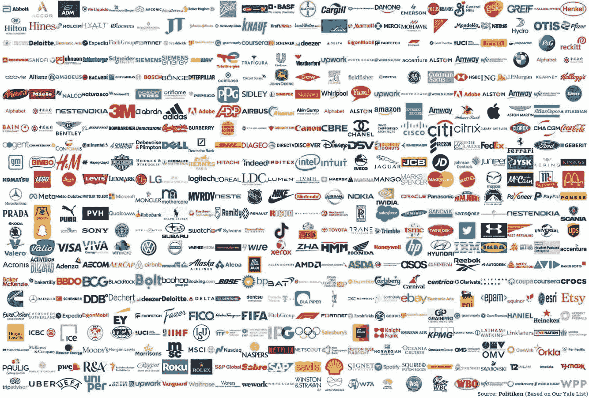

# 哪些公司仍在俄罗斯运营和开展业务？

> 原文：<https://medium.com/coinmonks/who-are-the-companies-still-operating-and-doing-business-in-russia-d020d64445f5?source=collection_archive---------47----------------------->

Seriously, just look at the number of companies that has pulled out of Russia.

这确实是一个黄金问题，找出原因至关重要。

自 2 月在乌克兰开展“特别行动”以来，数百家公司已经放弃了俄罗斯。

这是令人难过的，但乌克兰-俄罗斯战争已经持续了近 3 个月，这是一场人道主义危机，但你想切片。

无辜平民的生命处于危险之中，而好战的祖父和将军们则在炫耀军事力量，打击他们的自我。

当你的整个国家进入全面战争时，没有家可回，不知道接下来会发生什么，这是一种可怕的经历，任何人都不应该忍受。

我们都在用各种方式“反击”。

银行正在实施金融封锁和经济制裁。

全球领导人正采取攻势，表明立场，表达他们对俄罗斯行为的反对。

乌克兰的邻国，特别是波兰，在他们最需要的时候向逃离的乌克兰人敞开了大门。

甚至连 web3 社区也找到了用加密货币和出售非加密货币来筹集资金的方法。

公司正在停止运营，关闭实体店，停止贸易，并从根本上削减俄罗斯的供应和就业。

Airbnb、苹果、宝马、迪士尼、贝宝、三星、壳牌、雀巢、麦当劳、百胜餐饮集团等等已经停止了。

这些公司为什么要这么做？

嗯，原因有很多，从“发表声明”、“支持乌克兰”到“根据原则做出决定”、“确保普京感受到压力”。

不管怎样，每家公司都在做他们认为正确的事，做他们力所能及的事。

总的来说，我们只能希望它能收紧套在俄罗斯身上的绞索，并产生实际效果。

他们为什么希望实现？

也许当这些公司，包括 F&B、公用事业、能源、零售等等，停止运营时，普通俄罗斯人会感到痛苦，并反过来迫使他们的政府停止入侵。

或者也许普京会随着时间的推移最终感受到经济饥饿的痛苦并屈服？

行得通吗？

只有时间能证明一切。

这确实迫使俄罗斯开始评估自己的生存能力和独立性，从印度和中国的其他地方寻求支持。

Ukraine has raised more than a billion dollars since and crypto donations played a huge role.

有效吗？

也许不是，但是除了用更多的军事攻击和力量来回报，人类还能做什么呢？

专家们说，现代战争不是用核能，而是用经济实力和软件。

我不知道这是否会影响到你，但如果你告诉我，我所有的谷歌服务、Gmail、谷歌搜索、Youtube、地图等将于明天停止，我认为这对我来说是将死。

接下来会发生什么？

不能迅速取胜的战争随后会以消耗战的方式进行。

谁能够“损失更少”并随着时间的推移而生存下来，谁就将获胜。

每场战争都讲述一个故事，但历史是由胜利者书写的。

在这场战争中，泽伦斯基是白衣骑士，普京是邪恶的暴君。

暂时如此。

谁知道会发现什么新的信息，历史会如何对待未来的玩家。

我们只能想象它将如何结束，让我们都希望它早点结束。

就像埃隆·马斯克出价 430 亿美元收购 Twitter 时对 Twitter 董事长说的那样:

“我一直走到最后”。

我真的希望这场混乱、动荡、不必要的战争是为了过时的意识形态和 404 逻辑。

-

你认为乌俄战争会很快结束吗？

-

# startups # business # startupx # growth # success # social media # culture # entrepreneur # strategy # eth #比特币#战争#乌克兰#俄罗斯# **泽伦斯基#普京# war sucks # prayforukraine # support Ukraine**

> 加入 Coinmonks [电报频道](https://t.me/coincodecap)和 [Youtube 频道](https://www.youtube.com/c/coinmonks/videos)了解加密交易和投资

# 另外，阅读

*   [分散交易所](https://coincodecap.com/what-are-decentralized-exchanges) | [比特 FIP](https://coincodecap.com/bitbns-fip) | [宾邦评论](https://coincodecap.com/bingbon-review)
*   [用信用卡购买密码的 10 个最佳地点](https://coincodecap.com/buy-crypto-with-credit-card)
*   [加拿大最佳加密交易机器人](https://coincodecap.com/5-best-crypto-trading-bots-in-canada) | [Bybit vs 币安](https://coincodecap.com/bybit-binance-moonxbt)
*   [阿联酋 5 大最佳加密交易所](https://coincodecap.com/best-crypto-exchanges-in-uae) | [SimpleSwap 评论](https://coincodecap.com/simpleswap-review)
*   购买 Dogecoin 的 7 种最佳方式
*   [最佳期货交易信号](https://coincodecap.com/futures-trading-signals) | [流动性交易所评论](https://coincodecap.com/liquid-exchange-review)