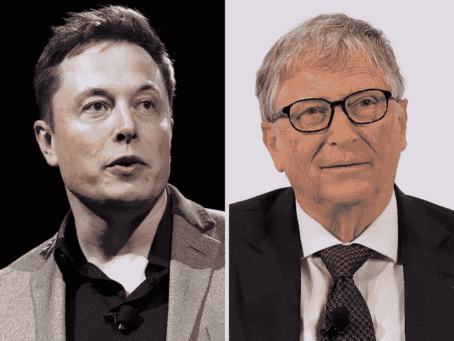
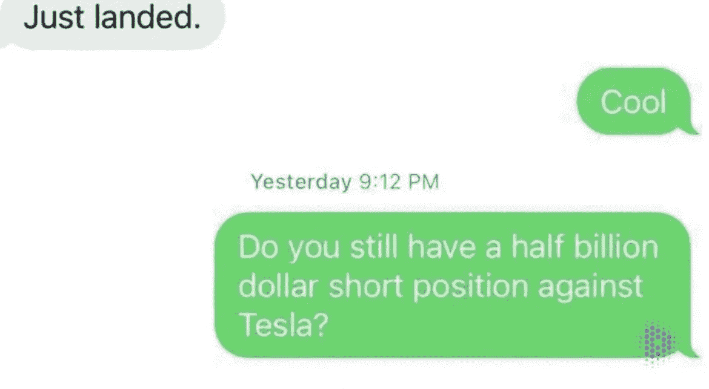
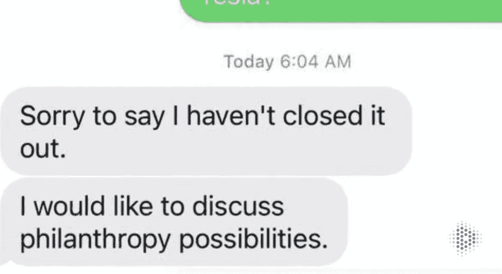
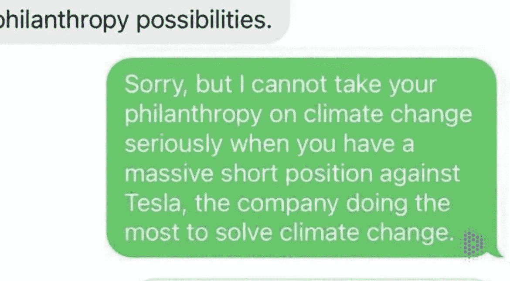

# 谁能嘲笑比尔·盖茨而逍遥法外？

> 原文：<https://medium.com/coinmonks/who-can-mock-bill-gates-and-get-away-with-it-9852a9742473?source=collection_archive---------24----------------------->

Billionaires vs Billionaires.

一个两倍富有，三倍时髦的人。

狗爸爸自己。

埃隆·马斯克先生。

“在敲定购买该平台的三天前，马斯克打出了一张比尔·盖茨的不讨人喜欢的照片，照片旁边是一幅怀孕男子的插图。”以防你需要快速减肥，”《时代》2021 年度人物告诉他的 8000 多万粉丝。马斯克认为盖茨正在做空特斯拉的股票，这是他的回应。它获得了超过 165，000 次转发和 130 万次赞。这是一个真正了解 Twitter 的人。那么 Twitter 是用来做什么的呢？它的建立是为了让对话游戏化。它通过对一个人的谈话成功提供即时、生动和量化的评估来做到这一点。Twitter 为我们提供了话语点；它给我们的交流打分。”

亿万富翁也是人。

他们在最愚蠢的事情上变得心胸狭窄。

如果你认为亿万富翁最不在乎的就是钱，那你就大错特错了。

埃隆·马斯克的身价约为 2500 亿美元。

运行 6 个独角兽，是比尔盖茨的两倍。

比尔·盖茨的身价约为 1300 亿美元。

对于一个十年前就没工作的人来说，这已经不错了。

显然，比尔·盖茨点击了@elonmusk 来讨论“关于气候变化的慈善事业”,但 Elon 问他是否还有 5 亿美元的$TSLA 空头头寸。

比尔说他还没关门，所以埃隆叫他走开。不知道这是不是真的

那只是纯粹的喜剧。

比尔·盖茨似乎很乐意向埃隆提出拯救地球的想法。

埃隆所关心的只是弄清谣言的真相。

埃隆非常不安，他发布了一个怀孕的表情符号来指代比尔·盖茨。

不出所料，这引发了推特飓风。

亿万富翁戳亿万富翁。

我们生活在一个什么时代？

最有趣的是表情符号的实际使用。

世界上最忙的 CEO 之一的 Elon，居然为孕妇表情符号找到了一个用例！

当它第一次发布时，我很困惑为什么会有人使用这样的表情符号。

现在我们知道了。

我不知道这是否合法，但显然埃隆被问及此事，他证实，对话真的发生在比尔盖茨身上！

令人惊讶的是，比尔·盖茨做空特斯拉的想法是对的。

特斯拉几周前遭受了相当大的打击，股价大幅下跌。

当然，没有人知道比尔·盖茨何时平仓，但我能说的是，当你是亿万富翁时，你真的知道所有人都不知道的事情。

你可以在别人玩的游戏之上玩这个游戏。

迷人的不是吗？

亿万富翁未知的、看不见的、听不见的、不熟悉的世界。

他们做空公司，以我们永远无法理解或负担得起的方式赚钱。

他们有熟人。

那些人知道像你我这样的平民永远不会理解的事情。

但是说真的，为什么比尔·盖茨要做空特斯拉？

当埃隆说特斯拉比世界上任何其他公司都为可持续的绿色未来做得更多时，他没有错。

-

你会做空特斯拉股票吗？

-

# startups # business # startupx # growth # success # social media # culture # entrepreneur # strategy # elon musk # bill gates # elon # dogefather # dogecoin # sustain ability # Tesla # electric cars # e moji # Microsoft # shorting # Twitter # jabbing

> 加入 Coinmonks [电报频道](https://t.me/coincodecap)和 [Youtube 频道](https://www.youtube.com/c/coinmonks/videos)了解加密交易和投资

# 另外，阅读

*   [3 商业评论](/coinmonks/3commas-review-an-excellent-crypto-trading-bot-2020-1313a58bec92) | [Pionex 评论](https://coincodecap.com/pionex-review-exchange-with-crypto-trading-bot) | [Coinrule 评论](/coinmonks/coinrule-review-2021-a-beginner-friendly-crypto-trading-bot-daf0504848ba)
*   [莱杰 vs n rave](/coinmonks/ledger-vs-ngrave-zero-7e40f0c1d694)|[莱杰 nano s vs x](/coinmonks/ledger-nano-s-vs-x-battery-hardware-price-storage-59a6663fe3b0) | [币安评论](/coinmonks/binance-review-ee10d3bf3b6e)
*   [Bybit Exchange 审查](/coinmonks/bybit-exchange-review-dbd570019b71) | [Bityard 审查](https://coincodecap.com/bityard-reivew) | [Jet-Bot 审查](https://coincodecap.com/jet-bot-review)
*   [3 commas vs crypto hopper](/coinmonks/3commas-vs-pionex-vs-cryptohopper-best-crypto-bot-6a98d2baa203)|[赚取加密利息](/coinmonks/earn-crypto-interest-b10b810fdda3)
*   最好的比特币[硬件钱包](/coinmonks/hardware-wallets-dfa1211730c6) | [BitBox02 回顾](/coinmonks/bitbox02-review-your-swiss-bitcoin-hardware-wallet-c36c88fff29)
*   [BlockFi vs 摄氏度](/coinmonks/blockfi-vs-celsius-vs-hodlnaut-8a1cc8c26630) | [Hodlnaut 审核](/coinmonks/hodlnaut-review-best-way-to-hodl-is-to-earn-interest-on-your-bitcoin-6658a8c19edf) | [KuCoin 审核](https://coincodecap.com/kucoin-review)