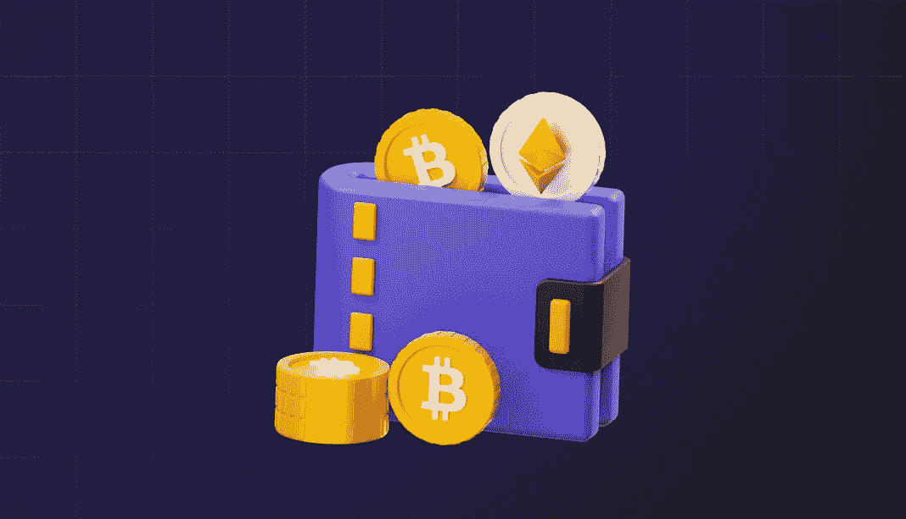

# 加密钱包开发团队由谁组成？

> 原文：<https://medium.com/coinmonks/who-does-a-team-of-crypto-wallet-development-consist-of-c69f2aacb45?source=collection_archive---------43----------------------->

# 什么是加密钱包？

区块链钱包或加密货币钱包是用于在特定区块链网络的用户之间转移数字交易或加密货币并触发区块链智能合约的应用。该钱包还提供对其持有者的数字交易历史以及他们的余额的访问。这是他们的区块链身份和账户。

如果不使用钱包，在区块链进行交易是不可能的。由于近年来创造了大量的加密货币，对令牌管理的稳健解决方案的需求日益增长。

定制加密货币钱包开发允许您提供定制的解决方案，使用户能够在移动设备或网络上进行交易。

# 业务和技术分析

在开发钱包之前，需要对业务和技术方面进行全面的分析。这种分析对于开发人员理解钱包的目的、它与区块链项目的关系以及实现钱包的技术要求是必要的。

# 建筑设计

一旦理解了钱包的业务和技术规范，就要构建钱包应用的架构，并与客户端进行协调。这一步决定了钱包前端和后端之间的关系，钱包是如何生成的，数据是如何存储和检索的，以及交易是如何执行的。该架构是所有后续开发步骤的蓝图。

# 钱包界面的低保真度和高保真度设计

虽然该架构描绘了钱包的不同部分以及它们如何交互，但富达设计用于指定它的外观以及用户将如何与之交互。首先，创建一个低保真度原型来提供 UI/UX 元素的粗略轮廓。一旦这一点与客户完全澄清，一个高保真设计原型创建。这一阶段的结果是一个尽可能接近钱包最终外观和感觉的原型。

# 钱包智能合约的开发

根据项目规范，可能需要开发钱包智能合同。智能合约用于管理主要触发事件并为钱包添加功能，如实施账户恢复流程、捆绑交易、转账限额等。任何需要为钱包开发的智能合约在部署之前都要经过广泛的审核和测试。

# 后端服务的开发

如果需要，还会创建后端服务。这些对于前端和区块链之间的交互以及任何智能合同的执行都是必要的。

# 前端开发

在部署之前，开发前端，导致钱包应用程序的最终版本。然后对应用程序进行测试，看是否有任何可能出现的错误或遗漏。

# 部署

完成上述步骤后，用户即可部署并使用 wallet。

需要[加密货币钱包开发](https://crypton.studio/blog/Who-does-a-team-of-crypto-wallet-development-consist-of)吗？告诉我们您的项目想法，我们将帮助实施。 [https://crypton.studio](https://crypton.studio)

> 加入 Coinmonks [电报频道](https://t.me/coincodecap)和 [Youtube 频道](https://www.youtube.com/c/coinmonks/videos)了解加密交易和投资

# 另外，阅读

*   [如何购买 Monero](https://coincodecap.com/buy-monero) | [IDEX 评论](https://coincodecap.com/idex-review) | [BitKan 交易机器人](https://coincodecap.com/bitkan-trading-bot)
*   [CoinDCX 评论](/coinmonks/coindcx-review-8444db3621a2) | [加密保证金交易交易所](https://coincodecap.com/crypto-margin-trading-exchanges)
*   [红狗赌场评论](https://coincodecap.com/red-dog-casino-review) | [Swyftx 评论](https://coincodecap.com/swyftx-review) | [CoinGate 评论](https://coincodecap.com/coingate-review)
*   [Bookmap 评论](https://coincodecap.com/bookmap-review-2021-best-trading-software) | [美国 5 大最佳加密交易所](https://coincodecap.com/crypto-exchange-usa)
*   [如何在 FTX 交易所交易期货](https://coincodecap.com/ftx-futures-trading) | [OKEx vs 币安](https://coincodecap.com/okex-vs-binance)