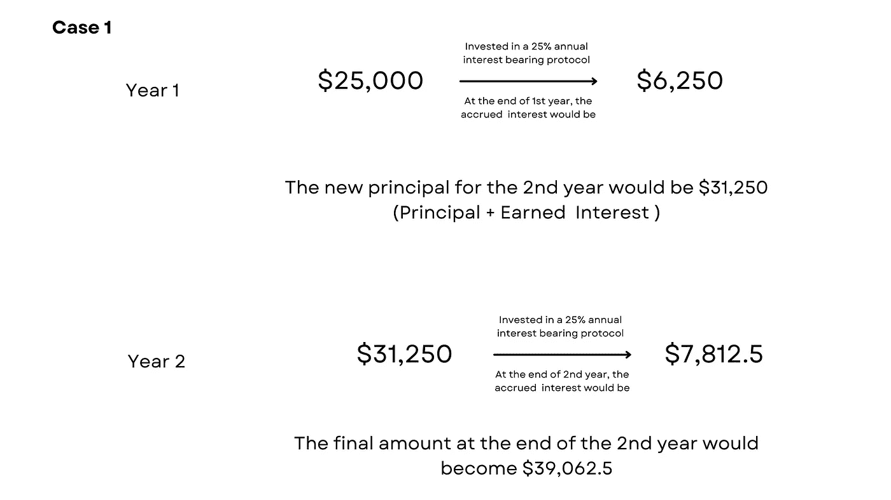
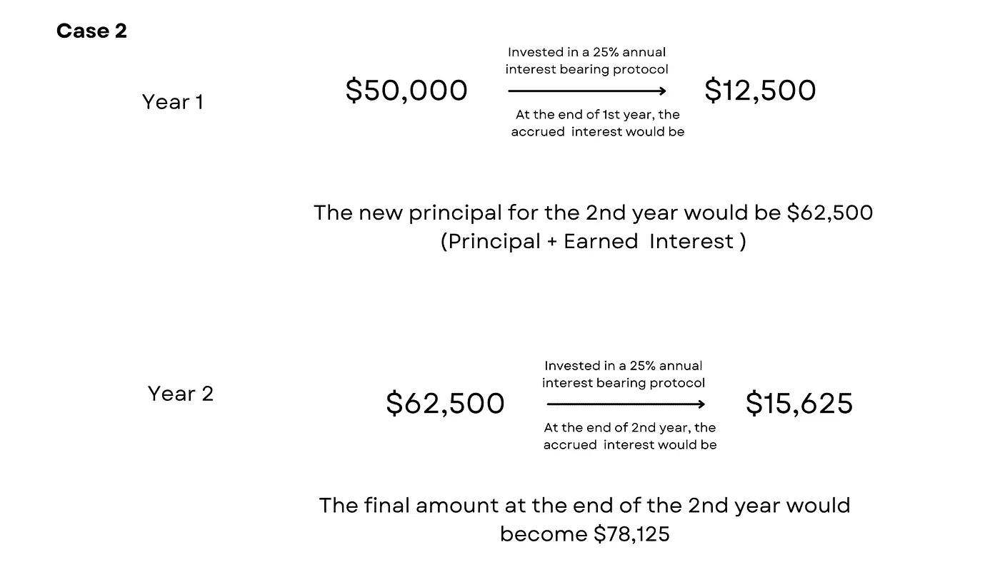
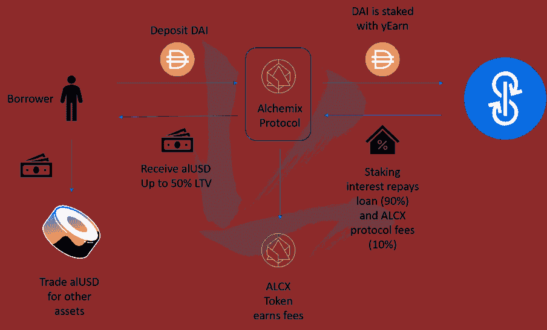

# 还有谁讨厌贷款分期付款？

> 原文：<https://medium.com/coinmonks/who-else-hates-paying-loan-installments-fa7032597fd3?source=collection_archive---------9----------------------->

有了这些自还贷款，2 年就可以无债一身轻。

想象一下，你日复一日地工作了几年，最终能够在银行账户上存下 5 万美元。正当一切开始变得美好时，生活却向你扔来了一个绝对的倒霉事——灾难性的车祸！幸运的是，你活了下来，但是你的车被撞得四分五裂。因为你需要一辆车来来回回地上下班，你被迫买一辆新的。这意味着花掉你大部分的生活积蓄，因为你正在进行的教育贷款，贷款不会到来。但是，你很确定你不会清算你宝贵的储蓄。

因此，你开始寻找可能的方法来借钱，这样你就可以给自己买一辆汽车。在你的探索中，你了解到*一家提供神奇贷款的银行，这种贷款将在两年多一点的时间内偿还。唯一的条件是，它希望你保留你的 5 万美元存款作为抵押。一旦满足这个条件，你将有资格获得一笔 25000 美元的神奇贷款(你抵押品价值的 50%)，这笔贷款将在未来 24 个月内偿还。一旦贷款完全偿还，你就可以拿回你原来的 50，000 美元存款。**你会选择借这笔神奇的自我偿还贷款，让你的生活恢复正常，而不必放弃你原来的积蓄吗？***

这个神奇的贷款人是[Alchemix](https://alchemix.fi/)——一个 Defi 协议，在大约两年内自动偿还所有贷款，让你的资本为你工作，同时你享受消费信贷。这种贷款协议最显著的特点是你的存款保持不变，并在贷款偿还后全额返还给你。你可能想知道，两年内偿还贷款的巨额回报来自哪里？在回答这个问题之前，让我们确保从这个贷款协议中借款在财务上是有意义的！

继续我们最初的例子，出现了两种情况。案例 1，你被迫从你的存款中拿出 25，000 美元购买你的新车，并决定投资另一半，就像 Alchemix 投资你的资本以获得这些高回报一样。两年后，等式会是这样的:

在这种情况下，你最终拥有了自己的汽车，并在第二年末获得了 39，062.5 美元。但是，如果你选择从 Alchemix 借款，会发生什么呢？让我们来了解一下！

在第二种情况下，你工作两年后的 50，000 美元将增长到惊人的 78，125 美元。Alchemix 协议将收回 25，000 美元的本金以及一小部分利润，剩余的 50，000 美元将返还给您。第二年年底，你就有了自己的车和最初的 5 万美元。这意味着你将比第一种情况多 10，937.5 美元。我想从 Alchemix 借钱总比扔掉自己辛苦赚来的积蓄有意义。

# 但是，贷款如何偿还呢？

Alchemix 的基本机制很简单:借款人存入一定数量的 DAI stablecoin (1 DAI 等于 1 美元),并能够提供高达存款金额 50% LTV 的贷款，以合成协议令牌——alUSD 的形式支付，相当于 1 美元，由未来收益率支持。(这种 alUSD 也是一种稳定币，可以很容易地与戴、、、等其他流行的稳定币交换，甚至可以用来交易以太币和比特币。)

为了获得最高的收益率，Alchemix 将这些存款部署到 Yearn Finance 的金库中，这是一种收益率优化器，使用赌注和贷款策略的组合来实现收益率最大化。随着从 Yearn-yv Dai 金库中收获收益，用户将看到他们的 alUSD 债务减少，如果他们等待足够长的时间，它将通过 Alchemix 协议完全还清。换句话说，贷款是有回报的。

在示意图上，整个过程如下所示:

*Source:* [*Three Body Capital*](https://threebody.capital/blog/2021/4/30/self-paying-loans-and-the-magic-of-alchemix)

# 如果你提前需要你的存款怎么办？

那么，在这种情况下，你可以选择清算选项，这将允许你在扣除费用和 10%的协议费用后提前提取存款。

# 是否应该考虑向 Alchemix 借款？

从我们前面的例子可以看出，使用 Alchemix 产生了 10，937.5 美元的额外收入，比使用储蓄来购买汽车的情况多 27%。在每一种可能的情况下，从这个协议中借款会让你有更多的钱。

# 你的贷款会一直在 2 年内还清吗？

贷款偿还期限根据市场上可用的收益率而变化。2021 年首次推出时，Alchemix 贷款的年收益率为 18-22%。按照这一利率，Alchemix 完全有可能在 25-30 个月内偿还您的贷款，无论贷款规模如何。然而，在目前的市场条件下，这些曾经可以获得的巨大收益已经有点枯竭了。好消息是，这些可变收益率仍然是两位数，因此完全有能力在 5 年内偿还所有借款，这很可能是在不久的将来。

有了 Alchemix，你唯一的债务就是时间！

免责声明:此信息仅用于教育目的，并非财务建议。

> 加入 Coinmonks [电报频道](https://t.me/coincodecap)和 [Youtube 频道](https://www.youtube.com/c/coinmonks/videos)了解加密交易和投资

# 另外，阅读

*   [买 PancakeSwap(蛋糕)](https://coincodecap.com/buy-pancakeswap)|[matrix export Review](https://coincodecap.com/matrixport-review)
*   [最佳免费加密信号](https://coincodecap.com/free-crypto-signals) | [YoBit 评论](/coinmonks/yobit-review-175464162c62) | [Bitbns 评论](/coinmonks/bitbns-review-38256a07e161)
*   [OKEx 回顾](/coinmonks/okex-review-6b369304110f) | [Kucoin 交易机器人](/coinmonks/kucoin-trading-bot-automate-your-trades-8cf0ca2138e0) | [期货交易机器人](/coinmonks/futures-trading-bots-5a282ccee3f5)
*   [AscendEx Staking](https://coincodecap.com/ascendex-staking)|[Bot Ocean Review](https://coincodecap.com/bot-ocean-review)|[最佳比特币钱包](https://coincodecap.com/bitcoin-wallets-india)
*   [霍比评论](https://coincodecap.com/huobi-review) | [OKEx 保证金交易](https://coincodecap.com/okex-margin-trading) | [期货交易](https://coincodecap.com/futures-trading)
*   [比特币基地赌注](https://coincodecap.com/coinbase-staking) | [Hotbit 评论](/coinmonks/hotbit-review-cd5bec41dafb) | [KuCoin 评论](https://coincodecap.com/kucoin-review)
*   购买 Dogecoin 的 7 种最佳方式 | [ZebPay 评论](https://coincodecap.com/zebpay-review)
*   [iTop VPN 审查](https://coincodecap.com/itop-vpn-review) | [曼陀罗交易所审查](https://coincodecap.com/mandala-exchange-review)